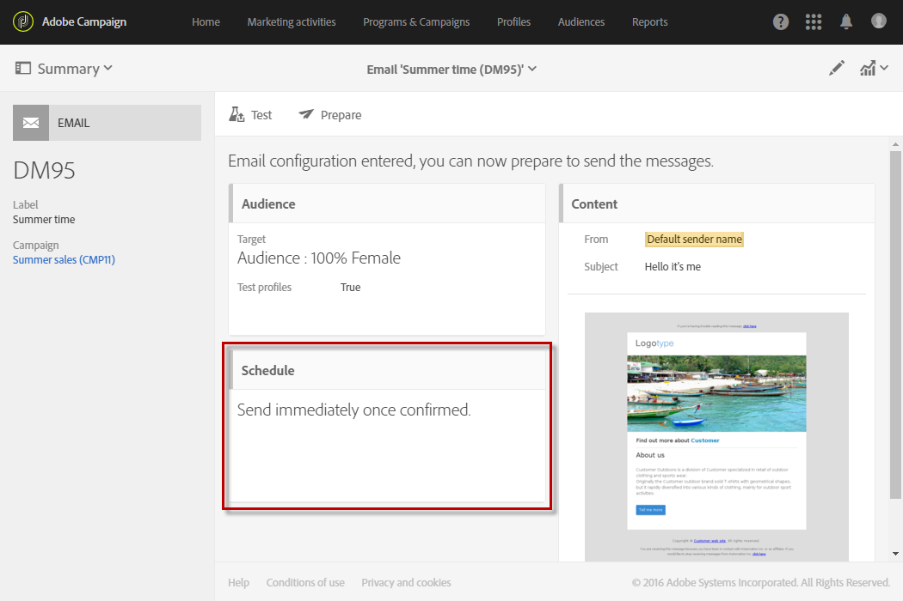
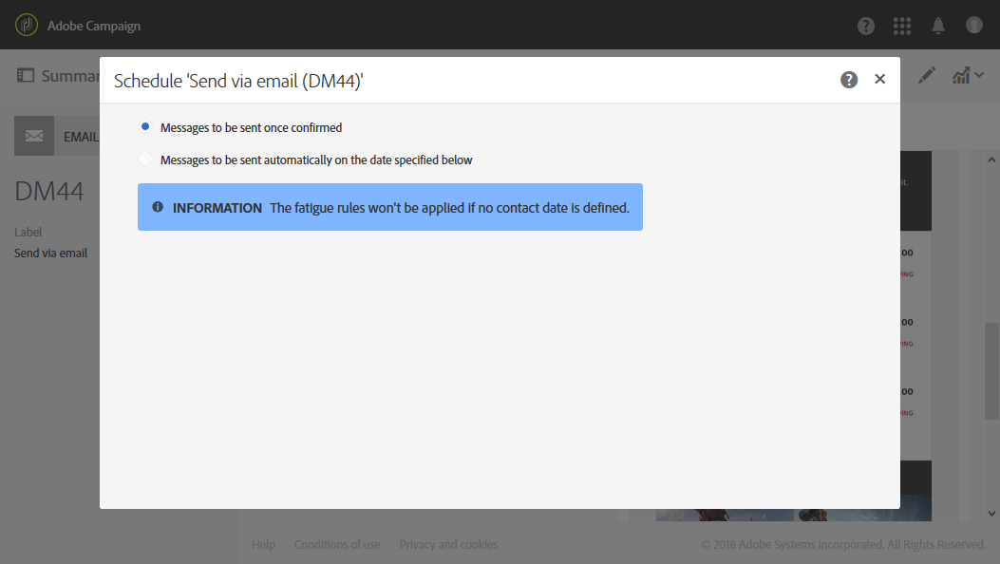
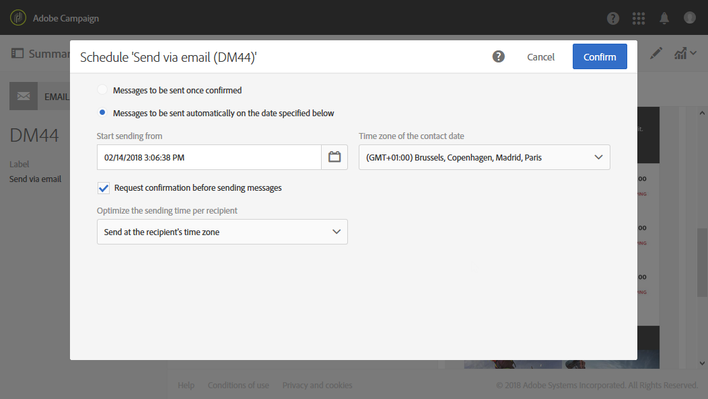

# Sobre a programação de mensagens{#about-scheduling-messages}

>[!IMPORTANT]
>
>Sempre que você fizer alterações no cronograma de uma entrega, prepare novamente a entrega clicando no botão **Prepare** antes de clicar em **Confirm**.

No painel de mensagens, o bloco **[!UICONTROL Schedule]** permite definir quando as mensagens (email, SMS ou notificações por push) serão enviadas.

As propriedades **[!UICONTROL Schedule]** permitem definir as opções de envio para emails, SMS ou notificações por push:

* **[!UICONTROL Messages to be sent once confirmed]**: as mensagens são enviadas assim que o envio é confirmado. Consulte [Confirmação do envio](../../sending/using/confirming-the-send.md).

  

* **[!UICONTROL Messages to be sent automatically on the date specified below]**: as mensagens serão enviadas em data e hora posteriores. Especifique a **data de contato** no campo **Start sending from**.

  Você pode preparar e confirmar o envio, mas as mensagens só serão enviadas a partir da data e hora selecionadas. A preparação e a confirmação do envio são apresentadas nas seções [Preparação do envio](../../sending/using/preparing-the-send.md) e [Confirmação do envio](../../sending/using/confirming-the-send.md).

  A lista suspensa **[!UICONTROL Time zone of the contact date]** permite modificar o fuso horário que será considerado para o horário de envio. Por exemplo, se você inserir 9:00 AM no campo **[!UICONTROL Start sending from]** e selecionar Brussels, Copenhagen, Madrid, Paris (GMT+1) na lista suspensa de **[!UICONTROL Time zone of the contact date]**, todos os recipients receberão a mensagem às 9:00 AM, horário de Paris. Portanto, um recipient localizado em Moscou (GMT+3) receberá a mensagem às 11:00, horário de Moscou.

  Se você quiser confirmar o envio manualmente, marque a opção **[!UICONTROL Request confirmation before sending messages]**. Essa opção está habilitada por padrão.

  

>[!IMPORTANT]
>
>Ao duplicar uma entrega, todas as configurações de programação são excluídas. A menos que você programe uma nova data de contato, a entrega duplicada será enviada assim que o envio for confirmado.

**Tópicos relacionados**:

* [Otimização do tempo de envio](../../sending/using/optimizing-the-sending-time.md)
* [Envio de mensagens no fuso horário do destinatário](../../sending/using/sending-messages-at-the-recipient-s-time-zone.md)
* [Cálculo da data de envio](../../sending/using/computing-the-sending-date.md)
