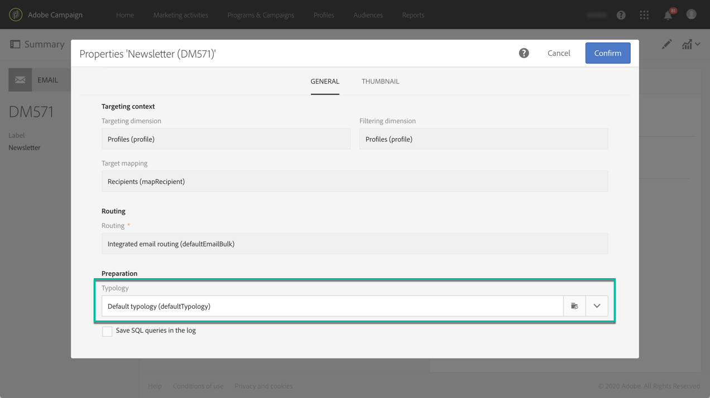

# Sobre tipologias e regras de tipologia{#about-typology-rules}

No Campaign Standard é possível vincular uma mensagem a uma **tipologia**, a fim de verificar se a mensagem é válida e atende aos seus critérios de qualidade.

Tipologias são conjuntos de **regras de tipologia**, que são executadas durante a fase de análise da mensagem. Elas possibilitam garantir que seus emails sempre contenham determinados elementos (como um link de cancelamento de assinatura ou uma linha de assunto) ou regras de filtragem para excluir grupos do público-alvo desejado (como clientes que não assinam, concorrentes ou clientes não fidelizados).

As tipologias e regras de tipologia prontas para uso estão disponíveis no Campaign Standard. Dependendo das suas necessidades, você também pode criar novas regras e adicioná-las a tipologias existentes ou novas para vincular às suas mensagens.

As etapas para criar e aplicar uma tipologia às mensagens são:

1. Criar regras de tipologia (consulte [esta seção](../../sending/using/managing-typology-rules.md#creating-a-typology-rule)).
1. Criar uma tipologia e fazer referência às regras criadas nela (consulte [esta seção](../../sending/using/managing-typologies.md#creating-a-typology)).
1. Configurar a entrega para usar a tipologia criada (consulte [esta seção](../../sending/using/managing-typologies.md#applying-typologies-to-messages)).
1. Durante a preparação da mensagem, os perfis são excluídos quando o critério é atendido. Você pode verificar os logs para monitorar exclusões.
