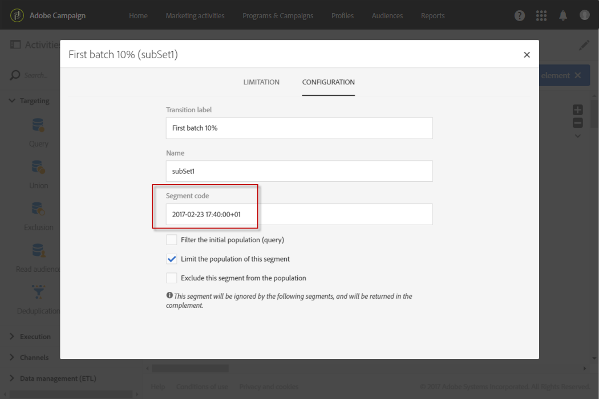

# Computing the sending date{#computing-the-sending-date}

É possível definir uma fórmula para enviar a mensagem a cada destinatário em uma data e hora específicas.

## Customizing date formula {#customizing-date-formula}

Por exemplo, você pode usar a otimização de tempo durante o processo de ramificação.

Quando e-mails são enviados usando uma nova plataforma, os provedores de serviços de Internet (isps) são suspeitos de endereços IP que não são reconhecidos. Se grandes volumes de emails forem enviados de repente, os isps geralmente marcarão os valores como spam.

Para evitar que seja marcada como spam, é possível aumentar progressivamente o volume enviado distribuindo grandes volumes de emails em diferentes períodos. Isso deve garantir o desenvolvimento suave da fase de inicialização e permitir reduzir a taxa geral de endereços inválidos.

Por exemplo, você pode segmentar o público-alvo aleatoriamente para enviar sua entrega em cinco lotes. Você enviará um primeiro lote que representa 10% do público-alvo de sua meta às 1june June 00 AM, um segundo lote 24 horas mais tarde, com 15% do público-alvo e assim por diante.

Você pode programar isso usando um fluxo de trabalho.


1. Acesse a lista de atividades de marketing e crie um novo fluxo de trabalho. See [Creating a workflow](../../automating/using/building-a-workflow.md#creating-a-workflow).
1. Drag and drop a **Query** activity into your workflow and open it. See the [Query](../../automating/using/query.md) section.
1. Select an audience, for example all your Gold customers and click **[!UICONTROL Confirm]** to save the query.
1. Drag and drop a **Segmentation** activity into your workflow and open it. See the [Segmentation](../../automating/using/segmentation.md) section.
1. Defina cinco segmentos. Para cada segmento:

   * Fill in the **[!UICONTROL Segment code]** field: manually enter the desired date and time for sending the message.

      Por exemplo, você deseja enviar o primeiro lote em June June de junho às 10h G0 GMT +1. Use the following format: **YYYY-MM-DD hh:mm:ss+tz**.

      

      To send the next batch the day after, enter **2017-06-02 10:00:00+01** for the second segment.

      Para os segmentos restantes, defina os seguintes lotes da seguinte maneira:

      * **2017-06-03 10:00:00+01**
      * **2017-06-04 10:00:00+01**
      * **2017-06-05 10:00:00+01**
   * Make sure you select the **[!UICONTROL Limit the population of this segment]** option.

      In the **[!UICONTROL Limitation]** tab, select **[!UICONTROL Random sampling]** and enter the desired percentage for each segment: 10 for the first batch, 15 for the second, and so on.

      


1. Once all segments are defined, select **[!UICONTROL Generate all segments in the same transition]** and click **[!UICONTROL Confirm]**.

   

1. Drag and drop an **Email delivery** activity into your workflow and open it. See the [Email delivery](../../automating/using/email-delivery.md) section.
1. Click the **[!UICONTROL Schedule]** section in the email dashboard and select **[!UICONTROL Messages to be sent automatically on the date specified below]**.
1. In the **[!UICONTROL Start sending from]** field, define a contact date.
1. From the send time optimization drop-down menu, choose **[!UICONTROL Send at a custom date defined by a formula]**.
1. Click the **[!UICONTROL Edit an expression]** button of the **[!UICONTROL Custom date formula]** field.

   

1. Create the following expression using the **[!UICONTROL ToDateTime]** function and the **[!UICONTROL Segment code]** field. Você também pode digitar diretamente na expressão, mas certifique-se de usar sintaxe e ortografia corretas.

   ```
   ToDateTime([targetData/@segmentCode])
   ```

   The **[!UICONTROL ToDateTime]** function transforms the segment code from a text string to a date and time value.

   Confirme a expressão para retornar à tela anterior.

   

   In the **[!UICONTROL Schedule]** window, the custom date formula is displayed as follows:

   ```
   ToDateTime([targetData/@segmentCode])
   ```

   

1. Confirme o agendamento, salve a entrega e execute o fluxo de trabalho.

A entrega será enviada progressivamente para todos os destinatários direcionados por cinco dias.

>[!NOTE]
>
>Certifique-se de que todas as datas estarão no futuro ao confirmar o envio. Caso contrário, a mensagem será enviada assim que o envio for confirmado.

## Using an expression {#using-an-expression}

A otimização de tempo também é útil para campanhas que envolvem uma central de atendimento. Você pode garantir que todas as mensagens não sejam recebidas ao mesmo tempo. Isso permite que sua organização processe o número de chamadas de acordo com sua capacidade.

Por exemplo, você deseja enviar um email convidando seus clientes a entrar em contato com uma central de atendimento para obter uma oferta promocional. Para evitar o aumento da central de atendimento, você decide segmentar o público-alvo aleatoriamente para enviar seu e-mail em quatro lotes.

Você pode programar isso usando um fluxo de trabalho.


1. Acesse a lista de atividades de marketing e crie um novo fluxo de trabalho. See [Creating a workflow](../../automating/using/building-a-workflow.md#creating-a-workflow).
1. Drag and drop a **Query** activity into your workflow and open it. See the [Query](../../automating/using/query.md) section.
1. Select an audience, for example over 35 profiles and click **[!UICONTROL Confirm]** to save the query.
1. Drag and drop a **Segmentation** activity into your workflow and open it. See the [Segmentation](../../automating/using/segmentation.md) section.
1. Defina quatro segmentos. Para cada segmento:

   * Defina os códigos de segmento da seguinte maneira:

      * 8:00 AM - 10:00 AM: **0**. A mensagem será enviada para o primeiro trimestre da população de destino às 8h 00 (data de contato).
      * 10:00 AM - 12:00 PM: **2**. A mensagem será enviada para o segundo trimestre da população de destino às 1h:0 AM (data de contato + 2 horas).
      * 2:00 PM - 4:00 PM: **6**. O centro de chamada está fechado entre 12:00 PM e 2:00 PM, a mensagem será enviada para o terceiro trimestre da população de destino às 2:00 PM (data do contato + 6 horas).
      * 4:00 PM - 6:00 PM: **8**. A mensagem será enviada para o último trimestre da população de destino às 4:00 PM (data de contato + 8 horas).
      >[!NOTE]
      >
      >A data do contato será definida na atividade de entrega de email mais tarde no fluxo de trabalho.

   * Make sure you select the **[!UICONTROL Limit the population of this segment]** option.
   * In the **[!UICONTROL Limitation]** tab, select **[!UICONTROL Random sampling]** and enter the desired percentage for each segment: **25**.


1. Once all segments are defined, select **[!UICONTROL Generate all segments in the same transition]** and click **[!UICONTROL Confirm]**.

   

1. Drag and drop an **Email delivery** activity into your workflow and open it. See the [Email delivery](../../automating/using/email-delivery.md) section.
1. Click the **[!UICONTROL Schedule]** section in the email dashboard.
1. Select **[!UICONTROL Messages to be sent automatically on the date specified below]**.
1. In the **[!UICONTROL Start sending from]** field, define a contact date.

   Neste exemplo, selecione May 5 de maio às 8. h…

1. From the send time optimization drop-down menu, choose **[!UICONTROL Send at a custom date defined by a formula]** and click the **[!UICONTROL Edit an expression]** button.

   

1. In the **[!UICONTROL Expression editor]**, set the date and the segment codes to compute the data for each customer.

   In the list of functions, select **[!UICONTROL AddHours]**.

   

   In the available fields, select **[!UICONTROL Current delivery]** &gt; **[!UICONTROL Delivery scheduling]** &gt; **[!UICONTROL Contact date]**.

   

   This enables you to retrieve the date and time specified in the **[!UICONTROL Start sending from]** field.

   In the list of functions, select **[!UICONTROL ToInteger]**. In the available fields, select **[!UICONTROL Additional data]** &gt; **[!UICONTROL Segment code]**.

   

   Isso permite recuperar os números especificados nos códigos de segmento.

   Você deve obter a seguinte fórmula:

   ```
   AddHours([currentDelivery/scheduling/@contactDate], ToInteger([targetData/@segmentCode]))
   ```

1. Confirme para salvar sua expressão. Confirme o agendamento, salve a entrega e execute o fluxo de trabalho.

* O primeiro segmento receberá a mensagem na data de contato (25 de maio às 8:h 0 AM).
* O segundo segmento receberá a mensagem duas horas depois (25 de maio às 10h 00).
* O terceiro segmento receberá a mensagem seis horas depois (25 de maio às 2pm 00 PM PM).
* O quarto segmento receberá a mensagem oito horas depois (25 de maio às 4pm 00 PM PM).

