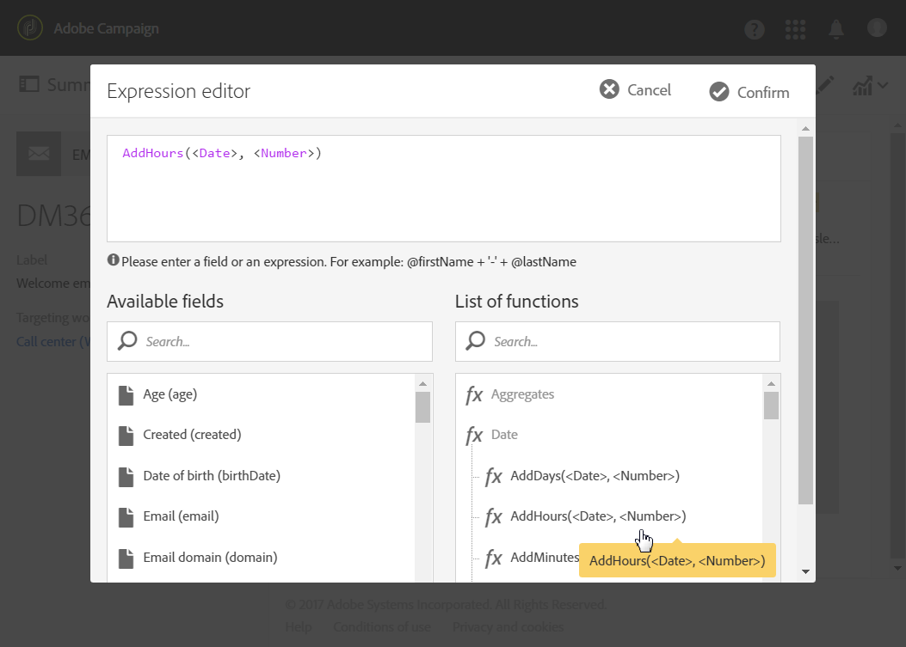

# Calcular a data de envio{#computing-the-sending-date}

Você pode definir uma fórmula para enviar a mensagem para cada recipient em uma data e hora específicas.

## Fórmula de data de personalização {#customizing-date-formula}

Por exemplo, você pode usar a otimização de tempo de envio durante o processo de rampa.

Quando os emails são enviados usando uma nova plataforma, os provedores de serviços de Internet (ISPs) suspeitam de endereços IP que não são reconhecidos. Se grandes volumes de emails forem enviados repentinamente, os ISPs freqüentemente os marcam como spam.

Para evitar ser marcado como spam, você pode aumentar progressivamente o volume enviado, distribuindo grandes volumes de e-mails em momentos diferentes. Isso deve garantir o desenvolvimento suave da fase de inicialização e permitir que você reduza a taxa geral de endereços inválidos.

Por exemplo, você pode segmentar sua audiência de público alvo aleatoriamente para enviar seu delivery em cinco lotes. Você enviará um primeiro lote representando 10% de sua audiência de público alvo em 1º de junho às 10h00, um segundo lote 24 horas depois com 15% da audiência e assim por diante.

Você pode agendar isso usando um fluxo de trabalho.


1. Acesse a lista da atividade de marketing e crie um novo fluxo de trabalho. Consulte [Criação de um workflow](../../automating/using/building-a-workflow.md#creating-a-workflow).
1. Drag and drop a **Query** activity into your workflow and open it. Consulte a seção [Query](../../automating/using/query.md) .
1. Selecione uma audiência, por exemplo, todos os clientes Gold e clique **[!UICONTROL Confirm]** para salvar o query.
1. Drag and drop a **Segmentation** activity into your workflow and open it. Consulte a seção [Segmentação](../../automating/using/segmentation.md) .
1. Defina cinco segmentos. Para cada segmento:

   * Preencha o **[!UICONTROL Segment code]** campo: insira manualmente a data e a hora desejadas para enviar a mensagem.

      Por exemplo, você deseja enviar o primeiro lote em 1º de junho às 10:00 AM GMT+1. Use o seguinte formato: **AAAA-MM-DD hh:mm:ss+tz**.

      

      Para enviar o próximo lote no dia seguinte, digite **2017-06-02 10:00:00+01** para o segundo segmento.

      Para os segmentos restantes, defina os próximos lotes da seguinte forma:

      * **2017-06-03 10:00:00+01**
      * **2017-06-04 10:00:00+01**
      * **2017-06-05 10:00:00+01**
   * Certifique-se de selecionar a **[!UICONTROL Limit the population of this segment]** opção.

      Na **[!UICONTROL Limitation]** guia, selecione **[!UICONTROL Random sampling]** e insira a porcentagem desejada para cada segmento: 10 para o primeiro lote, 15 para o segundo, e assim por diante.

      


1. Depois que todos os segmentos forem definidos, selecione **[!UICONTROL Generate all segments in the same transition]** e clique em **[!UICONTROL Confirm]**.

   

1. Drag and drop an **Email delivery** activity into your workflow and open it. Consulte a seção delivery [de e-](../../automating/using/email-delivery.md) mail.
1. Clique na **[!UICONTROL Schedule]** seção no painel de email e selecione **[!UICONTROL Messages to be sent automatically on the date specified below]**.
1. No **[!UICONTROL Start sending from]** campo, defina uma data de contato.
1. No menu suspenso de otimização do tempo de envio, escolha **[!UICONTROL Send at a custom date defined by a formula]**.
1. Clique no **[!UICONTROL Edit an expression]** botão do **[!UICONTROL Custom date formula]** campo.

   

1. Crie a expressão a seguir usando a **[!UICONTROL ToDateTime]** função e o **[!UICONTROL Segment code]** campo. Você também pode digitar diretamente na expressão, mas certifique-se de usar a sintaxe e a ortografia corretas.

   ```
   ToDateTime([targetData/@segmentCode])
   ```

   A **[!UICONTROL ToDateTime]** função transforma o código de segmento de uma string de texto em um valor de data e hora.

   Confirme a expressão para retornar à tela anterior.

   

   Na **[!UICONTROL Schedule]** janela, a fórmula de data personalizada é exibida da seguinte maneira:

   ```
   ToDateTime([targetData/@segmentCode])
   ```

   

1. Confirme o agendamento, salve o delivery e execute o fluxo de trabalho.

O delivery será progressivamente enviado a todos os recipient-alvo ao longo de cinco dias.

>[!NOTE]
>
>Certifique-se de que todas as datas estejam no futuro ao confirmar o envio. Caso contrário, a mensagem será enviada assim que o envio for confirmado.

## Uso de uma expressão {#using-an-expression}

A otimização do tempo de envio também é útil para campanhas que envolvem uma central de atendimento. Você pode garantir que todas as mensagens não sejam recebidas ao mesmo tempo. Isso permite que sua organização processe o número de chamadas de acordo com sua capacidade.

Por exemplo, você deseja enviar um email convidando seus clientes a entrar em contato com uma central de atendimento para obter uma oferta promocional. Para evitar sobrecarregar a central de atendimento, você decide segmentar a audiência do público alvo aleatoriamente para enviar seu email em quatro lotes.

Você pode agendar isso usando um fluxo de trabalho.


1. Acesse a lista da atividade de marketing e crie um novo fluxo de trabalho. Consulte [Criação de um workflow](../../automating/using/building-a-workflow.md#creating-a-workflow).
1. Drag and drop a **Query** activity into your workflow and open it. Consulte a seção [Query](../../automating/using/query.md) .
1. Selecione uma audiência, por exemplo, mais de 35 perfis e clique em **[!UICONTROL Confirm]** para salvar o query.
1. Drag and drop a **Segmentation** activity into your workflow and open it. Consulte a seção [Segmentação](../../automating/using/segmentation.md) .
1. Defina quatro segmentos. Para cada segmento:

   * Defina os códigos de segmento da seguinte maneira:

      * 08:00 - 10:00: **0**. A mensagem será enviada para o primeiro trimestre da população do público alvo às 8:00 da manhã (data de contato).
      * 22:00 - 12:00: **2**. A mensagem será enviada para o segundo trimestre da população do público alvo às 10:00 da manhã (data de contato + 2 horas).
      * 14:00 - 16:00: **6**. Estando a central de atendimento fechada entre as 12:00 e as 14:00, a mensagem será enviada para o terceiro trimestre da população do público alvo às 14:00 horas (data de contato + 6 horas).
      * 16:00 - 18:00: **8**. A mensagem será enviada para o último trimestre da população do público alvo às 16:00 horas (data de contato + 8 horas).

      >[!NOTE]
      >
      >A data de contato será definida na atividade delivery de e-mail posteriormente no fluxo de trabalho.

   * Certifique-se de selecionar a **[!UICONTROL Limit the population of this segment]** opção.
   * Na **[!UICONTROL Limitation]** guia, selecione **[!UICONTROL Random sampling]** e insira a porcentagem desejada para cada segmento: **25**.


1. Depois que todos os segmentos forem definidos, selecione **[!UICONTROL Generate all segments in the same transition]** e clique em **[!UICONTROL Confirm]**.

   

1. Drag and drop an **Email delivery** activity into your workflow and open it. Consulte a seção delivery [de e-](../../automating/using/email-delivery.md) mail.
1. Clique na **[!UICONTROL Schedule]** seção no painel de email.
1. Selecione **[!UICONTROL Messages to be sent automatically on the date specified below]**.
1. No **[!UICONTROL Start sending from]** campo, defina uma data de contato.

   Neste exemplo, selecione 25 de maio às 8:00 da manhã.

1. No menu suspenso de otimização do tempo de envio, escolha **[!UICONTROL Send at a custom date defined by a formula]** e clique no **[!UICONTROL Edit an expression]** botão.

   

1. No **[!UICONTROL Expression editor]**, defina a data e os códigos de segmento para calcular os dados de cada cliente.

   Na lista de funções, selecione **[!UICONTROL AddHours]**.

   

   Nos campos disponíveis, selecione **[!UICONTROL Current delivery]** > **[!UICONTROL Delivery scheduling]** > **[!UICONTROL Contact date]**.

   

   Isso permite recuperar a data e a hora especificadas no **[!UICONTROL Start sending from]** campo.

   Na lista de funções, selecione **[!UICONTROL ToInteger]**. Nos campos disponíveis, selecione **[!UICONTROL Additional data]** > **[!UICONTROL Segment code]**.

   

   Isso permite que você recupere os números especificados nos códigos de segmento.

   Você deve obter a seguinte fórmula:

   ```
   AddHours([currentDelivery/scheduling/@contactDate], ToInteger([targetData/@segmentCode]))
   ```

1. Confirme para salvar sua expressão. Confirme o agendamento, salve o delivery e execute o fluxo de trabalho.

* O primeiro segmento receberá a mensagem na data do contato (25 de maio às 8:00 da manhã).
* O segundo segmento receberá a mensagem duas horas depois (25 de maio às 10:00).
* O terceiro segmento receberá a mensagem seis horas depois (25 de maio às 14:00).
* O quarto segmento receberá a mensagem oito horas depois (25 de maio às 16:00).

