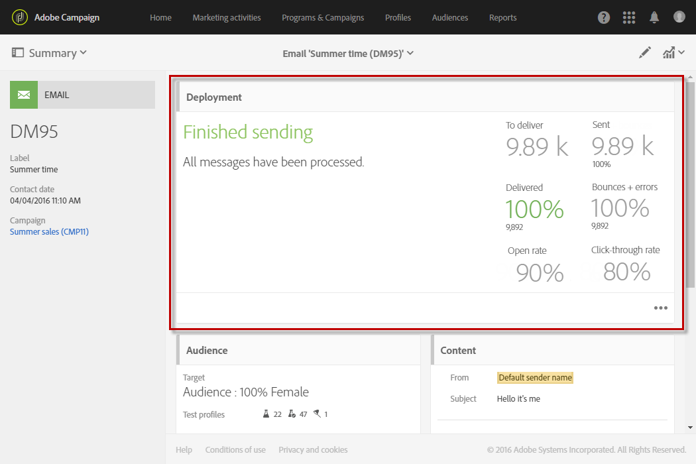

# Confirmação do envio{#confirming-the-send}

Quando terminar de preparar as mensagens e as etapas de aprovação forem executadas, você poderá enviá-las. Para saber mais sobre a preparação de mensagens, consulte [Preparação do envio](../../sending/using/preparing-the-send.md).

Somente os usuários com a função **[!UICONTROL Start deliveries]** podem confirmar o envio. Para saber mais, consulte a seção [Lista de funções](../../administration/using/list-of-roles.md).

<!--Users without this role will see the following message: 

-->

## Envio da mensagem {#sending-message}

Quando a preparação estiver concluída, siga as etapas abaixo para enviar sua mensagem.

1. Clique no botão **[!UICONTROL Confirm send]** encontrado na barra de ação da mensagem.

   

1. Finalize o envio clicando no botão **[!UICONTROL OK]**.

   

1. Aguarde enquanto a mensagem está sendo enviada. O bloco **[!UICONTROL Deployment]** mostra o progresso do envio.

>[!NOTE]
>
>Se a mensagem estiver programada, ela será enviada no horário especificado. Para saber mais sobre como programar mensagens, consulte [esta seção](../../sending/using/about-scheduling-messages.md).

Se estiver usando um delivery recorrente sem nenhum período de agregação, você poderá solicitar uma confirmação antes de o delivery ser enviado. Para fazer isso, ao configurar sua mensagem, abra o bloco **[!UICONTROL Schedule]** do painel do delivery e ative a opção dedicada.

## Noções básicas sobre indicadores de mensagem {#message-indicators}

Depois que a mensagem é enviada aos contatos, a zona **[!UICONTROL Deployment]** mostra seus KPIs (indicadores principais de desempenho), inclusive:

* Número de mensagens para delivery
* Número de mensagens enviadas
* A porcentagem de mensagens entregues
* A porcentagem de rejeições e erros
* A porcentagem de mensagens abertas
* A porcentagem de cliques nas mensagens (para emails)

   >[!NOTE]
   >
   >A **[!UICONTROL Open rate]** e a **[!UICONTROL Click-through rate]** são atualizadas a cada hora.

Se os KPIs levarem muito tempo para atualizar ou não levarem em conta os resultados dos logs de envio, clique no botão **[!UICONTROL Compute stats]** na janela **[!UICONTROL Deployment]**.

A mensagem pode ser visualizada no histórico de um dos perfis direcionados. Consulte [Perfil de cliente integrado](../../audiences/using/integrated-customer-profile.md).

Depois que uma mensagem é enviada, você pode rastrear o comportamento de seus recipient e monitorá-la para medir seu impacto. Para saber mais, consulte estas seções:

* [Rastreamento de mensagens](../../sending/using/tracking-messages.md)
* [Monitorar um delivery](../../sending/using/monitoring-a-delivery.md)

### Relatórios bem-sucedido do delivery {#delivered-status-report}

>[!NOTE]
>
>Esta seção se aplica somente ao canal de email.

Na visualização **[!UICONTROL Summary]** de cada email, a porcentagem **[!UICONTROL Delivered]** start em 100% e, em seguida, diminui progressivamente durante todo o delivery [período de validade](../../administration/using/configuring-email-channel.md#validity-period-parameters), à medida que as rejeições em hardware e software são reportadas<!--from the Enhanced MTA to Campaign-->.

Na verdade, todas as mensagens são exibidas como **[!UICONTROL Sent]** no [remetendo logs](../../sending/using/monitoring-a-delivery.md#sending-logs) assim que são repassadas com êxito da Campanha para o MTA Avançado (Message Transfer Agent). Eles permanecem nesse status, a menos que [bounce](../../sending/using/understanding-delivery-failures.md#delivery-failure-types-and-reasons) para essa mensagem seja comunicada de volta do MTA aprimorado para a Campanha.

Quando as mensagens de ressalto rígido são reportadas do MTA Avançado, seu status muda de **[!UICONTROL Sent]** para **[!UICONTROL Failed]** e a porcentagem **[!UICONTROL Delivered]** é diminuída de acordo.

Quando as mensagens de salto em modo suave são reportadas de volta do MTA aprimorado, elas ainda são exibidas como **[!UICONTROL Sent]** e a porcentagem **[!UICONTROL Delivered]** ainda não é atualizada. As mensagens de ressalto automático são então [repetidas](../../sending/using/understanding-delivery-failures.md#retries-after-a-delivery-temporary-failure) durante todo o período de validade do delivery:

* Se uma nova tentativa for bem-sucedida antes do final do período de validade, o status da mensagem permanecerá como **[!UICONTROL Sent]** e a porcentagem **[!UICONTROL Delivered]** permanecerá inalterada.

* Caso contrário, o status mudará para **[!UICONTROL Failed]** e a porcentagem **[!UICONTROL Delivered]** será diminuída de acordo.

<!--Soft-bouncing messages increment an error counter. When the error counter reaches the limit threshold or when the validity period is over, their status changes to **[!UICONTROL Failed]**.-->

<!--For more on retries after a delivery temporary failure, see [this section](../../sending/using/understanding-delivery-failures.md#retries-after-a-delivery-temporary-failure).-->

Consequentemente, você deve aguardar até o final do período de validade para ver a porcentagem final **[!UICONTROL Delivered]** e o número final das mensagens **[!UICONTROL Sent]** e **[!UICONTROL Failed]**.

### Serviço de feedback por email (beta) {#email-feedback-service}

>[!NOTE]
>
>Esta seção se aplica somente ao canal de email.

Com o recurso EFS (Email Feedback Service), o status de cada email é relatado com precisão, pois o feedback é capturado diretamente do MTA Avançado (Message Transfer Agent).

>[!IMPORTANT]
>
>O Serviço de Comentários por Email está disponível no momento como um recurso beta.

Depois que o delivery é iniciado, não há alteração na porcentagem **[!UICONTROL Delivered]** quando a mensagem é retransmitida com êxito da Campanha para o MTA aprimorado.

Os logs do delivery mostram o status **[!UICONTROL Pending]** para cada endereço direcionado.

Quando a mensagem é realmente entregue aos perfis direcionados e uma vez que essas informações são reportadas em tempo real do MTA aprimorado, os logs do delivery mostram o status **[!UICONTROL Sent]** para cada endereço que recebeu a mensagem com êxito. A porcentagem **[!UICONTROL Delivered]** é aumentada de acordo com cada delivery bem-sucedido.

Quando mensagens de ressalto rígido são reportadas do MTA aprimorado, o status do log muda de **[!UICONTROL Pending]** para **[!UICONTROL Failed]** e a porcentagem **[!UICONTROL Bounces + errors]** é aumentada de acordo.

Quando mensagens de salto em modo suave são reportadas de volta do MTA aprimorado, o status do log também muda de **[!UICONTROL Pending]** para **[!UICONTROL Failed]** e a porcentagem **[!UICONTROL Bounces + errors]** é aumentada de acordo. A porcentagem **[!UICONTROL Delivered]** permanece inalterada. As mensagens de ressalto automático são então repetidas durante todo o período de validade do delivery [a1/>:](../../administration/using/configuring-email-channel.md#validity-period-parameters)

* Se uma nova tentativa for bem-sucedida antes do final do período de validade, o status da mensagem mudará para **[!UICONTROL Sent]** e a porcentagem **[!UICONTROL Delivered]** será aumentada de acordo.

* Caso contrário, o status permanecerá como **[!UICONTROL Failed]**. As porcentagens **[!UICONTROL Delivered]** e **[!UICONTROL Bounces + errors]** permanecem inalteradas.

>[!NOTE]
>
>Para obter mais informações sobre saltos duros e suaves, consulte [esta seção](../../sending/using/understanding-delivery-failures.md#delivery-failure-types-and-reasons).
>
>Para obter mais informações sobre o tentativas após uma falha temporária de delivery, consulte [esta seção](../../sending/using/understanding-delivery-failures.md#retries-after-a-delivery-temporary-failure).

<!--Soft-bouncing messages increment an error counter. When the error counter reaches the limit threshold or when the validity period is over, the address goes into quarantine and the status remains as **[!UICONTROL Failed]**. For more on conditions for sending an address to quarantine, see [this section](../../help/sending/using/understanding-quarantine-management.md#conditions-for-sending-an-address-to-quarantine).-->

### Alterações introduzidas por EFS {#changes-introduced-by-efs}

A tabela abaixo mostra as alterações nos KPIs e no envio de status de registros introduzidos pelo recurso EFS.

| Etapa no processo de envio  | Resumo do KPI SEM EFS | Enviando o status dos logs SEM EFS | Resumo do KPI WITH EFS | Enviando o status dos logs WITH EFS |
|--- |--- |--- | --- | --- |
| A mensagem foi repassada com êxito da Campanha para o MTA Avançado | <ul><li>**[!UICONTROL Delivered]** porcentagem de start em 100%</li><li>**[!UICONTROL Bounces + errors]** porcentagem de start em 0%</li></ul> | Sent | <ul><li>**[!UICONTROL Delivered]** porcentagem de start em 0%</li><li>**[!UICONTROL Bounces + errors]** porcentagem de start em 0%</li></ul> | Pending |
| Mensagens de salto rígido são relatadas de volta do MTA aprimorado | <ul><li>**[!UICONTROL Delivered]** a porcentagem é reduzida em conformidade</li><li>**[!UICONTROL Bounces + errors]** a percentagem é aumentada em conformidade</li></ul> | Failed | <ul><li>Nenhuma alteração na porcentagem **[!UICONTROL Delivered]**</li><li>**[!UICONTROL Bounces + errors]** a percentagem é aumentada em conformidade</li></ul> | Falha |
| Mensagens de ressalto automático são reportadas de volta do MTA aprimorado | <ul><li>Nenhuma alteração na porcentagem **[!UICONTROL Delivered]**</li><li>Nenhuma alteração na porcentagem **[!UICONTROL Bounces + errors]**</li></ul> | Enviados | <ul><li>Nenhuma alteração na porcentagem **[!UICONTROL Delivered]**</li><li>**[!UICONTROL Bounces + errors]** a percentagem é aumentada em conformidade</li></ul> | Falha |
| Tentativas de mensagens de salto automático bem-sucedidas | <ul><li>Nenhuma alteração na porcentagem **[!UICONTROL Delivered]**</li><li>Nenhuma alteração na porcentagem **[!UICONTROL Bounces + errors]**</li></ul> | Enviados | <ul><li>**[!UICONTROL Delivered]** a percentagem é aumentada em conformidade</li><li>**[!UICONTROL Bounces + errors]** a porcentagem é reduzida em conformidade</li></ul> | Enviados |
| Tentativas de mensagens de salto automático falham | <ul><li>**[!UICONTROL Delivered]** a porcentagem é reduzida em conformidade</li><li>**[!UICONTROL Bounces + errors]** a percentagem é aumentada em conformidade</li></ul> | Falha | <ul><li> Nenhuma alteração na porcentagem **[!UICONTROL Delivered]** </li><li> Nenhuma alteração na porcentagem **[!UICONTROL Bounces + errors]** </li></ul> | Falha |
