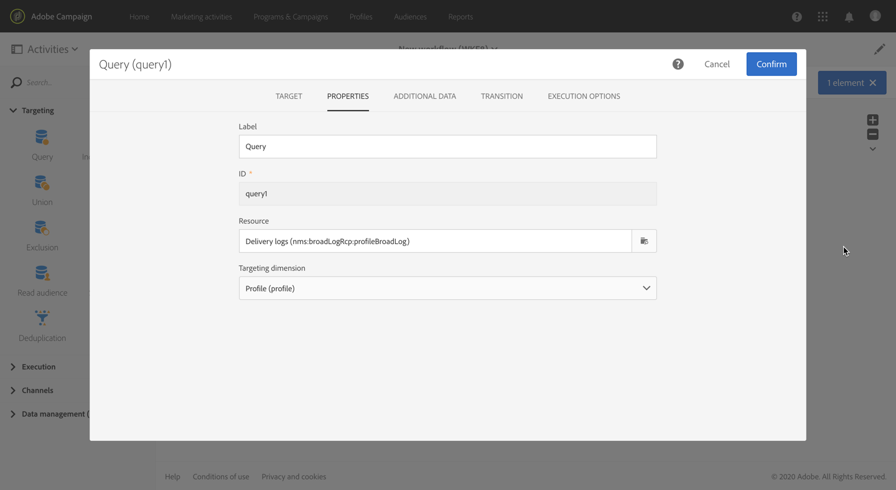
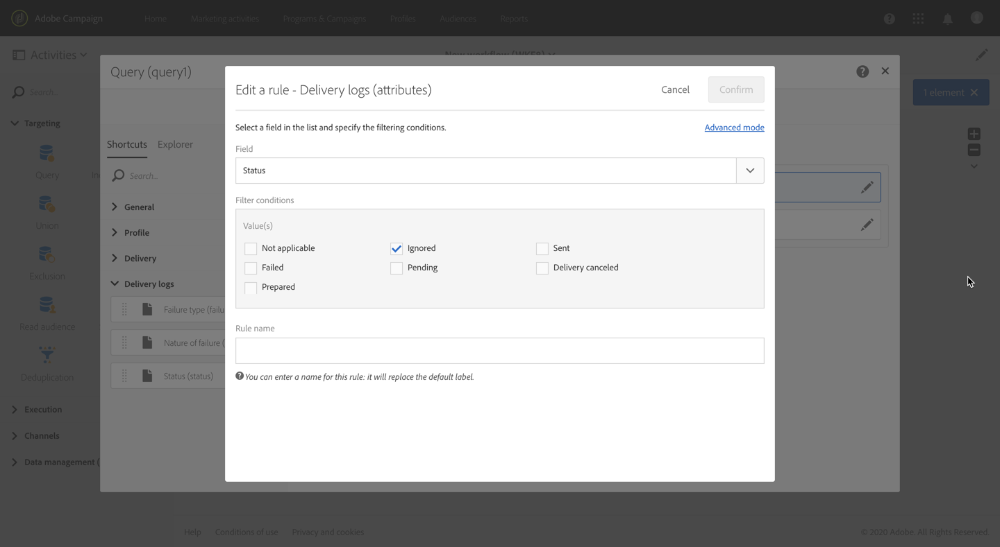

# Adicionar um grupo de controle {#adding-control-group}

Você pode usar grupos de controle para evitar o envio de mensagens para uma parte da sua audiência, a fim de medir o impacto das campanhas.

Para fazer isso no Adobe Campaign, crie um <b>grupo de controle</b> ao definir o público alvo do seu delivery. Perfis são adicionados ao grupo de controle aleatoriamente, filtrados ou não, ou com base em critérios.

Poderá então comparar o comportamento da população do público alvo que recebeu a mensagem com o comportamento dos contatos que não foram visados. Com base nos registros de envio, você também pode público alvo um grupo de controle em futuras campanhas.

<!--The control group is built when the delivery is prepared.-->

## Visão geral {#overview}

O grupo de controle pode ser extraído aleatoriamente do público alvo principal e/ou selecionado de uma população específica. Consequentemente, há duas maneiras principais de definir um grupo de controle:
* **Extraia** vários perfis do público alvo principal.
* **Exclua** alguns perfis com base em critérios definidos em um query.

Você pode usar ambos os métodos ao definir um grupo de controle.

Todos os perfis que fazem parte do grupo de controle na etapa de preparação do delivery serão removidos do público alvo principal. Eles não receberão a mensagem depois que ela for enviada.

## Extração da população público alvo {#extraction-target-population}

Para definir um grupo de controle, você pode optar por extrair, aleatoriamente ou com base em uma classificação, uma porcentagem ou um número fixo de perfis da população do público alvo.

### Extração público alvo {#target-extraction}

Primeiro, defina como os perfis serão extraídos do público alvo: **aleatoriamente** ou com base em uma **classificação**.

Na **[!UICONTROL Target extraction]** seção, selecione uma das seguintes opções:

* **[!UICONTROL Random sampling]**: ao preparar o delivery, a Adobe Campaign extrairá aleatoriamente um número de perfis correspondente à porcentagem ou ao número máximo que você definirá como o limite [de](#size-limit)tamanho.

   For example, if you then set the threshold to 10 in the **[!UICONTROL Limits]** section, the control group will be made up of 10% selected randomly from the targeted population.<!--Change screenshot to match example)-->

   

* **[!UICONTROL Keep only the first records after sorting]**: esta opção permite definir uma limitação baseada em uma ou mais ordens de classificação.

   Por exemplo:

   * Selecione o **[!UICONTROL Age]** campo como um critério de classificação.
   * Defina 100 como o limite na **[!UICONTROL Limits]** seção (consulte Limite de tamanho).
   * Leave the **[!UICONTROL Descending sort]** option checked.

   Com isso, o grupo de controle será formado pelos 100 recipient mais antigos.<!--Change screenshot to match example)-->

   

   Pode ser interessante definir um grupo de controle que inclua perfis que fazem poucas compras ou compras frequentes e comparar seu comportamento com o dos recipient contatados.

>[!NOTE]
>
>Selecione **[!UICONTROL No extraction]** se você não deseja usar a **[!UICONTROL Target extraction]** opção.

<!---->

### Limite de tamanho {#size-limit}

Se você selecionou **[!UICONTROL Random sampling]** ou **[!UICONTROL Keep only the first records after sorting]**, deve definir como limitar o número de perfis extraídos do público alvo principal. Execute um dos procedimentos a seguir:

* Selecione **[!UICONTROL Size (as a % of the initial population)]** e preencha o quadro correspondente.

   Por exemplo, se você definir 10, dependendo da opção selecionada acima, a Adobe Campaign:
   * Extrair aleatoriamente 10% da população público alvo.
   * Se você selecionou o **[!UICONTROL Age]** campo como critério de classificação, extraia os perfis 10% mais antigos da população do público alvo.

   >[!NOTE]
   >
   >Se você desmarcar a **[!UICONTROL Descending sort]** opção, os 10% mais novos perfis serão extraídos.

* Selecione **[!UICONTROL Maximum size]** e preencha o quadro correspondente.

   Por exemplo, se você definir 100, a Adobe Campaign:
   * Extrair aleatoriamente 100 perfis da população público alvo.
   * Se você selecionou o **[!UICONTROL Age]** campo como critério de classificação, extraia os 100 perfis mais antigos da população do público alvo.

   >[!NOTE]
   >
   >Se você desmarcar a **[!UICONTROL Descending sort]** opção, os 100 perfis mais jovens serão extraídos.

## Excluindo uma população específica {#excluding-specific-population}

Outra forma de definir um grupo de controle é excluir uma população específica do público alvo usando um query.

Para fazer isso:

1. From the **[!UICONTROL Target exclusion]** section, click **[!UICONTROL Define target exclusion]**.

   

1. Defina os critérios de exclusão usando o editor [de](../../automating/using/editing-queries.md)query. Você também pode selecionar uma [audiência](../../audiences/using/about-audiences.md) criada anteriormente.

   

1. Clique em **[!UICONTROL Confirm]**.

Os perfis que correspondem ao resultado do query serão excluídos do público alvo.

<!--For more on using the query editor, see the [Editing queries](../../automating/using/editing-queries.md) section.-->

## Caso de uso: configurar um grupo de controle {#control-group-example}

Abaixo está um exemplo que mostra como definir um grupo de controle usando ambos os métodos: extrair perfis do público alvo principal e usar um query para excluir uma população específica.

1. Criar um workflow. As etapas detalhadas para criar um fluxo de trabalho são apresentadas na seção [Criação de um fluxo de trabalho](../../automating/using/building-a-workflow.md).
1. Em **[!UICONTROL Activities]** > **[!UICONTROL Targeting]**, arraste e solte uma atividade de [Query](../../automating/using/query.md) . Clique na atividade com o duplo do mouse e defina seu público alvo. <!--For example, in **[!UICONTROL Shortcuts]**, drag and drop **[!UICONTROL Profile]**, select **[!UICONTROL Age]** with the operator **[!UICONTROL Greater than]** and type 25 in the **[!UICONTROL Value]** field.-->

1. Em **[!UICONTROL Activities]** > **[!UICONTROL Channels]**, arraste e solte uma atividade de delivery  de e-mail após o segmento principal do público alvo e edite-a.
1. Clique no **[!UICONTROL Audience]** bloco do painel do delivery.

1. Selecione a guia **[!UICONTROL Control group]**.

   

1. From the **[!UICONTROL Target extraction]** section, select **[!UICONTROL Keep only the first records after sorting]**.
1. Classifique na página e deixe a opção de **[!UICONTROL Descending]** classificação marcada.

   

1. Defina 100 como o tamanho máximo. Os 100 perfis mais antigos do seu público alvo serão extraídos.

1. Na **[!UICONTROL Target exclusion]** seção, defina os perfis que serão excluídos do seu público alvo, com base nos critérios de sua escolha usando o editor [de](../../automating/using/editing-queries.md)query. Por exemplo, &quot;A idade é menor que 20&quot;.

   

   Os perfis com menos de 20 anos serão excluídos.

1. Inicie a preparação [do](../../sending/using/preparing-the-send.md) delivery e [confirme o envio](../../sending/using/confirming-the-send.md).

Os perfis extraídos (os 100 perfis mais antigos) e os definidos com base no query (perfis com menos de 20 anos) serão retirados do público alvo principal. Eles não receberão a mensagem.

## Comparação dos resultados {#delivery-logs}

Agora que você enviou seu delivery, o que você pode fazer com o grupo de controle?

Você pode extrair os registros **de** envio para comparar como o grupo de controle que não recebeu a comunicação agiu comparado ao público alvo efetivo. Você também pode usar os logs do delivery para **criar outra definição de metas**.

>[!IMPORTANT]
>
>Você precisa ter uma função [de](../../administration/using/users-management.md#functional-administrators) Administrador e fazer parte da unidade **[!UICONTROL All]**  organizacional para se conectar à Adobe Campaign. Se você deseja restringir o acesso de um usuário ou grupo de usuários específico, não vincule-o às **[!UICONTROL All]** unidades para poder acessar os logs do delivery.

### Verificando os logs do delivery {#checking-logs}

Para ver quais perfis foram removidos do público alvo depois que a mensagem foi enviada, verifique o **[!UICONTROL Delivery logs]**. Para obter mais informações sobre os logs do delivery e como acessá-los, consulte [esta seção](../../sending/using/monitoring-a-delivery.md#delivery-logs).

* Na **[!UICONTROL Sending logs]** guia, é possível ver os perfis extraídos e excluídos. Têm o **[!UICONTROL Ignored]** estatuto e **[!UICONTROL Control group]** a razão do fracasso.

   

* Você também pode verificar a **[!UICONTROL Exclusion causes]** guia para ver o número de perfis que não foram incluídos no delivery.

   

### Uso dos registros de grupos de controle {#using-logs}

Depois que o delivery for enviado, você poderá usar os logs do delivery para filtrar os perfis que não receberam a mensagem. Siga as etapas abaixo:

1. Criar um workflow. As etapas detalhadas para criar um fluxo de trabalho são apresentadas na seção [Criação de um fluxo de trabalho](../../automating/using/building-a-workflow.md).
1. Em **[!UICONTROL Activities]** > **[!UICONTROL Targeting]**, arraste e solte uma atividade de [Query](../../automating/using/query.md) .
1. Na **[!UICONTROL Properties]** guia, defina **[!UICONTROL Delivery logs]** como o **[!UICONTROL Resource]** e **[!UICONTROL Profile]** como o **[!UICONTROL Targeting dimension]**.

   

1. Na guia **[!UICONTROL Target]**, clique em **[!UICONTROL Delivery logs]**.
1. Arraste e solte **[!UICONTROL Status]** e selecione **[!UICONTROL Ignored]** como a condição de filtro.

   

1. Clique em **[!UICONTROL Confirm]**.

1. Ainda na **[!UICONTROL Target]** guia, arraste e solte **[!UICONTROL Nature of failure]** e selecione **[!UICONTROL Control group]** a condição de filtro.

   

1. Clique em **[!UICONTROL Confirm]**.

   

Você pode exportar os dados de log usando uma atividade **Extract file** seguido de uma atividade **Transfer file** , por exemplo. Isso permitirá que você analise em sua própria ferramenta de relatórios os resultados de sua campanha no público alvo efetivo em comparação ao grupo de controle. For more on exporting logs, see [this section](../../automating/using/exporting-logs.md).

### Direcionando o grupo de controle {#targeting-control-group}

Para fazer uma definição de metas com base nos perfis que não receberam a mensagem, você também pode usar os logs do delivery. Siga as etapas abaixo:

1. Criar um workflow. As etapas detalhadas para criar um fluxo de trabalho são apresentadas na seção [Criação de um fluxo de trabalho](../../automating/using/building-a-workflow.md).
1. Em **[!UICONTROL Activities]** > **[!UICONTROL Targeting]**, arraste e solte uma primeira atividade [de Query](../../automating/using/query.md) .
1. Na **[!UICONTROL Properties]** guia, verifique se o **[!UICONTROL Profile]** recurso está selecionado como o **[!UICONTROL Resource]** e **[!UICONTROL Targeting dimension]**.

   

1. Na **[!UICONTROL Target]** guia, expanda **[!UICONTROL Delivery]** e arraste e solte **[!UICONTROL Delivery logs]**.

   

1. Na **[!UICONTROL Add a rule]** janela, arraste e solte **[!UICONTROL Delivery]**.

   

1. Selecione o email enviado como a condição de filtro. Clique em **[!UICONTROL Confirm]**.

   

1. De volta à **[!UICONTROL Add a rule]** janela, arraste e solte **[!UICONTROL Status]** e selecione **[!UICONTROL Ignored]** a condição de filtro. Clique em **[!UICONTROL Confirm]**.

   

1. Arraste e solte **[!UICONTROL Nature of failure]** e selecione **[!UICONTROL Control group]** como a condição de filtro. Clique em **[!UICONTROL Confirm]**.

   

1. Verifique se todas as condições estão alinhadas com o operador booleano **AND** .

   

1. Clique em **[!UICONTROL Confirm]**.

Agora você pode público alvo os perfis que não receberam sua primeira mensagem porque fizeram parte do grupo de controle e enviaram outro email para eles.

No mesmo fluxo de trabalho, você também pode criar outro query para público alvo dos perfis que receberam o email e enviá-los uma mensagem diferente.

