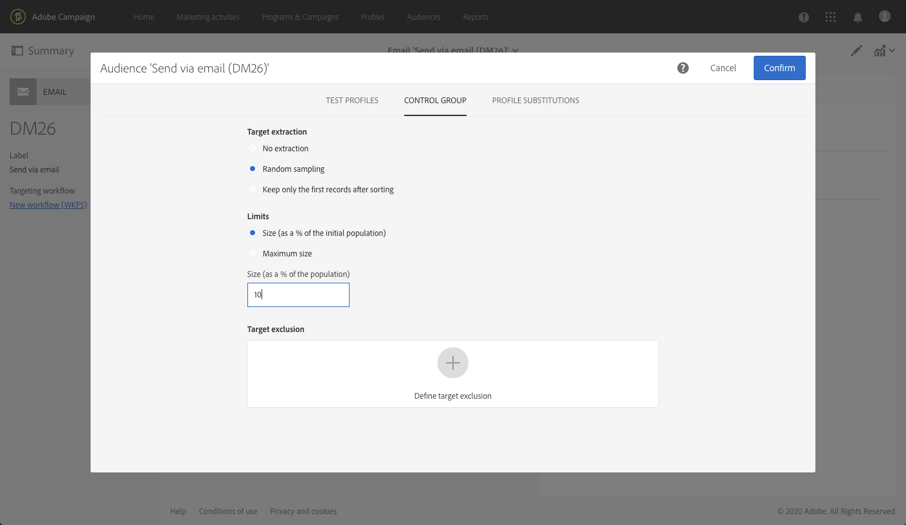

# Adição de um grupo de controle {#adding-control-group}

Você pode usar grupos de controle para evitar o envio de mensagens para uma parte do público para medir o impacto das campanhas.

Para fazer isso no Adobe Campaign, crie um <b>grupo de controle</b> ao definir o público-alvo do seu delivery. Perfis são adicionados ao grupo de controle aleatoriamente, filtrados ou não, ou baseados em critérios.

Portanto você poderá comparar o comportamento do público-alvo que recebeu a mensagem com o comportamento dos contatos não atingidos. Com base nos logs de envio, você também poderá se concentrar em um grupo de controle em campanhas futuras.

<!--The control group is built when the delivery is prepared.-->

## Visão geral {#overview}

O grupo de controle pode ser extraído do público-alvo principal e/ou vir de uma população específica. Consequentemente, há duas maneiras principais de definir um grupo de controle:
* **Extrair** vários perfis do público-alvo principal.
* **Excluir** alguns perfis com base em critérios definidos em uma query.

Você pode usar ambos os métodos ao definir um grupo de controle.

Todos os perfis que fazem parte do grupo de controle na etapa de preparação do delivery serão removidos do público-alvo principal. Eles não receberão a mensagem depois que ela for enviada.

## Extração a partir do público-alvo {#extraction-target-population}

Para definir um grupo de controle, você pode optar por extrair, aleatoriamente ou com base em uma classificação, uma porcentagem ou um número fixo de perfis da população do público-alvo.

### Extração de público-alvo {#target-extraction}

Primeiro, defina como os perfis serão extraídos do público-alvo: **aleatoriamente** ou com base em uma **classificação**.

Na seção **[!UICONTROL Target extraction]**, selecione uma das seguintes opções:

* **[!UICONTROL Random sampling]**: ao preparar o delivery, o Adobe Campaign extrairá aleatoriamente um número de perfis correspondente à porcentagem ou ao número máximo que você definirá como o [limite de tamanho](#size-limit).

   Por exemplo, se você definir o limite como 10 na seção **[!UICONTROL Limits]**, 10% do grupo de controle será constituído por um público selecionado aleatoriamente a partir da população direcionada.<!--Change screenshot to match example)-->

   

* **[!UICONTROL Keep only the first records after sorting]**: essa opção permite definir uma limitação baseada em uma ou mais ordens de classificação.

   Por exemplo:

   * Selecione o campo **[!UICONTROL Age]** como um critério de classificação.
   * Defina 100 como o limite na seção **[!UICONTROL Limits]** (consulte [Limite de tamanho](#size-limit)).
   * Deixe marcada a opção **[!UICONTROL Descending sort]**.

   Com isso, o grupo de controle será formado pelos 100 recipients mais antigos.<!--Change screenshot to match example)-->

   

   Pode ser interessante definir um grupo de controle que inclua perfis que façam poucas compras ou compras frequentes, e comparar seu comportamento com os recipients contatados.

>[!NOTE]
>
>Selecione **[!UICONTROL No extraction]** se você não quiser usar a opção **[!UICONTROL Target extraction]**.

<!---->

### Limite de tamanho {#size-limit}

Se você selecionou **[!UICONTROL Random sampling]** ou **[!UICONTROL Keep only the first records after sorting]**, deve definir como limitar o número de perfis extraídos do público-alvo principal. Execute um dos procedimentos a seguir:

* Selecione **[!UICONTROL Size (as a % of the initial population)]** e preencha o quadro correspondente.

   Por exemplo, se você definir 10, dependendo da opção selecionada acima, o Adobe Campaign irá:
   * Extrair aleatoriamente 10% da população do público-alvo.
   * Se você selecionou o campo **[!UICONTROL Age]** como critério de classificação, extraia 10% dos perfis mais antigos da população alvo.

   >[!NOTE]
   >
   >Se você desmarcar a opção **[!UICONTROL Descending sort]**, 10% dos perfis mais novos serão extraídos.

* Selecione **[!UICONTROL Maximum size]** e preencha o quadro correspondente.

   Por exemplo, se você definir 100, o Adobe Campaign irá:
   * Extrair aleatoriamente 100 perfis da população do público-alvo.
   * Se você selecionar o campo **[!UICONTROL Age]** como critério de classificação, extrairá os 100 perfis mais antigos da população do público-alvo.

   >[!NOTE]
   >
   >Se você desmarcar a opção **[!UICONTROL Descending sort]**, os 100 perfis mais novos serão extraídos.

## Excluir uma população específica {#excluding-specific-population}

Outra forma de definir um grupo de controle é excluir uma população específica do público-alvo usando um query.

Para fazer isso:

1. Na seção **[!UICONTROL Target exclusion]**, clique em **[!UICONTROL Define target exclusion]**.

   

1. Defina os critérios de exclusão usando o [editor de consultas](../../automating/using/editing-queries.md). Você também pode selecionar um [público](../../audiences/using/about-audiences.md) criado anteriormente.

   

1. Clique em **[!UICONTROL Confirm]**.

Os perfis que correspondem ao resultado do query serão excluídos do público-alvo.

<!--For more on using the query editor, see the [Editing queries](../../automating/using/editing-queries.md) section.-->

## Caso de uso: configurar um grupo de controle {#control-group-example}

Abaixo está um exemplo de como definir um grupo de controle usando ambos os métodos: extraindo perfis do público-alvo principal e usando um query para excluir uma população específica.

1. Criar um workflow. As etapas detalhadas para criar um workflow são apresentadas na seção [Criação de um workflow](../../automating/using/building-a-workflow.md).
1. Em **[!UICONTROL Activities]** > **[!UICONTROL Targeting]**, arraste e solte uma atividade de [Query](../../automating/using/query.md). Dê um duplo clique na atividade e defina seu público-alvo. <!--For example, in **[!UICONTROL Shortcuts]**, drag and drop **[!UICONTROL Profile]**, select **[!UICONTROL Age]** with the operator **[!UICONTROL Greater than]** and type 25 in the **[!UICONTROL Value]** field.-->

1. Em **[!UICONTROL Activities]** > **[!UICONTROL Channels]**, arraste e solte uma atividade de [delivery de email](../../automating/using/email-delivery.md) após o segmento principal do público-alvo e edite-a.
1. Clique no bloco **[!UICONTROL Audience]** do painel do delivery.

1. Selecione a guia **[!UICONTROL Control group]**.

   

1. Na seção **[!UICONTROL Target extraction]**, selecione **[!UICONTROL Keep only the first records after sorting]**.
1. Classifique por idade e deixe marcada a opção de classificação **[!UICONTROL Descending]**.

   

1. Defina 100 como o tamanho máximo. Os 100 perfis mais antigos do seu público-alvo serão extraídos.

1. Na seção **[!UICONTROL Target exclusion]**, defina os perfis que serão excluídos do seu público-alvo com base nos critérios de sua escolha usando o [editor de consultas](../../automating/using/editing-queries.md). Por exemplo, &quot;A idade é menor que 20&quot;.

   

   Os perfis com menos de 20 anos serão excluídos.

1. Inicie a [preparação do delivery](../../sending/using/preparing-the-send.md) e [confirme o envio](../../sending/using/confirming-the-send.md).

Os perfis extraídos (os 100 perfis mais antigos) e os definidos com base no query (perfis com menos de 20 anos) serão retirados do público-alvo principal. Eles não receberão a mensagem.

## Comparação dos resultados {#delivery-logs}

Agora que seu delivery foi enviado, o que você pode fazer com o grupo de controle?

Você pode extrair os **logs de envio** para comparar como foi a ação do grupo de controle que não recebeu a comunicação e a do público-alvo efetivo. Você também pode usar os logs do delivery para **criar outro direcionamento**.

>[!IMPORTANT]
>
>Você precisa ter uma [função de Administrador](../../administration/using/users-management.md#functional-administrators) e fazer parte da **[!UICONTROL All]** [unidade organizacional](../../administration/using/organizational-units.md) para se conectar ao Adobe Campaign. Se você quiser restringir o acesso de um usuário ou grupo de usuários específico, não vincule-o às unidades **[!UICONTROL All]** para poder acessar os logs do delivery.

### Verificar os logs do delivery {#checking-logs}

Para ver quais perfis foram removidos do público-alvo depois que a mensagem foi enviada, verifique o **[!UICONTROL Delivery logs]**. Para obter mais informações sobre os logs do delivery e como acessá-los, consulte [esta seção](../../sending/using/monitoring-a-delivery.md#delivery-logs).

* Na guia **[!UICONTROL Sending logs]** é possível ver os perfis extraídos e excluídos. Eles têm o status **[!UICONTROL Ignored]** e **[!UICONTROL Control group]** como razão da falha.

   

* Você também pode verificar a guia **[!UICONTROL Exclusion causes]** para ver o número de perfis que não foram incluídos no delivery.

   

### Usar logs de grupos de controle {#using-logs}

Após o envio do delivery, você poderá usar os logs do delivery para filtrar os perfis que não receberam a mensagem. Siga as etapas abaixo:

1. Criar um workflow. As etapas detalhadas para criar um workflow são apresentadas na seção [Criação de um workflow](../../automating/using/building-a-workflow.md).
1. Em **[!UICONTROL Activities]** > **[!UICONTROL Targeting]**, arraste e solte uma atividade de [Query](../../automating/using/query.md).
1. Na guia **[!UICONTROL Properties]**, defina **[!UICONTROL Delivery logs]** como **[!UICONTROL Resource]** e **[!UICONTROL Profile]** como **[!UICONTROL Targeting dimension]**.

   

1. Na guia **[!UICONTROL Target]**, clique em **[!UICONTROL Delivery logs]**.
1. Arraste e solte **[!UICONTROL Status]** e selecione **[!UICONTROL Ignored]** como condição de filtro.

   

1. Clique em **[!UICONTROL Confirm]**.

1. Ainda na guia **[!UICONTROL Target]**, arraste e solte **[!UICONTROL Nature of failure]** e selecione **[!UICONTROL Control group]** como condição de filtro.

   

1. Clique em **[!UICONTROL Confirm]**.

   

Você pode, por exemplo, exportar os dados de log usando uma atividade **Extrair arquivo** seguido de uma atividade **Transferir arquivo**. Dessa forma, você poderá analisar em sua própria ferramenta de relatórios os resultados de sua campanha no público-alvo efetivo em comparação ao grupo de controle. Para obter mais informações sobre esses requisitos, consulte [esta seção](../../automating/using/exporting-logs.md).

### Direcionar o grupo de controle {#targeting-control-group}

Para fazer um direcionamento com base nos perfis que não receberam a mensagem, você também pode usar os logs do delivery. Siga as etapas abaixo:

1. Criar um workflow. As etapas detalhadas para criar um workflow são apresentadas na seção [Criação de um workflow](../../automating/using/building-a-workflow.md).
1. Em **[!UICONTROL Activities]** > **[!UICONTROL Targeting]**, arraste e solte uma primeira atividade de [Query](../../automating/using/query.md).
1. Na guia **[!UICONTROL Properties]**, verifique se o recurso **[!UICONTROL Profile]** está selecionado como o **[!UICONTROL Resource]** e **[!UICONTROL Targeting dimension]**.

   

1. Na guia **[!UICONTROL Target]**, expanda **[!UICONTROL Delivery]** e arraste e solte **[!UICONTROL Delivery logs]**.

   

1. Na janela **[!UICONTROL Add a rule]**, arraste e solte **[!UICONTROL Delivery]**.

   

1. Selecione o email enviado como a condição de filtro. Clique em **[!UICONTROL Confirm]**.

   

1. De volta à janela **[!UICONTROL Add a rule]**, arraste e solte **[!UICONTROL Status]** e selecione **[!UICONTROL Ignored]** como condição de filtro. Clique em **[!UICONTROL Confirm]**.

   

1. Arraste e solte **[!UICONTROL Nature of failure]** e selecione **[!UICONTROL Control group]** como condição de filtro. Clique em **[!UICONTROL Confirm]**.

   

1. Verifique se todas as condições estão alinhadas com o operador booleano **AND**.

   

1. Clique em **[!UICONTROL Confirm]**.

Agora você pode direcionar os perfis que não receberam sua primeira mensagem porque eram parte do grupo de controle e receberam outro email.

No mesmo workflow, você também pode criar outro query para direcionar os perfis que receberam o email e enviar a eles uma mensagem diferente.

