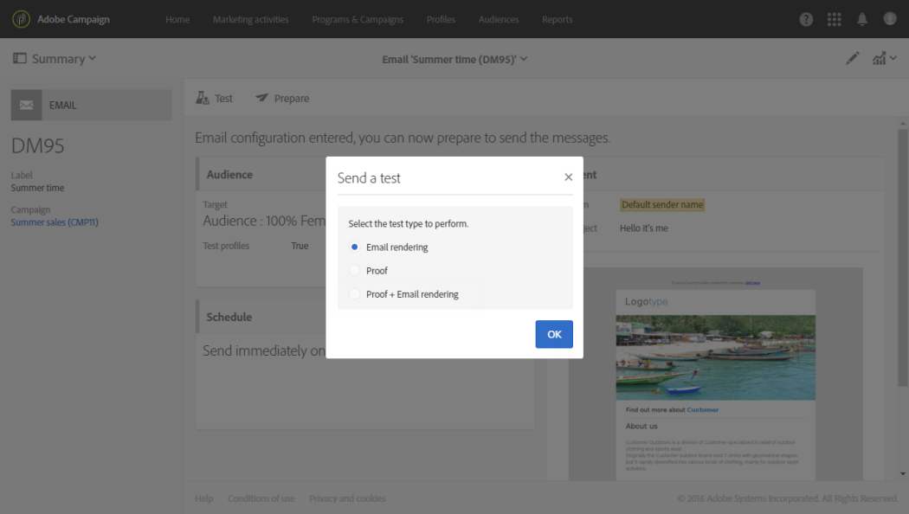

# Email rendering{#email-rendering}

Before hitting the **[!UICONTROL Send]** button, make sure that your message will be displayed in an optimal way on a variety of web clients, web mails and devices.

Para permitir isso, o Adobe Campaign captura a renderização e a torna disponível em um relatório dedicado. Isso permite visualizar a mensagem enviada em um contexto diferente no qual pode ser recebido.

The mobile, messaging and webmail clients available for **Email rendering** in Adobe Campaign are listed on the Litmus [website](https://litmus.com/email-testing) (click **View all email clients**).

## Checking the Email rendering report {#checking-the-email-rendering-report}

Após criar a entrega de email e definir seu conteúdo, bem como a população direcionada, siga as etapas abaixo.

1. Click **Audience** to access the **[!UICONTROL Test profiles]** tab.

   

1. Use the query editor to define the test profiles that you want to use, including the test profiles that are for **Email rendering** use. See [About test profiles](../../sending/using/managing-test-profiles-and-sending-proofs.md#about-test-profiles).

   

1. Verifique e confirme sua consulta e salve suas alterações.
1. Click the **[!UICONTROL Test]** button in the action bar.

   

1. Select the **[!UICONTROL Email rendering]** option then click **[!UICONTROL OK]**.

   

   >[!NOTE]
   >
   >The **[!UICONTROL Proof + Email rendering]** option enables you to send a proof and use the email rendering feature simultaneously. Você pode ter a mensagem aprovada pelos destinatários da prova e ao mesmo tempo, pode testar a forma como a mensagem será recebida dependendo das caixas de entrada direcionadas. Nesse caso, você também precisa selecionar Prova de perfis de teste. See [About test profiles](../../sending/using/managing-test-profiles-and-sending-proofs.md#about-test-profiles).

   A entrega do teste é enviada.

1. As miniaturas de renderização estão disponíveis alguns minutos após o envio das mensagens. To access them, select **[!UICONTROL Proofs]** in the **[!UICONTROL Summary]** drop-down list.

   

1. From the **[!UICONTROL Proofs]** list, click the **[!UICONTROL Access email rendering]** icon.

   

O relatório de renderização de email dedicado é exibido. See [Email rendering report description](../../sending/using/email-rendering.md#email-rendering-report-description).

**Tópicos relacionados**:

* [Criação de um email](../../channels/using/creating-an-email.md)
* [Gerenciamento de perfis de teste e envio de testes](../../sending/using/managing-test-profiles-and-sending-proofs.md)
* [Editor de consultas](../../automating/using/editing-queries.md#about-query-editor)

## Email rendering report description {#email-rendering-report-description}

Este relatório apresenta os renderizações por email conforme aparecem para o destinatário. As execuções por email podem diferir com base na forma como o destinatário abre a entrega de email: em um navegador, em um dispositivo móvel ou por meio de um aplicativo de email.

>[!NOTE]
>
>O número de execuções disponíveis é listado no contrato de licença. Each delivery with **Email rendering** enabled decreases your available renderings (known as tokens) by one. Se você for um cliente Litmus, poderá usar sua própria conta Litmus para fornecer e usar renderização de email no Adobe Campaign. Para obter mais informações, entre em contato com seu executivo de contas da Adobe.

O resumo do relatório apresenta o número de mensagens recebidas, indesejadas (spam), não recebidas ou a recepção pendente.

The report is divided into three parts: **[!UICONTROL Mobile]**, **[!UICONTROL Messaging clients]**, and **[!UICONTROL Webmails]**. Role o relatório para baixo para exibir todos os renderizações agrupados nessas três categorias.

Para obter os detalhes de cada relatório, clique no cartão correspondente. A renderização é exibida para o método de recepção selecionado.

The **[!UICONTROL Technical data]** tab allows you to get more information, such as the receiving and capture dates, and the complete headers of emails.
