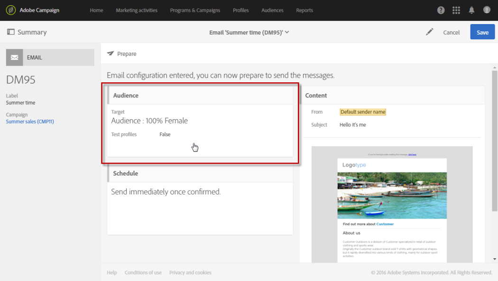

# Renderização de email{#email-rendering}

Before hitting the **[!UICONTROL Send]** button, make sure that your message will be displayed in an optimal way on a variety of web clients, web mails and devices.

Para permitir isso, o Adobe Campaign captura a renderização e a disponibiliza em um relatório dedicado. Isso permite que você visualize a mensagem enviada nos diferentes contextos em que ela pode ser recebida.

The mobile, messaging and webmail clients available for **Email rendering** in Adobe Campaign are listed on the Litmus [website](https://litmus.com/email-testing) (click **View all email clients**).

## Verificando o relatório de renderização de email {#checking-the-email-rendering-report}

Após criar seu delivery de email e definir seu conteúdo, assim como a população alvo, siga as etapas abaixo.

1. Clique em **Público** para acessar a **[!UICONTROL Test profiles]** guia.

   

1. Use o editor de consultas para definir os perfis de teste que deseja usar, incluindo os perfis de teste que são para uso de renderização **por** email. Consulte [Sobre perfis](../../sending/using/managing-test-profiles-and-sending-proofs.md#about-test-profiles)de teste.

   

1. Verifique e confirme sua consulta e salve suas alterações.
1. Clique no **[!UICONTROL Test]** botão na barra de ações.

   

1. Selecione a **[!UICONTROL Email rendering]** opção e clique em **[!UICONTROL OK]**.

   

   >[!NOTE]
   >
   >A **[!UICONTROL Proof + Email rendering]** opção permite enviar uma prova e usar o recurso de renderização de email simultaneamente. Você pode ter sua mensagem aprovada pelos destinatários da prova e, ao mesmo tempo, pode testar a forma como ela será recebida, dependendo das caixas de entrada direcionadas. Nesse caso, também é necessário selecionar perfis de teste de prova. Consulte [Sobre perfis](../../sending/using/managing-test-profiles-and-sending-proofs.md#about-test-profiles)de teste.

   A entrega do teste é enviada.

1. As miniaturas de renderização estão disponíveis alguns minutos após o envio das mensagens. Para acessá-los, selecione **[!UICONTROL Proofs]** na lista **[!UICONTROL Summary]** suspensa.

   

1. Na **[!UICONTROL Proofs]** lista, clique no **[!UICONTROL Access email rendering]** ícone.

   

O relatório de renderização de email dedicado é exibido. Consulte Descrição [do relatório de renderização por](#email-rendering-report-description)email.

**Tópicos relacionados**:

* [Criação de um email](../../channels/using/creating-an-email.md)
* [Gerenciamento de perfis de teste e envio de provas](../../sending/using/managing-test-profiles-and-sending-proofs.md)
* [Editor de consulta](../../automating/using/editing-queries.md#about-query-editor)

## Descrição do relatório de renderização de email {#email-rendering-report-description}

Este relatório apresenta as renderizações por email conforme elas são exibidas ao destinatário. As renderizações por email podem diferir com base em como o destinatário abre a entrega de email: em um navegador, em um dispositivo móvel ou por meio de um aplicativo de email.

>[!NOTE]
>
>O número de renderizações disponíveis está listado em seu contrato de licença. Cada entrega com renderização **** por email ativada diminui as renderizações disponíveis (conhecidas como tokens) em uma. Se você for um cliente Litmus, poderá usar sua própria conta Litmus para provisionar e usar renderização por email no Adobe Campaign. Para saber mais sobre isso, entre em contato com o executivo da sua conta da Adobe.

O resumo do relatório apresenta o número de mensagens recebidas, indesejadas (spam), não recebidas ou recebidas pendentes.

O relatório divide-se em três partes: **[!UICONTROL Mobile]**, **[!UICONTROL Messaging clients]** e **[!UICONTROL Webmails]**. Role para baixo no relatório para exibir todas as renderizações agrupadas nessas três categorias.

Para obter os detalhes de cada relatório, clique no cartão correspondente. A renderização é exibida para o método de recebimento selecionado.

A **[!UICONTROL Technical data]** guia permite obter mais informações, como as datas de recebimento e captura, e os cabeçalhos completos de emails.
