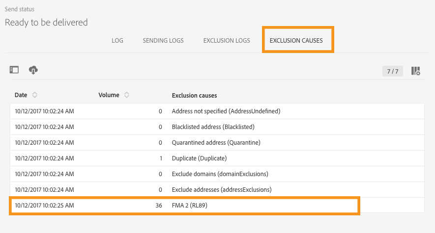

# Regras de fadiga{#fatigue-rules}

## Sobre regras de fadiga {#about-fatigue-rules}

Com as regras de fadiga os profissionais de marketing definem regras comerciais globais entre canais que excluirão automaticamente perfis excessivamente solicitados das campanhas.

Para implementar regras de fadiga, defina um número máximo de mensagens por perfil e selecione um período no qual a regra será aplicada. Durante a preparação do delivery, os perfis são excluídos do delivery, se aplicável, dependendo do número de mensagens já enviadas a eles.

>[!NOTE]
>
>Para que as regras de fadiga sejam aplicadas, é necessário definir uma data de contato para o seu delivery. Se a opção for enviar mensagens imediatamente, a regra de fadiga não é aplicada.

Tópicos relacionados:

* [Preparação](../../administration/using/configuring-email-channel.md#preparation)
* [Gerenciamento de tipologias](../../sending/using/managing-typologies.md)
* [Regras de tipologia](../../sending/using/managing-typology-rules.md)
* [Otimização da frequência de comunicação para evitar a fadiga de contato](https://helpx.adobe.com/br/campaign/kb/simplify-campaign-management.html#Engageyourcustomersateverystep)

## Criação de uma regra de fadiga {#creating-a-fatigue-rule}

Para criar e configurar uma regra de tipologia **[!UICONTROL Fatigue]**, siga estas etapas:

1. Clique no logotipo do Adobe Campaign, no canto superior esquerdo da interface, em seguida, selecione **[!UICONTROL Administration]** > **[!UICONTROL Channels]** > **[!UICONTROL Typologies]** > **[!UICONTROL Typology rules]**.

   

1. Na lista das regras de tipologia, clique em **[!UICONTROL Create]**.

   

1. No campo **[!UICONTROL Rule type]**, selecione **[!UICONTROL Fatigue]**.

   

1. No campo **[!UICONTROL Channel]**, selecione a que canal sua regra será aplicada. Você pode selecionar um único canal (email, SMS, correspondência direta, aplicativo para dispositivos móveis) ou selecionar **[!UICONTROL All channels]**. Consulte [Escolha de canal](#choosing-the-channel).

   

1. Na guia **[!UICONTROL General]**, defina o método para calcular o número máximo de mensagens por perfil. Você pode escolher um limite constante ou uma variável. Também é possível refinar o limite nos perfis e nos deliveries. Para obter mais informações, consulte [Definição de limite](#defining-the-threshold).

   

1. Escolha um **[!UICONTROL Sliding period]** em que a regra de tipologia será aplicada. Para obter mais informações, consulte [Definição do período deslizante](#setting-the-sliding-period).

   

   Neste exemplo (veja as capturas de tela anteriores), optamos por enviar um número máximo de 4 mensagens em um período deslizante de 15 dias.

1. Na guia **[!UICONTROL Application criteria]**, você pode optar por aplicar essa regra a todos os deliveries ou restringir a aplicabilidade da regra de acordo com a mensagem a ser enviada. A regra é executada somente se a condição do aplicativo for atendida. Por exemplo, você pode aplicar a regra somente em mensagens com um rótulo começando por uma determinada palavra ou com uma ID contendo determinadas letras. Consulte [Restrição da aplicabilidade de uma regra de filtragem](../../sending/using/filtering-rules.md#restricting-the-applicability-of-a-filtering-rule).

   

1. Selecione a guia **[!UICONTROL Typologies]** e vincule sua regra de tipologia à tipologia usada para seus deliveries. Consulte [Gerenciamento de tipologias](../../sending/using/managing-typologies.md) e [Regras de tipologia](../../sending/using/managing-typology-rules.md).

   

   >[!NOTE]
   >
   >A tipologia pode ser definida no template do delivery para que seja aplicada automaticamente a todos os deliveries criados usando esse modelo.

Durante a preparação do delivery, os perfis são excluídos do delivery, se aplicável, dependendo do número de deliveries já enviados a eles. Você pode exibir os resultados da execução da regra de fadiga nos logs do delivery. Consulte [Visualização dos resultados de fadiga](#viewing-the-fatigue-results).

>[!IMPORTANT]
>
>Para que as regras de fadiga funcionem, é necessário definir uma data de contato para o seu delivery. Se a opção for enviar mensagens imediatamente, a regra de fadiga não é aplicada.

## Escolha do canal {#choosing-the-channel}

As regras de fadiga estão disponíveis para vários canais. O canal é definido no campo **[!UICONTROL Channel]** das configurações de regra de tipologia. Você pode selecionar um único canal ou selecionar **[!UICONTROL All channels]**.

**Canais disponíveis**

Os seguintes canais estão disponíveis:

* Email
* Móvel (SMS)
* Correspondência direta
* Aplicativo para dispositivos móveis: esse canal permite enviar notificações por push a perfis ou assinantes de aplicativos. Se a opção for enviar notificações a perfis, elas serão compatíveis com as regras de fadiga de vários canais.

   >[!IMPORTANT]
   >
   >As regras de fadiga não são compatíveis com as notificações por push enviadas aos assinantes de aplicativos. Se você estiver enviando mensagens para assinantes de aplicativos, as regras de fadiga não são aplicáveis.

* Todos os canais: essa opção permite aplicar a regra a todos os canais. Por exemplo, você pode decidir enviar no máximo 3 mensagens por mês em qualquer canal. Se você enviou dois emails para um perfil na semana passada e tentar enviar uma notificação por push hoje, o mesmo perfil será excluído.

**Tipos de delivery**

As regras de fadiga são compatíveis com todos os tipos de delivery: deliveries únicos, deliveries recorrentes, deliveries de fluxo de trabalho e mensagens transacionais.

**As mensagens transacionais** podem ser usadas para enviar mensagens de serviço direcionadas a um evento (rtEvent), e mensagens de marketing (perfis segmentados), por exemplo, uma mensagem de remarketing. As regras de fadiga são compatíveis somente com mensagens de marketing (perfis segmentados). As mensagens transacionais de evento não contêm informações sobre perfis, portanto, não são compatíveis com as regras de fadiga (mesmo no caso de um enriquecimento com perfis). Com o suporte de mensagens de marketing em mensagens transacionais, você pode **aplicar uma regra de fadiga a todos os canais, incluindo mensagens transacionais de marketing**.

## Definição de limite {#defining-the-threshold}

Cada regra de fadiga define um limite, ou seja, o número máximo de mensagens que podem ser enviadas para um perfil em um determinado período. Depois que esse limite for atingido, não poderá ocorrer mais deliveries até o final do período considerado. Esse processo permite excluir automaticamente um perfil de um delivery, caso uma mensagem exceder o limite definido, evitando assim um excesso de solicitações.

Os valores do limite podem ser constantes ou variáveis. Isso significa que, para um determinado período, os limites podem variar de um perfil para o outro, ou até mesmo para o mesmo perfil.

**Uso de um limite fixo**

O limite representa o número mais alto de mensagens que podem ser enviadas para um perfil durante o período em questão.

Por padrão, o limite é constante e você precisa indicar um número máximo de mensagens autorizadas pela regra.

**Uso de um limite variável**

Para definir um limite variável, selecione o valor **[!UICONTROL Depends on the recipient]** no campo **[!UICONTROL Threshold type]**.

Depois você tem duas opções:

* selecionar um campo de perfil: o limite varia para cada perfil de acordo com o campo selecionado. Por exemplo, se você tiver estendido o recurso de perfis com um campo &quot;Frequência de comunicação&quot;, clique no botão à direita do campo **[!UICONTROL Threshold computation formula]** e selecione seu campo. Para cada perfil, o limite usa o valor do campo &quot;Frequência de comunicação&quot;.

   

* definir uma fórmula: clique no segundo botão à direita do campo **[!UICONTROL Threshold computation formula]** para definir uma fórmula de cálculo de limite avançada. Por exemplo, você pode indexar o número de mensagens autorizadas de acordo com o segmento ao qual o perfil pertence. Isso significa que um perfil pertencente ao segmento “Web” pode receber mais mensagens do que outros perfis. Uma fórmula do tipo **[!UICONTROL Iif (@origin='Web', 5, 3)]** autoriza o delivery de 5 mensagens para perfis do segmento da Web e 3 para outros segmentos.

   

**Refinamento do limite em perfis e deliveries**

Por padrão, todas as mensagens são consideradas para o cálculo do limite. Marque a caixa **[!UICONTROL Refine Threshold on profiles and deliveries]** para filtrar os perfis e os deliveries a serem contados na preparação do delivery.

No exemplo a seguir, somente perfis do sexo masculino são contados e somente deliveries com um rótulo começando com **Informativos** são contados.

Refinar o limite em deliveries é diferente de restringir a aplicabilidade da regra inteira (guia **[!UICONTROL Application criteria]** ):

* **[!UICONTROL Application criteria]**: você escolhe executar a regra ou não, de acordo com critérios específicos. Por exemplo, se a condição do aplicativo for &quot;Rótulo começa com Informativo&quot;, a regra será aplicada somente a deliveries que respeitem essa condição. Se o rótulo do delivery começa com &quot;Promoção&quot;, a regra não será executada.
* **[!UICONTROL Refine threshold on profiles and deliveries > Deliveries to count]**: todos os deliveries que usam essa regra de tipologia executarão a regra, mas você decide, entre os deliveries anteriores e programados, quais deles deseja contar. Por exemplo, se a sua restrição for &quot;Rótulo começa com Informativo&quot;, a regra será executada mesmo que o rótulo do delivery comece com &quot;Promo&quot;. Ela contará, durante o período deslizante selecionado, o número de deliveries cujo rótulo começa com &quot;Informativo&quot;.

## Definir o período deslizante {#setting-the-sliding-period}

As regras de fadiga são definidas em períodos móveis de n dias. O período é configurado na seção **[!UICONTROL Sliding period]**, por exemplo, 2 semanas, 7 dias ou 5 horas.

Quando a regra é executada, os deliveries passados e os deliveries programados são considerados. Isso garante que, em um determinado período deslizante, o limite nunca seja ultrapassado.

Por exemplo, se você definir um período de 48 horas, o sistema procura 48 horas **antes da data do contato** e 48 horas **após a data do contato**. Portanto, o período selecionado é dobrado para permitir a integração de deliveries futuros, bem como os anteriores.

Para restringir os deliveries considerados para um período de 2 semanas, insira **Dia** e **7** ou 1 semana na seção **Período deslizante**. São considerados no cálculos os deliveries enviados até 7 dias antes da data do delivery, e programados até 7 dias após a data do delivery na qual a regra é aplicada.

## Visualização dos resultados de fadiga {#viewing-the-fatigue-results}

Durante a preparação do delivery, os perfis são excluídos do delivery, se aplicável, dependendo do número de deliveries já enviados a eles. Para visualizar os resultados de execução da regra de fadiga, clique no botão no canto inferior direito do bloco **[!UICONTROL Deployment]**.

Três guias estão disponíveis, mostrando os detalhes dos resultados da execução de fadiga, incluindo o nome da regra que foi aplicada:

* Logs do delivery:

   

* Logs de exclusão:

   

* Causas de exclusão:

   

## Visualização do relatório resumido da regra de fadiga {#viewing-the-fatigue-rule-summary-report}

O Adobe Campaign apresenta um relatório dedicado sobre regras de fadiga para ajudar você a entender como elas são aplicadas às suas campanhas. Dessa forma, você sabe como suas campanhas afetam umas às outras e pode fazer os ajustes corretos.

O relatório **[!UICONTROL Fatigue rules summary]** pode ser acessado pelo botão **[!UICONTROL Reports]**, no canto superior direito de cada programa, campanha e mensagem.

Na parte esquerda da tela, é possível filtrar os dados do relatório na data de contato dos deliveries. Por padrão, o período selecionado começa 15 dias antes da data atual e termina 15 dias depois. Também é possível filtrar por uma regra de fadiga específica.

O gráfico de pizza exibe as seguintes informações sobre o período selecionado:

* **[!UICONTROL Total targeted]**: o público alvo total antes da preparação da mensagem
* **[!UICONTROL Excluded]**: o número total de exclusões devido à aplicação da regra de fadiga
* **[!UICONTROL Other exclusions]**: o número total de exclusões devido a outras regras de tipologia
* **[!UICONTROL To deliver]**: o número total de mensagens que serão entregues após a preparação da mensagem ( **[!UICONTROL To deliver]** = **[!UICONTROL Total targeted]** - **[!UICONTROL Excluded]** - **[!UICONTROL Other exclusions]** )

À direita do gráfico, encontra-se o número de exclusões detalhadas pela regra de fadiga.

A tabela inferior exibe todos os deliveries dentro do período selecionado. Para cada delivery, é possível ver as regras de fadiga que foram aplicadas e as exclusões correspondentes. Deliveries que não têm data de contato também são exibidos na tabela.

* **[!UICONTROL 0]** significa que a regra de fadiga foi aplicada, mas não houve exclusão.
* **[!UICONTROL -N]** significa que ocorreram N exclusões.
* Um campo vazio significa que a regra de fadiga não foi aplicada.

>[!NOTE]
>
>Os dados exibidos não são contextuais ao programa, mensagem ou campanha a partir do(a) qual você acessa o relatório. Esse relatório exibe todas as regras de fadiga e deliveries para todas as unidades organizacionais. Ele permite uma visualização global de todos os deliveries para entender como suas campanhas são influenciadas por outras.

## Exemplos {#examples}

Há muitas possibilidades em termos de implementação de gestão da fadiga. Estes são alguns exemplos do que é possível fazer:

* Criar uma regra de fadiga usando um **limite constante** que se aplique a **todos os canais**:

   Digamos que você crie uma regra multicanal, com um limite constante de 3 durante um período deslizante de 7 dias.

   Na semana passada, seus perfis premium receberam um email promocional e um email de remarketing transacional. Você também programou que um SMS seja enviado na semana que vem. Hoje, você decide enviar uma notificação por push direcionada a todos os seus perfis. Os perfis premium serão excluídos da notificação por push de hoje, pois o número máximo de mensagens em um período de 2 semanas já foi atingido.

   

* Crie uma regra de fadiga usando um **limite variável** com base em um **campo de perfil**:

   Você estendeu o recurso dos perfis com um campo &quot;Limite de comunicação&quot; para definir um limite diferente para cada perfil. Na regra de fadiga, defina um limite variável com base nesse campo e selecione um período deslizante de 2 dias. Vejamos dois exemplos de perfis: João tem um limite de comunicação de 1, e Pedro tem um limite de 2. Ambos já receberam um email informativo ontem. Você decide enviar outro email para eles hoje. Somente Pedro o receberá, porque João foi excluído do público-alvo.

   

* Criar uma regra de fadiga usando uma **fórmula de cálculo de limite**:

   Você deseja alterar o limite de acordo com a idade dos perfis. Se um perfil estiver abaixo de 40, você deseja definir um limite de 4, e para perfis mais maduros, um limite de 2. Em vez de definir esse limite para cada perfil com um campo estendido, você pode criar uma fórmula diretamente na regra de fadiga para calcular o limite de acordo com a idade dos perfis. Em nosso exemplo, a fórmula seria **[!UICONTROL Iif (@age<40, 4, 2)]**.

   

   >[!NOTE]
   >
   >Esta seção também inclui um exemplo passo a passo de uma regra de fadiga usando uma fórmula de cálculo de limite.

* Criar uma regra de fadiga que **refine o limite** em perfis e deliveries:

   Você estendeu o recurso dos perfis com um campo &quot;Score&quot;, e também estendeu o recurso dos deliveries com um campo &quot;Type&quot;. Você deseja definir um limite constante de 3, mas excluir da contagem todos os deliveries do tipo “Alerta” ou “Black Friday” e todos os perfis com uma pontuação maior que 10. Quando a regra for executada, ela contará, entre os deliveries anteriores e programados, todos os deliveries que não sejam do tipo “Alerta” ou “Black Friday” enviados para perfis cuja pontuação seja menor que 10.

   

Este é um exemplo passo a passo de uma regra de fadiga usando uma fórmula de cálculo de limite.

Neste caso de uso, queremos criar uma regra de tipologia para evitar o delivery de mais de 2 mensagens por semana para perfis premium e 2 mensagens por semana para perfis padrão.

Para identificar clientes e clientes potenciais, estendemos o recurso dos perfis com o campo **[!UICONTROL Status]**, que contém 0 para perfis premium e 1 para perfis padrão.

Para criar a regra, aplique as seguintes etapas:

1. Criar uma nova regra de tipologia do tipo **Fadiga**.
1. Na seção **[!UICONTROL Threshold]**, queremos criar uma fórmula para calcular o limite dependendo de cada perfil. Selecione o valor **[!UICONTROL Depends on the recipient]** no campo **[!UICONTROL Threshold type]**, e clique no ícone no segundo botão à direita do campo **[!UICONTROL Threshold computation formula]**.

   

1. Na seção **[!UICONTROL List of functions]**, clique duas vezes na função **Iif** no nó **[!UICONTROL Others]**.

   

1. Em seguida, selecione o **Status** do perfil na seção **[!UICONTROL Available fields]**.

   

1. Insira os valores desejados para criar a seguinte fórmula: **Iif(@status=0,2,4)**

   

   Essa fórmula permite atribuir o valor 2 se o status for igual a 0, e o valor 4 para todos os outros status.

1. Clique em **[!UICONTROL Confirm]** para aprovar a fórmula.
1. Indique o **[!UICONTROL Sliding period]** em que a regra será aplicada: 7 dias, neste caso, para restringir os deliveries considerados para um período de 2 semanas.

   

1. Agora, vincule a regra que acabou de criar a uma tipologia para aplicá-la aos deliveries. Para fazer isso, selecione a guia **[!UICONTROL Typologies]**, clique em **[!UICONTROL Create element]** e selecione a tipologia usada para os seus deliveries.

   

1. Salve a regra para aprovar a criação.

A regra será aplicada a todos os deliveries com base na tipologia.
