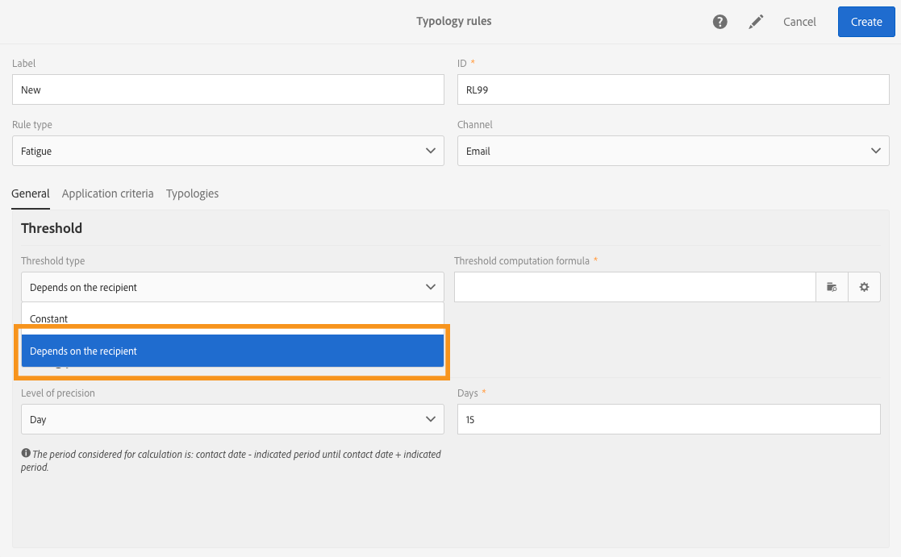

# Regras de esgotamento{#fatigue-rules}

## Sobre regras de fadiga {#about-fatigue-rules}

As regras de fadiga permitem que os comerciantes definam regras comerciais globais entre canais que excluirão automaticamente perfis excessivamente solicitados do campanha.

Para implementar regras de fadiga, defina um número máximo de mensagens por perfil e selecione um período no qual a regra será aplicada. Durante a preparação do delivery, os perfis são excluídos do delivery, se aplicável, dependendo do número de mensagens já enviadas a eles.

>[!NOTE]
>
>Para que as regras de fadiga sejam aplicadas, é necessário definir uma data de contato para o seu delivery. Se você optar por enviar mensagens imediatamente, a regra de fadiga não será aplicada.

Tópicos relacionados:

* [Preparação](../../administration/using/configuring-email-channel.md#preparation)
* [Gerenciamento de tipologias](../../sending/using/managing-typologies.md)
* [Regras de tipologia](../../sending/using/managing-typology-rules.md)
* [Otimizar a frequência de comunicação para evitar a fadiga de contato](https://helpx.adobe.com/campaign/kb/simplify-campaign-management.html#Engageyourcustomersateverystep)

## Creating a fatigue rule {#creating-a-fatigue-rule}

Para criar e configurar uma regra de tipologia **[!UICONTROL Fatigue]**, siga estas etapas:

1. Clique no logotipo Adobe Campaign, no canto superior esquerdo da interface, em seguida, selecione **[!UICONTROL Administration]** > **[!UICONTROL Channels]** > **[!UICONTROL Typologies]** > **[!UICONTROL Typology rules]**.

   

1. Na lista do regra de tipologia, clique em **[!UICONTROL Create]**.

   

1. No **[!UICONTROL Rule type]** campo, selecione **[!UICONTROL Fatigue]**.

   

1. No **[!UICONTROL Channel]** campo, selecione a que canal sua regra será aplicada. Você pode selecionar um único canal (email, SMS, mala direta, aplicativo móvel) ou selecionar **[!UICONTROL All channels]**. Consulte [Escolhendo o canal](#choosing-the-channel).

   

1. Na **[!UICONTROL General]** guia, defina o método para calcular o número máximo de mensagens por perfil. Você pode escolher um limite constante ou uma variável. Você também pode refinar o limite em perfis e delivery. For more on this, refer to [Defining the threshold](#defining-the-threshold).

   

1. Escolha um **[!UICONTROL Sliding period]** em que a regra de tipologia será aplicada. For more on this, refer to [Setting the sliding period](#setting-the-sliding-period).

   

   Neste exemplo (veja as capturas de tela anteriores), optamos por enviar um número máximo de 4 mensagens em um período deslizante de 15 dias.

1. Na **[!UICONTROL Application criteria]** guia, você pode optar por aplicar essa regra a todos os delivery ou restringir a aplicabilidade da regra de acordo com a mensagem a ser enviada. A regra só será executada se a condição do aplicativo for atendida. Por exemplo, você pode aplicar a regra somente em mensagens com um rótulo começando por uma determinada palavra ou com uma ID contendo determinadas letras. Consulte [Limitação da aplicabilidade de uma regra](../../sending/using/filtering-rules.md#restricting-the-applicability-of-a-filtering-rule)de filtragem.

   

1. Selecione a **[!UICONTROL Typologies]** guia e vincule sua regra de tipologia à tipologia usada para seus delivery. Consulte [Gerenciamento de tipologias](../../sending/using/about-typology-rules.md#managing-typologies) e [Regras de tipologia](../../sending/using/about-typology-rules.md#typology-rules).

   

   >[!NOTE]
   >
   >A tipologia poderá ser definida no template de delivery para ser aplicada automaticamente a todos os deliveries criados usando esse template.

Durante a preparação do delivery, os perfis são excluídos do delivery, se aplicável, dependendo do número de delivery já enviados para eles. Você pode visualização os resultados da execução da regra de fadiga nos logs do delivery. Consulte [Visualização dos resultados](#viewing-the-fatigue-results)de fadiga.

>[!IMPORTANT]
>
>Para que as regras de fadiga funcionem, é necessário definir uma data de contato para o seu delivery. Se você optar por enviar mensagens imediatamente, a regra de fadiga não será aplicada.

## Como escolher o canal {#choosing-the-channel}

As regras de fadiga estão disponíveis para vários canais. O canal é definido no **[!UICONTROL Channel]** campo das configurações de regra de tipologia. Você pode selecionar um único canal ou selecionar **[!UICONTROL All channels]**.

**canais disponíveis**

Os seguintes canais estão disponíveis:

* Email
* Móvel (SMS)
* Correspondência direta
* Aplicativo móvel: este canal permite enviar notificações por push a perfis ou assinantes de aplicativos. Se você optar por enviar notificações a perfis, elas serão compatíveis com as regras de fadiga de vários canais.

   >[!IMPORTANT]
   >
   >As regras de fadiga não são compatíveis com as notificações por push enviadas aos assinantes do aplicativo. Se você estiver enviando mensagens para assinantes do aplicativo, as regras de fadiga não se aplicarão.

* Todos os canais: essa opção permite que você aplique a regra a todos os canais. Por exemplo, você pode decidir enviar no máximo 3 mensagens por mês em qualquer canal. Se você enviou dois emails para um perfil na semana passada e tentar enviar uma notificação por push hoje, o mesmo perfil será excluído.

**Tipos de Delivery**

As regras de esgotamento são compatíveis com todos os tipos de delivery: delivery de uma só vez, delivery recorrentes, delivery de fluxo de trabalho e mensagens transacionais.

**As mensagens** transacionais podem ser usadas para enviar mensagens de serviço direcionadas a um evento (rtEvent), bem como mensagens de marketing (perfis de direcionamento), por exemplo, uma mensagem de remarketing. As regras de fadiga são compatíveis apenas com mensagens de marketing (perfis de definição de metas). Os mensagens transacionais Eventos não contêm informações sobre perfis, portanto, não são compatíveis com as regras de fadiga (mesmo no caso de um enriquecimento com perfis). Com o suporte de mensagens de marketing em mensagens transacionais, você pode **aplicar uma regra de fadiga a todos os canais, incluindo mensagens transacionais** de marketing.

## Definição do limite {#defining-the-threshold}

Cada regra de fadiga define um limite, ou seja, o número máximo de mensagens que podem ser enviadas para um perfil em um determinado período. Depois que esse limite for atingido, não poderá ocorrer mais deliveries até que o final do período seja considerado. Esse processo permite que você exclua automaticamente um perfil de um delivery se uma mensagem exceder o limite definido, evitando assim a solicitação excessiva.

Os valores de limite podem ser constantes ou variáveis. Isso significa que, para um determinado período, os limites podem variar de um perfil para outro, ou mesmo para o mesmo perfil.

**Uso de um limite de correção**

O limite representa o maior número de mensagens que podem ser enviadas a um perfil durante o período em questão.

Por padrão, o limite é constante e você precisa indicar um número máximo de mensagens autorizadas pela regra.

**Uso de um limite de variável**

Para definir um limite de variável, selecione o **[!UICONTROL Depends on the recipient]** valor no **[!UICONTROL Threshold type]** campo.

Em seguida, você tem duas opções:

* selecione um campo de perfil: o limite variará para cada perfil de acordo com o campo selecionado. Por exemplo, se você tiver estendido o recurso de perfis com um campo &quot;Frequência de comunicação&quot;, clique no botão à direita do **[!UICONTROL Threshold computation formula]** campo e selecione seu campo. Para cada perfil, o limiar terá o valor do campo &quot;Frequência de comunicação&quot;.

   

* defina uma fórmula: clique no segundo botão à direita do **[!UICONTROL Threshold computation formula]** campo para definir uma fórmula de cálculo de limite avançada. Por exemplo, você pode indexar o número de mensagens autorizadas de acordo com o segmento ao qual o perfil pertence. Isso significa que um perfil pertencente ao segmento &#39;Web&#39; pode receber mais mensagens do que outros perfis. Uma fórmula de **[!UICONTROL Iif (@origin='Web', 5, 3)]** tipo autoriza o delivery de 5 mensagens para perfis do segmento da Web e 3 para outros segmentos.

   

**Refinar o limite em perfis e delivery**

Por padrão, todas as mensagens são consideradas para o cálculo do limite. Marque a **[!UICONTROL Refine Threshold on profiles and deliveries]** caixa para filtrar os perfis e delivery a serem contados ao preparar o delivery.

No exemplo a seguir, somente perfis machos são contados e somente delivery com um rótulo começando com **Newsletters** são contados.

Refinar o limite em delivery é diferente de restringir a aplicabilidade da regra inteira ( **[!UICONTROL Application criteria]** guia):

* **[!UICONTROL Application criteria]**: você escolhe executar a regra ou não de acordo com critérios específicos. Por exemplo, se a condição do aplicativo for &quot;Etiqueta de start com boletim informativo&quot;, a regra será aplicada somente a delivery que respeitam essa condição. Se o delivery rotular start com &quot;Promoção&quot;, a regra não será executada.
* **[!UICONTROL Refine threshold on profiles and deliveries > Deliveries to count]**: todos os delivery que usam essa regra de tipologia executarão a regra, mas você decide, entre os delivery anteriores e programados, quais deseja contar. Por exemplo, se a sua restrição for &quot;Etiquetar start com boletim informativo&quot;, a regra será executada mesmo se o rótulo do delivery start com &quot;Promo&quot;. Contará, durante o período deslizante selecionado, o número de delivery cujo rótulo start com &quot;Newsletter&quot;.

## Setting the sliding period {#setting-the-sliding-period}

As regras de fadiga são definidas em períodos flexíveis de n dias. O período é configurado na **[!UICONTROL Sliding period]** seção, por exemplo, 2 semanas, 7 dias ou 5 horas.

Quando a regra é executada, delivery passados e delivery agendados são considerados. Isto garante que, num determinado período de deslizamento, o limiar nunca seja ultrapassado.

Por exemplo, se você definir um período de 48 horas, o sistema terá uma aparência de 48 horas **antes da data** do contato e 48 horas **após a data** do contato. Assim, o período selecionado é dobrado para permitir a integração de delivery futuros e anteriores.

Para restringir os delivery considerados para um período de 2 semanas, informe **Dia** e **7** ou 1 semana na seção Período **** deslizante. Os Delivery enviados até 7 dias antes da data do delivery e agendados até 7 dias após a data do delivery em que a regra é aplicada serão tidos em conta no cálculo.

## Visualização dos resultados da fadiga {#viewing-the-fatigue-results}

Durante a preparação do delivery, os perfis são excluídos do delivery, se aplicável, dependendo do número de delivery já enviados para eles. Para visualização dos resultados de execução da regra de fadiga, clique no botão no canto inferior direito do **[!UICONTROL Deployment]** bloco.

Três guias estão disponíveis, mostrando os detalhes dos resultados da execução de fadiga, incluindo o nome da regra que se aplica:

* Logs do delivery:

   

* Logs de exclusão:

   

* Causas de exclusão:

   

## Exibindo o relatório resumido da regra de fadiga {#viewing-the-fatigue-rule-summary-report}

O Adobe Campaign apresenta um relatório dedicado sobre regras de fadiga para ajudá-lo a entender como elas são aplicadas às suas campanhas. Isso permite que você saiba como suas campanhas impactam umas às outras e faça os ajustes corretos.

O **[!UICONTROL Fatigue rules summary]** relatório pode ser acessado a partir do **[!UICONTROL Reports]** botão, no canto superior direito de cada programa, campanha e mensagem.

Na parte esquerda da tela, você pode filtrar os dados do relatório na data de contato do delivery. Por padrão, o período selecionado start 15 dias antes da data atual e termina 15 dias depois. Você também pode filtrar por uma regra de fadiga específica.

O gráfico setorial exibe as seguintes informações sobre o período selecionado:

* **[!UICONTROL Total targeted]**: o público alvo total antes da preparação da mensagem
* **[!UICONTROL Excluded]**: o número total de exclusões devido à aplicação da regra de fadiga
* **[!UICONTROL Other exclusions]**: o número total de exclusões devidas a outras regras de tipologia
* **[!UICONTROL To deliver]**: o número total de mensagens a entregar após a preparação da mensagem ( **[!UICONTROL To deliver]** = **[!UICONTROL Total targeted]** - **[!UICONTROL Excluded]** - **[!UICONTROL Other exclusions]** )

À direita do gráfico, você encontrará o número de exclusões, detalhadas pela regra de fadiga.

A tabela inferior exibe todos os delivery dentro do período selecionado. Para cada delivery, você pode ver as regras de fadiga que se aplicaram e as exclusões correspondentes. Delivery que não têm data de contato também são exibidos na tabela.

* **[!UICONTROL 0]** significa que a regra da fadiga se aplica, mas não houve exclusão.
* **[!UICONTROL -N]** significa que ocorreram N exclusões.
* um campo vazio significa que a regra de fadiga não se aplica.

>[!NOTE]
>
>Os dados exibidos não são contextuais ao programa, mensagem ou campanha a partir da qual você acessa o relatório. Este relatório exibe todas as regras e delivery de fadiga para todas as unidades organizacionais. Isso permite obter uma visualização global de todos os delivery para entender como suas campanhas são influenciadas por outros.

## Exemplos {#examples}

Há muitas possibilidades em termos de implementação da gestão da fadiga. Estes são alguns exemplos do que você pode fazer:

* Crie uma regra de fadiga usando um limite **** constante que se aplica a **todos os canais**:

   Digamos que você crie uma regra com vários canais, com um limite constante de 3 durante um período deslizante de 7 dias.

   Na semana passada, seus perfis premium receberam um email promocional e um email transacional de remarketing. Você também agendou um SMS que será enviado na semana que vem. Hoje, você decide enviar uma notificação por push direcionando todos os seus perfis. Os perfis premium serão excluídos do push de hoje porque seu número máximo de mensagens em um período de 2 semanas já foi atingido.

   

* Crie uma regra de fadiga usando um limite **de** variável com base em um campo **de** perfil:

   Você estendeu o recurso perfis com um campo &quot;Limite de comunicação&quot; para definir um limite diferente para cada perfil. Na regra de fadiga, defina um limite de variável com base nesse campo e selecione um período deslizante de 2 dias. Vejamos dois exemplos de perfis: John tem um limite de comunicação de 1 e David tem um limite de 2. Ambos já receberam um email com newsletter ontem. Você decide enviar outro email para eles hoje. Só o David o receberá, porque o John foi excluído do público alvo.

   

* Crie uma regra de fadiga usando uma fórmula **de cálculo de** limite:

   Você deseja alterar o limite de acordo com a idade dos perfis. Se um perfil estiver abaixo de 40, você deseja definir um limite de 4 e para perfis mais antigos, um limite de 2. Em vez de definir esse limite para cada perfil com um campo estendido, você pode criar uma fórmula diretamente na regra de fadiga para calcular o limite de acordo com a idade dos perfis. Em nosso exemplo, a fórmula seria **[!UICONTROL Iif (@age<40, 4, 2)]**.

   

   >[!NOTE]
   >
   >Esta seção também inclui um exemplo passo a passo de uma regra de fadiga usando uma fórmula de cálculo de limite.

* Crie uma regra de fadiga que **refina o limite** em perfis e delivery:

   Você estendeu o recurso perfis com um campo &quot;Pontuação&quot; e também estendeu o recurso delivery com um campo &quot;Tipo&quot;. Você deseja definir um limite constante de 3, mas deseja excluir da contagem todos os delivery do tipo &#39;Alerta&#39; ou &#39;Sexta-feira negra&#39; e todos os perfis com uma pontuação maior que 10. Quando a regra for executada, ela contará, entre os delivery anteriores e programados, todos os delivery que não sejam do tipo &#39;Alerta&#39; ou &#39;Sexta-feira negra&#39; enviados para perfis cuja pontuação seja menor que 10.

   

Este é um exemplo passo a passo de uma regra de fadiga usando uma fórmula de cálculo de limite.

Nesse caso de uso, queremos criar uma regra de tipologia para evitar o delivery de mais de 2 mensagens por semana para perfis premium e 2 mensagens por semana para perfis padrão.

Para identificar clientes e prospectos, estendemos o recurso perfis com o **[!UICONTROL Status]** campo, que contém 0 para perfis premium e 1 para perfis padrão.

Para criar a regra, aplique as seguintes etapas:

1. Create a new **Fatigue** type typology rule.
1. Na **[!UICONTROL Threshold]** seção, queremos criar uma fórmula para calcular o limite dependendo de cada perfil. Selecione o **[!UICONTROL Depends on the recipient]** valor no **[!UICONTROL Threshold type]** campo e clique no ícone no segundo botão à direita do **[!UICONTROL Threshold computation formula]** campo.

   

1. Na **[!UICONTROL List of functions]** seção, clique com o botão duplo na função **Iif** no **[!UICONTROL Others]** nó.

   

1. Then select the profile&#39;s **Status** in the **[!UICONTROL Available fields]** section.

   

1. Insira os valores desejados para criar a seguinte fórmula: **Iif(@status=0,2,4)**

   

   Essa fórmula permite atribuir o valor 2 se o status for igual a 0, e o valor 4 para todos os outros status.

1. Clique em **[!UICONTROL Confirm]** para aprovar a fórmula.
1. Indique a regra **[!UICONTROL Sliding period]** em que será aplicada: 7 dias, neste caso, para restringir os delivery tidos em conta a um período de 2 semanas.

   

1. Agora, vincule a regra que você acabou de criar a uma tipologia para aplicá-la aos seus delivery. Para fazer isso, selecione a **[!UICONTROL Typologies]** guia, clique **[!UICONTROL Create element]** e selecione a tipologia usada para seus delivery.

   

1. Salve a regra para aprovar a criação.

A regra será aplicada a todos os delivery com base na tipologia.
