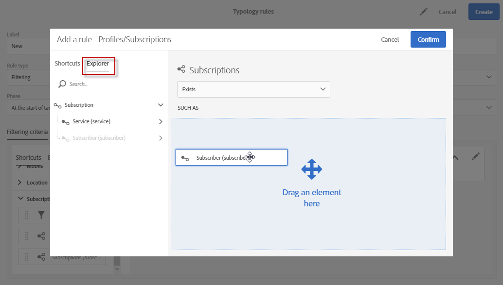

# Regras de filtragem {#filtering-rules}

As regras de filtragem permitem excluir uma parte do público alvo de mensagens de acordo com critérios definidos em um query, como perfis em quarentena ou perfis que já receberam um determinado número de emails.

## regras de tipologia de filtragem padrão {#default-filtering-typology-rules}

A tabela abaixo fornece informações sobre regras de filtragem predefinidas, bem como seus canais relacionados.

| Rótulo | Canal | Descrição |
---------|----------|---------|---------
| **[!UICONTROL Address not specified]** | Todos | Exclui a população do público alvo sem endereço especificado (email, endereço postal etc.) de acordo com o canal selecionado). |
| **[!UICONTROL Blacklisted address]** | Todos | Exclui endereços incluído na blacklist. |
| **[!UICONTROL Duplicate]** | Todos | Exclui duplicados com base no **[!UICONTROL Address]** campo da população do público alvo. |
| **[!UICONTROL Exclude mobile applications]** | Aplicativo móvel | Exclui subscrições de aplicativo que não correspondem ao aplicativo móvel definido na mensagem. |
| **[!UICONTROL Exclude mobile applications for In-App]** | No aplicativo | Exclui subscrições de aplicativo que não correspondem ao aplicativo móvel definido na mensagem (modelo no aplicativo). |
| **[!UICONTROL Exclude mobile applications for In-App broadcast]** | No aplicativo | Exclui subscrições de aplicativo que não correspondem ao aplicativo móvel definido na mensagem (modelo de transmissão no aplicativo) |
| **[!UICONTROL Exclude mobile applications for Push]** | Aplicativo móvel | Exclui subscrições de aplicativo que não correspondem ao aplicativo móvel definido na mensagem (para push) |
| **[!UICONTROL Quarantined address]** | Todos | Exclui endereços em quarentena. |
| **[!UICONTROL Target limited in size]** | Todos | Verifica se o tamanho máximo do delivery foi atingido para o público alvo. Aplica-se a delivery de mala direta com a opção &quot;limite do delivery&quot; ativada. |

Além dessas regras de filtragem padrão, duas regras de exclusão estão disponíveis:

* **[!UICONTROL Exclusion of addresses]** ( **[!UICONTROL addressExclusions]** )
* **[!UICONTROL Exclusion of domains]** ( **[!UICONTROL domainExclusions]** ).

Durante a análise de e-mail, essas regras comparam os endereços de e-mail do recipient com os endereços proibidos ou nomes de domínio contidos em uma lista de supressão global criptografada gerenciada na instância de entrega. Se houver algum positivo, a mensagem não será enviada para esse recipient.

Isso é para evitar a inclusão na blacklist devido a atividades mal-intencionadas, especialmente o uso de um Spamtrap. Por exemplo, se um Spamtrap for usado para se inscrever em um dos seus formulários Web, um e-mail de confirmação será enviado automaticamente para esse Spamtrap e isso resultará no endereço utilizado sendo automaticamente incluído na blacklist.

>[!NOTE]
>
>Os endereços e os nomes de domínio contidos na lista de supressão global estão ocultos. Somente o número de recipients excluídos é indicado nos logs de análise de delivery.

## Criando uma regra de filtragem {#creating-a-filtering-rule}

Você pode criar suas próprias regras de filtragem de acordo com suas necessidades. Por exemplo, você pode filtrar a população de públicos alvos dos boletins informativos para que os assinantes com menos de 18 anos nunca recebam comunicações.

Para criar uma regra de tipologia de filtragem, siga estas etapas:

1. Crie uma nova regra de tipologia. As etapas principais para criar regras de tipologia estão detalhadas [nesta seção](../../sending/using/managing-typology-rules.md).

1. Selecione o tipo de **[!UICONTROL Filtering]** regra e especifique o canal desejado.

1. Na guia Critérios **[!UICONTROde filtragem]** sL, selecione as subscrições na **[!UICONTROL Subscription]** categoria.

   

1. Na **[!UICONTROL Explorer]** guia do editor de query, arraste e solte o **[!UICONTROL Subscriber]** nó na parte principal da tela.

   

1. Selecione o **[!UICONTROL Age]** campo e defina as condições de filtragem para que a idade dos assinantes seja 18 ou superior.

   

1. In the **[!UICONTROL Typologies]** tab, link this rule to a typology.

   

1. Verifique se a tipologia está selecionada no delivery ou template do delivery que você deseja usar. Para obter mais informações, consulte [esta seção](../../sending/using/managing-typologies.md#applying-typologies-to-messages).

   

Sempre que esta regra for usada em uma mensagem, os assinantes considerados menores serão automaticamente excluídos.

## Configuração do contexto de definição de metas das regras de filtragem {#configuring-filtering-rules-targeting-context}

O Campaign Standard permite configurar as dimensões **de Definição de metas** e **Filtragem** para usar, dependendo dos dados que você deseja público alvo.

Para fazer isso, abra as propriedades do regra de tipologia e acesse a **[!UICONTROL Advanced information]** seção.

Por padrão, a filtragem é realizada no **[!UICONTROL Profiles]**. Por exemplo, se a regra for direcionada para um aplicativo móvel, a regra **[!UICONTROL Filtering dimension]** pode ser alterada para **[!UICONTROL Subscriptions to an application]**.

## Restrição da aplicabilidade de uma regra de filtragem {#restricting-the-applicability-of-a-filtering-rule}

Você pode restringir a aplicabilidade de uma regra de filtragem de acordo com a mensagem a ser enviada.

1. Na guia regra de tipologia, desmarque a opção **[!UICONTROL Application criteria]** **[!UICONTROL Apply the rule on all deliveries]** , que está ativada por padrão.

   

1. Use o editor de query para definir um filtro. Por exemplo, você pode aplicar a regra somente em mensagens cujo rótulo start com uma determinada palavra ou cuja ID contenha determinadas letras.

   

Nesse caso, a regra é aplicada somente às mensagens que correspondem aos critérios definidos.
