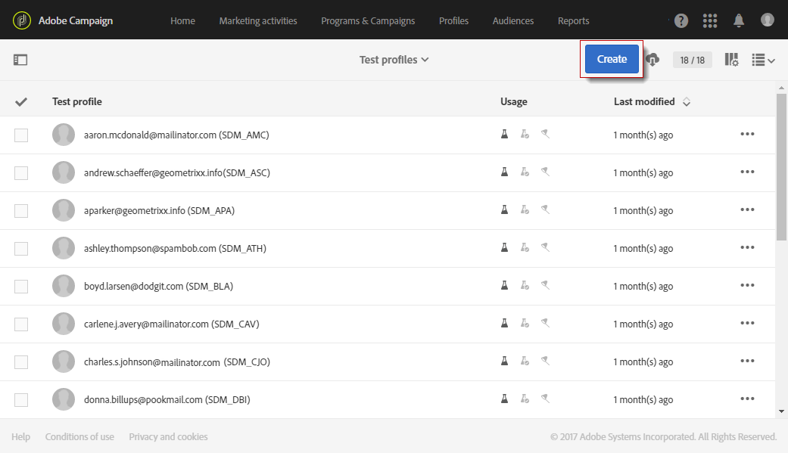

# Gerenciamento de perfis de teste e envio de provas{#managing-test-profiles-and-sending-proofs}

## Sobre perfis de teste {#about-test-profiles}

Os perfis de teste permitem direcionar destinatários adicionais que não correspondem aos critérios de definição de metas definidos. Eles são adicionados ao público-alvo de uma mensagem para detectar qualquer uso fraudulento do banco de dados do destinatário ou para garantir que os e-mails cheguem às caixas de entrada.

Você pode gerenciar seus perfis de teste no menu avançado **[!UICONTROL Profiles & audiences > Test profiles]**.

Um perfil de teste contém informações de contato fictícias, ou informações de contato controladas pelo remetente, que podem ser usadas em uma mensagem nos seguintes contextos:

* Para enviar **provas**: a Prova é uma mensagem específica usada para verificar a mensagem antes de enviar a entrega finalizada para os destinatários. Um perfil de teste de prova é responsável pela verificação da entrega, no que diz respeito ao seu conteúdo e formato. Consulte [Enviar provas](#sending-proofs).
* Para renderização **por** email: o perfil de teste de renderização de email é usado para verificar a maneira como uma mensagem é exibida de acordo com a caixa de entrada de mensagem que a recebe. Por exemplo, webmail, serviço de mensagens, celular etc. Consulte Renderização [por](../../sending/using/email-rendering.md)email.

   O uso de renderização **por** email é somente leitura. Os perfis de teste com esse uso só estão disponíveis prontamente no Adobe Campaign.

* Como uma **armadilha**: a mensagem é enviada para o perfil de teste da mesma forma que é enviada para o destino principal. Consulte [Uso de armadilhas](#using-traps).
* Para **visualizar** mensagens: um perfil de teste pode ser selecionado ao visualizar uma mensagem para testar os elementos de personalização. Consulte [Visualizar mensagens](/help/sending/using/previewing-messages.md).

## Gerenciamento de perfis de teste {#managing-test-profiles}

### Criação de perfis de teste {#creating-test-profiles}

1. No menu avançado, por meio do logotipo do Adobe Campaign, selecione **Perfis e públicos-alvo > Testar perfis** para acessar a lista de perfis de teste.

   

1. No **[!UICONTROL Test profiles]**painel, clique em** Criar **.

   

1. Insira os dados para este perfil.

   

1. Selecione o uso que você pretende para o seu perfil de teste.

   

1. Digite os canais de contato **[!UICONTROL Email, Telephone, Mobile, Mobile app]**, bem como o endereço do perfil de teste, se necessário.

   >[!NOTE]
   >
   >Você pode definir um formato de email preferencial: **[!UICONTROL Text]**ou**[!UICONTROL HTML]**.

1. Especifique um tipo de evento e os dados para esse evento se desejar usar esse perfil de teste para testar a personalização de uma mensagem transacional.
1. Clique em **[!UICONTROL Create]**para salvar o perfil de teste.

O perfil de teste será então adicionado à lista de perfis.

**Tópico relacionado:**

[Criação de um vídeo de perfil](https://docs.adobe.com/content/help/en/campaign-learn/campaign-standard-tutorials/profiles-and-audiences/test-profiles.html) de teste

### Editar perfis de teste {#editing-test-profiles}

Para editar um perfil de teste e consultar os dados vinculados a ele, ou para modificá-lo:

1. Selecione o perfil de teste que deseja editar clicando na imagem.
1. Consulte ou modifique os campos.

   

1. Clique **[!UICONTROL Save]**se tiver inserido suas alterações ou selecione o nome do perfil de teste e, em seguida,**[!UICONTROL Test profiles]** na seção na parte superior da tela para voltar ao painel de perfis de teste.

## Envio de provas {#sending-proofs}

Uma prova é uma mensagem específica que permite testar uma mensagem antes de enviá-la para o destino principal.

Os destinatários da prova são responsáveis pela aprovação da mensagem (seu conteúdo e formulário). Eles são definidos nos perfis **** de teste. Para obter mais informações, consulte [Gerenciamento de perfis](#managing-test-profiles)de teste.

Para enviar uma prova, os perfis de teste devem ser incluídos no público-alvo da mensagem.

Em uma mensagem:

1. Clique no botão **[!UICONTROL Send a test]**.

   

1. Selecione o tipo de prova que deseja usar:

   * **[!UICONTROL Email rendering]**: selecione essa opção para testar a forma como sua mensagem é recebida de acordo com as caixas de entrada direcionadas. Para obter mais informações, consulte Renderização[por](../../sending/using/email-rendering.md)email.
   * **[!UICONTROL Proof]**: selecione essa opção para testar a mensagem antes de enviá-la para o destino principal. Os destinatários da prova são responsáveis por aprovar a entrega, verificando tanto seu conteúdo quanto seu formato.
   * **[!UICONTROL Proof + Email rendering]**: essa opção combina as duas opções anteriores.
   

1. Confirme sua escolha.

   As provas são enviadas aos perfis de teste.

   

1. Você pode exibir suas provas usando a lista **[!UICONTROL Proofs]**suspensa.

   

1. Selecione uma prova para acessar seu resumo. Para um email, se você selecionou a opção de renderização **de** email como o tipo de prova, o **[!UICONTROL Access email rendering]**ícone será exibido à direita do rótulo de prova. Consulte Renderização[por](../../sending/using/email-rendering.md)email.

   

Dependendo dos comentários das pessoas que recebem a prova, você pode ser solicitado a modificar o conteúdo da entrega. Uma vez que as modificações tenham sido feitas, é necessário reiniciar a preparação do email e, em seguida, reenviar uma prova. Cada nova prova pode ser acessada usando o **[!UICONTROL Show proofs]**botão.

É necessário enviar tantas provas quantas forem necessárias até que você tenha concluído o conteúdo de sua entrega. Quando isso estiver concluído, você poderá enviar a entrega para o destino principal e fechar o ciclo de aprovação.

**Tópico relacionado:**

[Envio de um teste, preparação e envio de um vídeo por email](https://docs.adobe.com/content/help/en/campaign-learn/campaign-standard-tutorials/getting-started/sending-test-preparing-sending-email.html)

## Uso de traps {#using-traps}

Ao usar traps, a mensagem é enviada ao perfil de teste da mesma forma que é enviada para o destino principal, como um meio de identificar se o arquivo cliente está sendo usado de forma fraudulenta.

As armadilhas foram originalmente projetadas para entregas de mala direta. Eles permitem que você:
* Verifique se seu provedor de mala direta está realmente enviando a comunicação.
* Receba o email ao mesmo tempo e nas mesmas condições que seus clientes.
* Guarde uma cópia exata do correio enviado.
* Verifique se sua lista de clientes não é usada indevidamente pelo provedor de mala direta. Na verdade, se qualquer outra comunicação for enviada para o endereço do seu perfil de teste, seu arquivo cliente pode ter sido usado sem que você saiba. É por isso que o endereço do perfil de teste só deve ser usado para esse fim.

Para obter mais informações sobre como adicionar traps ao público-alvo de uma mala direta, consulte [Adicionar perfis](../../channels/using/defining-the-direct-mail-audience.md#adding-test-and-trap-profiles)de teste e trapping.

Para outros canais de comunicação, você pode adicionar perfis de teste de armadilha ao seu destino principal para:
* Verifique se sua mensagem foi enviada com êxito.
* Obtenha e guarde uma cópia exata da sua mensagem.
* Rastrear quando foi enviado e recebido.

Para usar um perfil de teste como armadilha, ele deve ser incluído no público-alvo da sua mensagem.

>[!NOTE]
>
>Ao contrário dos perfis de teste usados para [provas](#sending-proofs) ou renderização [por](../../sending/using/email-rendering.md)email, a mensagem é enviada ao mesmo tempo para o destino principal e para os perfis de teste usados como armadilhas.

Ao definir o público-alvo de uma mensagem:

1. Na **[!UICONTROL Test profiles]**guia, selecione um perfil de teste. Certifique-se de que tem**[!UICONTROL Trap]** o uso pretendido.

   

1. Quando o conteúdo da mensagem estiver pronto, clique no **[!UICONTROL Prepare]**botão. See[Preparing the send](../../sending/using/preparing-the-send.md).
   >[!NOTE]
   >
   >Certifique-se de selecionar um destino principal. Caso contrário, sua mensagem não poderá ser enviada.

1. Clique no botão **[!UICONTROL Confirm]**. See[Confirming the send](../../sending/using/confirming-the-send.md).

   

A mensagem é enviada para o destino principal e para o perfil de teste.

>[!NOTE]
>
>Ao usar um perfil de teste como armadilha, para qualquer campo enriquecido em uma mensagem, os dados adicionais correspondentes são escolhidos aleatoriamente de um perfil direcionado real e atribuídos ao perfil de teste de armadilha. Para obter mais informações sobre o enriquecimento, consulte [este exemplo](../../automating/using/enrichment.md#example--enriching-profile-data-with-data-contained-in-a-file).
