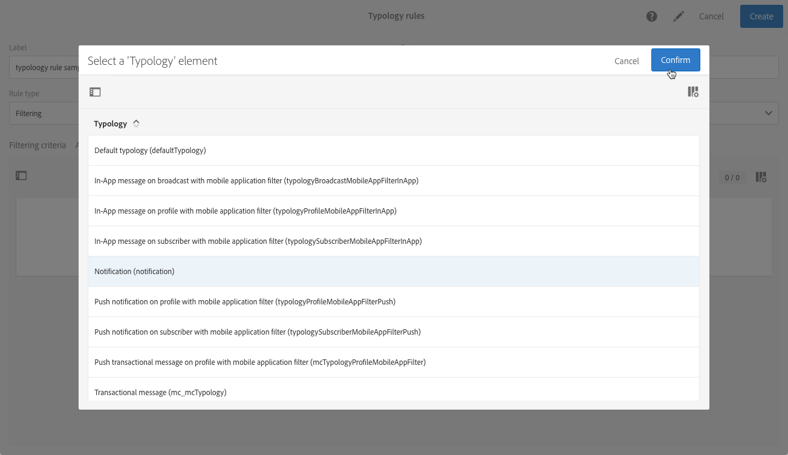
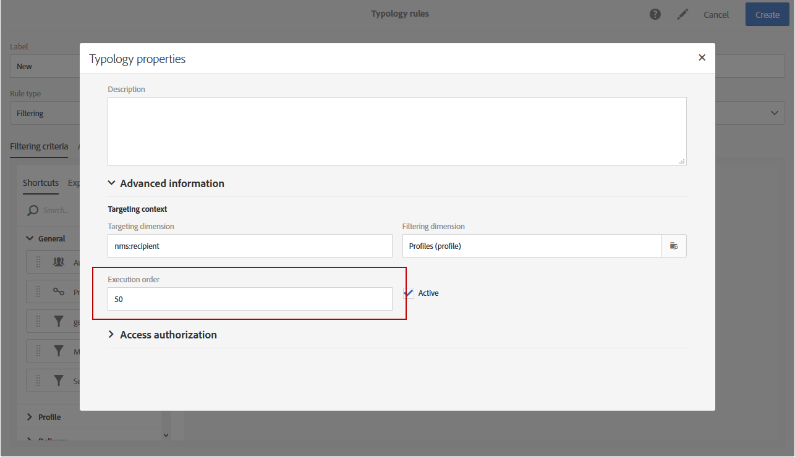

# Gerenciamento de regras de tipologia {#managing-typology-rules}

## Sobre as regras de tipologia {#about-typology-rules}

As Regras de tipologia são regras de negócios que permitem executar verificações e filtrar sua mensagem antes de enviá-la. Os tipos disponíveis de regras de tipologia são:

* **Regras de filtragem** : Esse tipo de regra permite que você exclua uma parte do público alvo de mensagem de acordo com os critérios definidos em um query, como perfis em quarentena ou perfis que já receberam um determinado número de emails. Para obter mais informações, consulte [esta seção](../../sending/using/filtering-rules.md).

* **Regras de fadiga** : Esse tipo de regras permite que você defina um número máximo de mensagens por perfil para evitar que elas sejam solicitadas em excesso. Para obter mais informações, consulte [esta seção](../../sending/using/fatigue-rules.md).

* **Regras de controle** : Esse tipo de regras permite que o usuário verifique a validade e a qualidade das mensagens antes de serem enviadas, como exibição de caracteres, tamanho da mensagem SMS, formato de endereço, etc. Para obter mais informações, consulte [esta seção](../../sending/using/control-rules.md).

Regras de tipologia estão disponíveis no menu **[!UICONTROL Administration]** > **[!UICONTROL Channels]** > **[!UICONTROL Typologies]** > **[!UICONTROL Typology rules]** .

Por padrão, várias regras de tipologia de **filtragem** e **controle** prontas para uso estão disponíveis. Eles são detalhados nas seções Regras [de](../../sending/using/fatigue-rules.md) filtragem e Regras  de controle.

De acordo com suas necessidades, você pode modificar regras de tipologia existentes ou criar novas, exceto para **[!UICONTROL Control]** regras, que são somente leitura e não podem ser modificadas.

## Criação de uma regra de tipologia {#creating-a-typology-rule}

As principais etapas para criar uma regra de tipologia são as seguintes:

1. Acesse o menu **[!UICONTROL Administration]** / **[!UICONTROL Channels]** / **[!UICONTROL Typologies]** / **[!UICONTROL Typology rules]** e clique em **[!UICONTROL Create]**.

   

1. Insira a tipologia **[!UICONTROL Label]** e especifique o **[!UICONTROL Channel]** à qual a regra deve se aplicar.

   

1. Especifique a regra de tipologia **[!UICONTROL Type]** e configure-a de acordo com suas necessidades. Observe que a configuração do regra de tipologia varia dependendo do tipo. Para obter mais informações, consulte as seções Regras **[de](../../sending/using/filtering-rules.md)**filtragem e Regras**[ de](../../sending/using/fatigue-rules.md)** fadiga.

1. Selecione as tipologias nas quais deseja incluir a nova regra. Para fazer isso, selecione a **[!UICONTROL Typologies]** guia e clique no **[!UICONTROL Create element]** botão.

   

1. Selecione a tipologia desejada e clique em **[!UICONTROL Confirm]**.

   

1. Depois que todas as tipologias forem selecionadas, clique em **[!UICONTROL Create]** para confirmar a criação da regra de tipologia.

## Ordem de execução do Regra de tipologia {#typology-rules-execution-order}

As Regras de tipologia são executadas em uma ordem especificada durante as fases de definição de metas, análise e personalização de mensagens.

No modo de operação padrão, as regras são aplicadas na seguinte sequência:

1. Regras de controle, se elas forem aplicadas no início do direcionamento.
1. Regras de filtragem:

   * Regras nativas para a qualificação de endereço: endereço definido / endereço não verificado / endereço na lista de blocos / endereço em quarentena / qualidade do endereço.
   * Filtrar regras definidas pelo usuário.

1. Regras de controle, se elas forem aplicadas no final do direcionamento.
1. Regras de controle, se elas forem aplicadas ao início da personalização.
1. Regras de controle, se forem aplicadas no final da personalização.

No entanto, você pode adaptar a ordem de execução do mesmo tipo de regras em cada tipologia. Na verdade, quando várias regras são executadas durante a mesma fase de processamento de mensagens, você pode escolher a ordem em que são aplicadas.

Por exemplo, uma regra de filtragem cuja ordem de execução está posicionada no número 20 será executada antes de uma regra de filtragem cuja ordem de execução está posicionada no número 30.

No caso **[!UICONTROL Properties]** de uma regra de tipologia, é possível definir sua ordem de execução. Quando várias regras têm de ser aplicadas, a ordem de execução de cada regra determina as que devem ser processadas primeiro. Para obter mais informações, consulte a seção de ordem [de execução do](#typology-rules-execution-order) Regra de tipologia.

Uma regra de tipologia pode ser desativada por meio de seu aplicativo **[!UICONTROL Properties]** se você não quiser que a regra seja aplicada no momento em que as mensagens afetadas pela regra forem analisadas.

