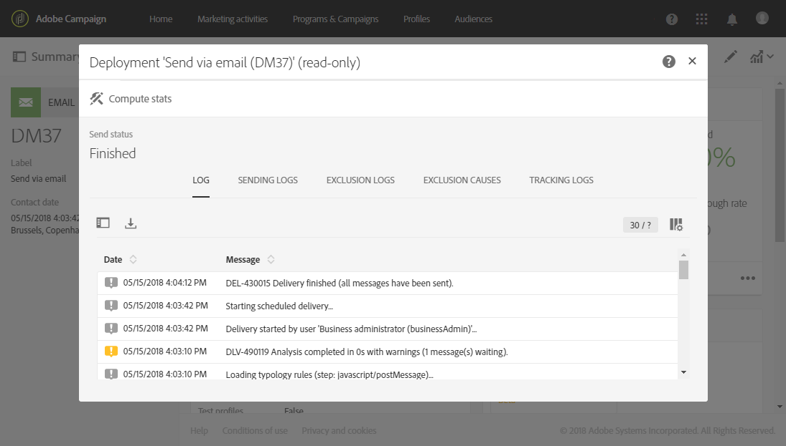
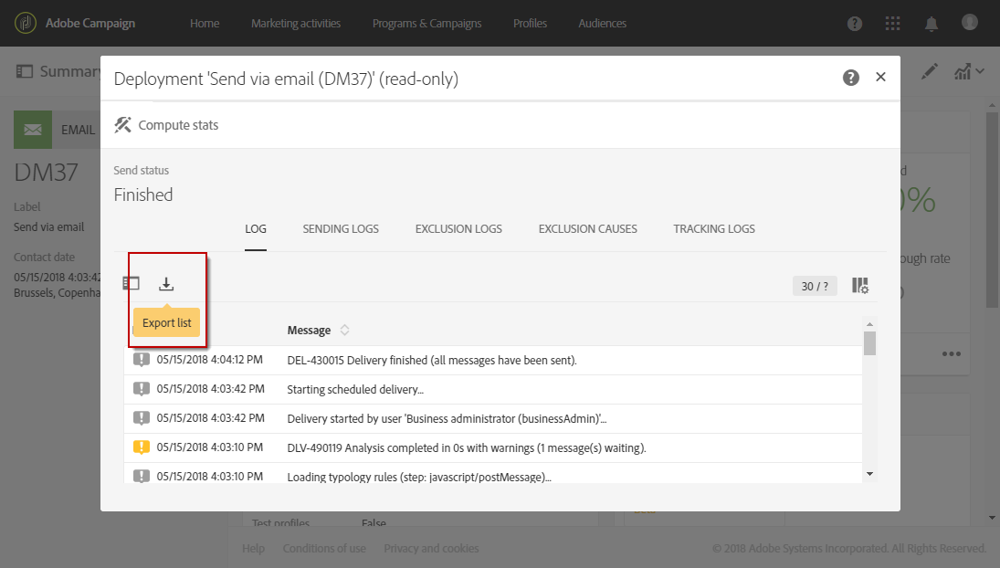
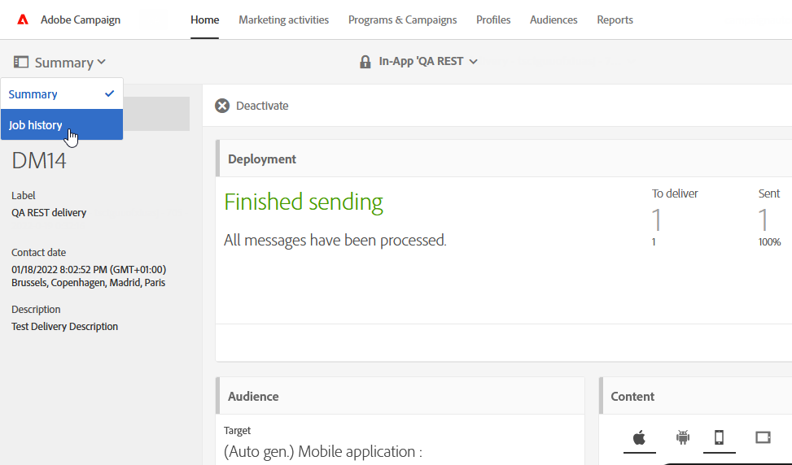
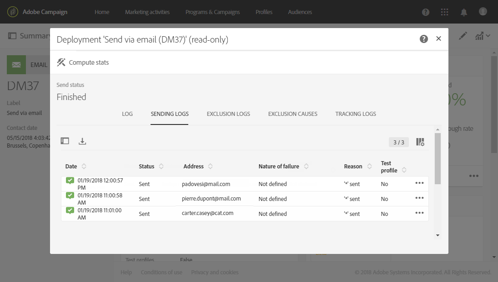
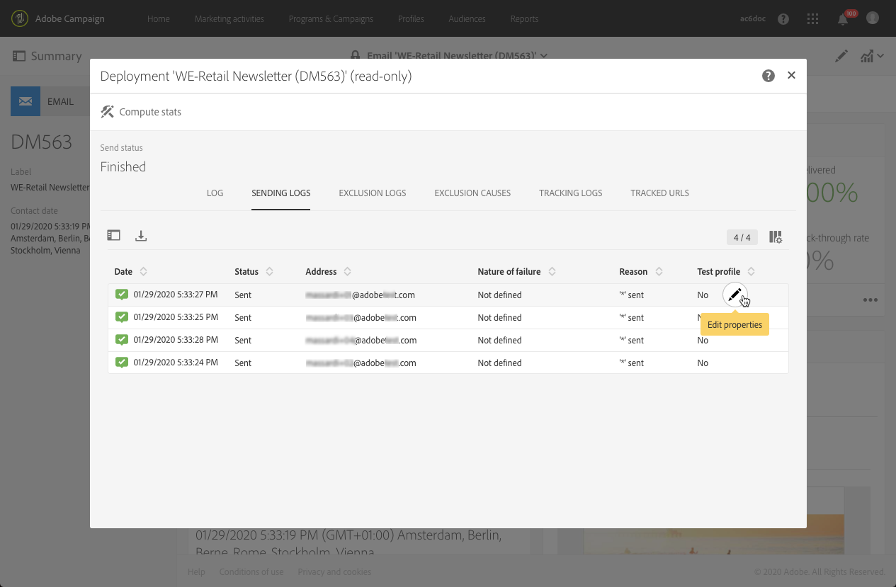
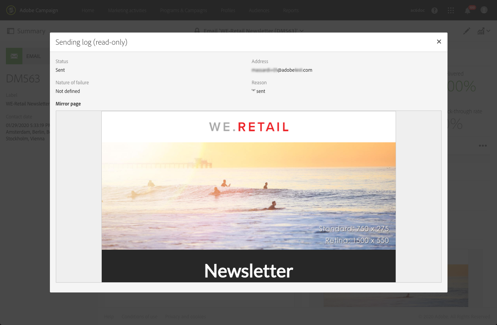
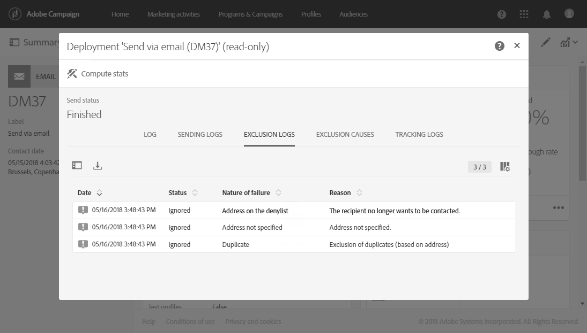
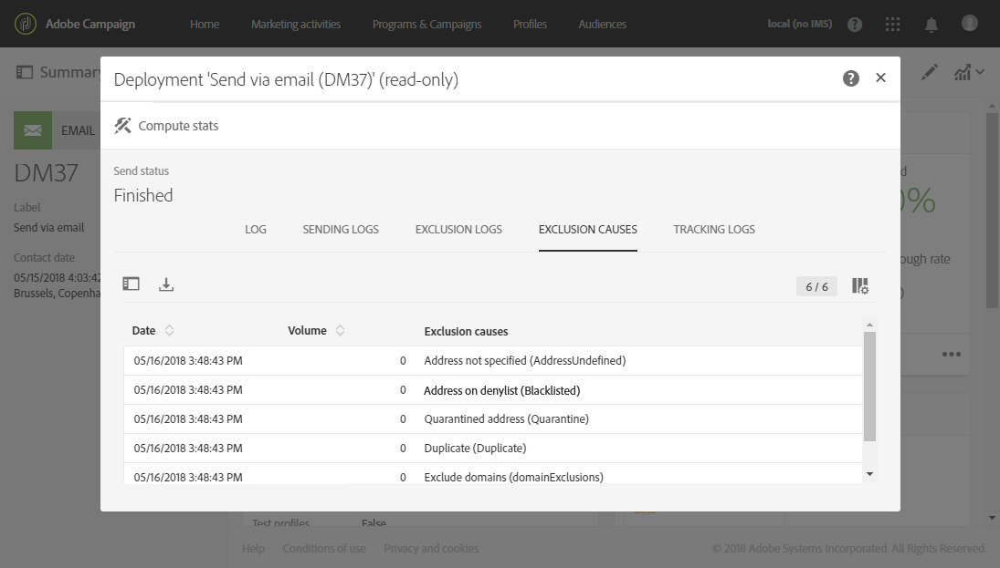

# Monitoramento de uma entrega{#monitoring-a-delivery}

Há várias maneiras de monitorar um delivery e medir seu impacto. Como administrador funcional, você pode acessar logs de mensagens e logs do delivery.

>[!IMPORTANT]
>
>Somente [administradores](../../administration/using/users-management.md#functional-administrators) funcionais, com função **[!UICONTROL Administration]** e acesso a **Todas** unidades, podem acessar logs de envio, logs de mensagens, logs de rastreamento, de exclusão ou de assinatura. Um usuário não administrador pode direcionar esses logs, mas começando por uma tabela vinculada (perfis, delivery).

* **Logs de mensagem**: esses logs podem ser acessados diretamente do painel de mensagens. Eles mostram os detalhes do envio, o target que foi excluído e o motivo, bem como as informações de rastreamento, como aberturas e cliques.

  Para exibir os logs de mensagem, clique no ícone na parte inferior direita do bloco **[!UICONTROL Deployment]**.

  Várias guias contêm informações (se houver) relacionadas a **[!UICONTROL Sending logs]**, **[!UICONTROL Exclusion logs]**, **[!UICONTROL Exclusion causes]**, **[!UICONTROL Tracking logs]** e **[!UICONTROL Tracked URLs]**. Consulte [Logs da entrega](#delivery-logs).

  

  O log contém todas as mensagens relacionadas com a entrega e com as provas. Os ícones especiais permitem identificar erros ou avisos. Para saber mais, consulte [Aprovação de mensagens](../../sending/using/previewing-messages.md).

  Você pode exportar o log clicando no botão **[!UICONTROL Export list]**.

  

* **Logs de trabalho**: uma lista dos trabalhos em lotes acionados pela entrega pode ser acessada no painel de mensagens selecionando **[!UICONTROL Job history]** na lista suspensa **[!UICONTROL Summary]**.

  Selecione qualquer trabalho na lista para ver os detalhes do **[!UICONTROL Batch job]** selecionado.

  

* **Alertas de entrega**: para rastrear os sucessos ou as falhas da entrega, o Adobe Campaign tem um sistema de alerta por email que envia notificações para informar os usuários sobre atividades importantes do sistema.
* **Relatórios**: no painel de mensagens, você pode acessar vários relatórios para a mensagem específica. O menu **[!UICONTROL Reports]** permite acessar uma lista completa de relatórios integrados ou personalizados que você pode usar para destacar métricas específicas relacionadas à mensagem ou campanha.
* Um administrador também pode exportar os logs em um arquivo que pode ser processado nos próprios relatórios ou nas ferramentas de BI. Para saber mais, consulte [Exportação de logs](../../automating/using/exporting-logs.md).

**Tópicos relacionados:**

* [Recebimento de alertas quando ocorrerem falhas](../../sending/using/receiving-alerts-when-failures-happen.md)
* [Relatórios](../../reporting/using/about-dynamic-reports.md)

## Logs de entrega {#delivery-logs}

### Logs de envio {#sending-logs}

A guia **[!UICONTROL Sending logs]** tem um histórico de todas as ocorrências da entrega. A lista de mensagens enviadas com os status é armazenada aqui. Assim, você pode exibir o status da entrega para cada destinatário.

Para cada perfil com status **[!UICONTROL Sent]**, a coluna **[!UICONTROL Date]** mostra quando a mensagem foi enviada.

Para acessar os detalhes de um log de envio específico, clique no ícone de lápis à direita da linha correspondente.

Todos os detalhes do log de envio são somente leitura. Você também pode pré-visualizar a mirror page.

>[!NOTE]
>
>Para exibir a renderização da mirror page na interface do usuário do Campaign, o URL do servidor da mirror page deve estar protegido. Nesse caso, use https:// em vez de http:// para definir esse URL ao [configurar sua marca](../../administration/using/branding.md#configuring-and-using-brands).

### Logs de exclusão {#exclusion-logs}

A guia **[!UICONTROL Exclusion logs]** lista todas as mensagens que foram excluídas do público-alvo enviado e especifica o motivo da falha de envio.

### Causas da exclusão {#exclusion-causes}

A guia **[!UICONTROL Exclusion causes]** exibe o volume (em número) das mensagens que foram excluídas do público-alvo enviado.

