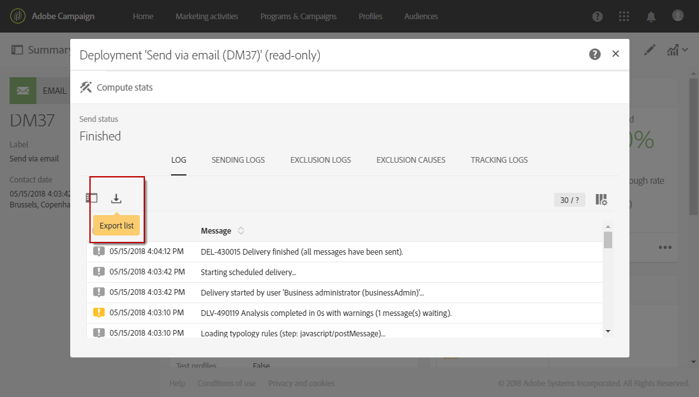
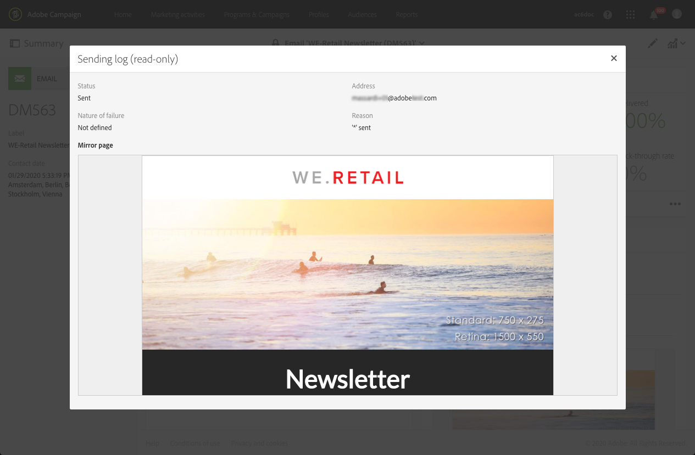

# Monitoramento de um delivery{#monitoring-a-delivery}

Há várias maneiras de monitorar um delivery e medir o impacto:

* **Logs de mensagem**: esses logs podem ser acessados diretamente do painel de mensagens. Eles mostram os detalhes do envio, o target que foi excluído e o motivo, bem como as informações de rastreamento, como aberturas e cliques.

   Para exibir os logs de mensagem, clique no ícone na parte inferior direita do bloco **[!UICONTROL Deployment]**.

   Várias guias contêm informações (se houver) relacionadas a **[!UICONTROL Sending logs]**, **[!UICONTROL Exclusion logs]**, **[!UICONTROL Exclusion causes]**, **[!UICONTROL Tracking logs]** e **[!UICONTROL Tracked URLs]**. Consulte [Logs do delivery](#delivery-logs).

   

   O log contém todas as mensagens relacionadas ao delivery e às provas. Os ícones especiais permitem identificar erros ou avisos. Para saber mais, consulte [Aprovação de mensagens](../../sending/using/previewing-messages.md).

   Você pode exportar o log clicando no botão **[!UICONTROL Export list]**.

   

* **Alertas de delivery**: para rastrear os sucessos ou as falhas do delivery, o Adobe Campaign tem um sistema de alerta por email que envia notificações para informar os usuários sobre atividades importantes do sistema.
* **Relatórios**: no painel de mensagens, você pode acessar vários relatórios para a mensagem específica. O menu **[!UICONTROL Reports]** permite acessar uma lista completa de relatórios incorporados ou personalizados que você pode usar para destacar métricas específicas relacionadas à mensagem ou campanha.
* Um administrador também pode exportar os logs em um arquivo que pode ser processado nos próprios relatórios ou nas ferramentas de BI. Para saber mais, consulte [Exportação de logs](../../automating/using/exporting-logs.md).

**Tópicos relacionados:**

* [Receber alertas quando ocorrerem falhas](../../sending/using/receiving-alerts-when-failures-happen.md)
* [Relatórios](../../reporting/using/about-dynamic-reports.md)

## Logs do delivery {#delivery-logs}

### Envio de logs {#sending-logs}

A guia **[!UICONTROL Sending logs]** tem um histórico de todas as ocorrências do delivery. A lista de mensagens enviadas com os status é armazenada aqui. Assim, você pode exibir o status do delivery para cada recipient.

Para cada perfil com status **[!UICONTROL Sent]**, a coluna **[!UICONTROL Date]** mostra quando a mensagem foi enviada.

Para acessar os detalhes de um log de envio específico, clique no ícone de lápis à direita da linha correspondente.

Todos os detalhes do log de envio são somente leitura. Você também pode pré-visualizar a mirror page.

>[!NOTE]
>
>Para exibir a renderização da mirror page na interface do usuário do Campaign, o URL do servidor da mirror page deve estar protegido. Nesse caso, use https:// em vez de http:// para definir esse URL ao [configurar sua marca](../../administration/using/branding.md#configuring-and-using-brands).

### Logs de exclusão {#exclusion-logs}

A guia **[!UICONTROL Exclusion logs]** lista todas as mensagens que foram excluídas do público-alvo enviado e especifica o motivo da falha de envio.

### Causas da exclusão {#exclusion-causes}

A guia **[!UICONTROL Exclusion causes]** exibe o volume (em número) das mensagens que foram excluídas do público-alvo enviado.

