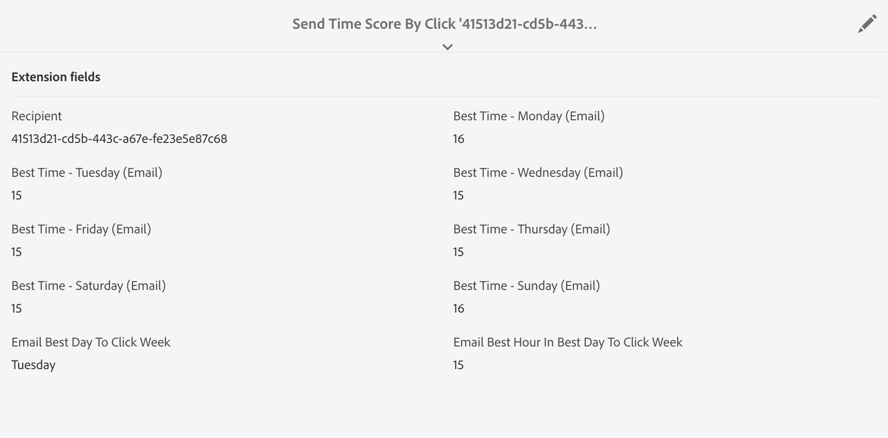

# Otimizar o design e o delivery com e-mails alimentados por AI{#journey-ai}

## Comece a usar e-mails com IA{#journey-ai-ovv}

Usando a Campanha, você pode otimizar o design e o delivery de viagens de clientes para prever a preferência de envolvimento de cada indivíduo. Com a tecnologia Journey AI, o Adobe Campaign pode analisar e prever taxas de abertura, tempos de envio ideais e probabilidade de taxa com base nas métricas de envolvimento do histórico.

**Modelos de aprendizado de máquina**

O Adobe Campaign Standard oferta dois novos modelos de aprendizado de máquina: **Otimizações** de tempo de envio preditivas e Pontuação de envolvimento **preditivo**. Esses dois modelos são chamados juntos de Journey AI, que é uma classe de modelos de aprendizado de máquina específicos para projetar e fornecer melhores viagens de cliente.

* **Otimização** previsível do tempo de envio: A otimização do tempo de envio previsível prevê qual é o melhor tempo de envio para cada perfil de recipient para abrir e clicar no email. Para cada perfil de recipient, as pontuações indicam o melhor horário de envio para cada dia da semana e qual dia da semana é o melhor para enviar para obter melhores resultados.

* **Pontuação** de envolvimento previsível: A pontuação de envolvimento previsível prevê a probabilidade de um recipient se envolver com uma mensagem, bem como a probabilidade de opt out (cancelar a inscrição) nos próximos 7 dias após o próximo envio de email. As probabilidades são divididas em escalões de acordo com o risco específico de desvinculação, médio ou baixo. Ao longo destes, o modelo também fornece a classificação do percentil de risco para os clientes entenderem onde é que a classificação de um determinado cliente em relação a outros.

>[!NOTE]
> **Pré-requisitos **
>
>Esse recurso não está disponível para uso imediato como parte do produto. A implementação exige que a Adobe Consulting esteja envolvida. Entre em contato com seu representante da Adobe para saber mais.
>
>Separadamente, o recurso exigia o uso de um armazenamento do Azure que deve ser fornecido pelo cliente.

## Otimização preditiva do tempo de envio{#predictive-send-time}

### Otimizar cliques e abrir{#about-predictive-send-time}

A otimização do tempo de envio previsível prevê qual é o melhor tempo de envio para cada perfil de recipient para abrir e clicar no email. Para cada perfil de recipient, as pontuações indicam o melhor horário de envio para cada dia da semana e qual dia da semana é o melhor para enviar para obter melhores resultados.

No modelo de Otimização de tempo de envio preditivo, há dois submodelos:
* O tempo de envio previsto para abrir é a melhor vez que uma comunicação deve ser enviada ao cliente para maximizar as aberturas
* O tempo de envio previsto para o clique é a melhor vez que uma comunicação deve ser enviada ao cliente para maximizar os cliques

**Entrada** do modelo: Logs do delivery, logs de rastreamento e atributos de perfil (não PII)

**Saída** do modelo: Melhor tempo para enviar uma mensagem (para abrir e clicar)


Detalhes da saída

* Calcule a melhor hora do dia para enviar um email para os próximos 7 dias com intervalos de 1 hora (por exemplo: 9:00 da manhã, 10:00 da manhã, 11:00 da manhã)
* O modelo indicará a melhor hora dos próximos 7 dias para enviar o e-mail
* Cada tempo ideal é calculado duas vezes: uma vez para maximizar a taxa de abertura e uma vez para maximizar a taxa de clique
* São administrados 16 campos (14 para os dias da semana e 2 para a semana inteira):
   * melhor hora para enviar um email para otimizar cliques para segunda-feira - valores entre 0 e 23
   * melhor hora para enviar um email para otimizar as aberturas de segunda-feira - valores entre 0 e 23
   * melhor hora para enviar um email para otimizar cliques para terça-feira - valores entre 0 e 23
   * ...
   * melhor hora para enviar um email para otimizar cliques para domingo - valores entre 0 e 23
   * melhor hora para enviar um email para otimizar as aberturas para domingo - valores entre 0 e 23
   * ...
   * melhor dia para enviar um email para otimizar as aberturas da semana inteira - de segunda a domingo
   * o melhor momento para enviar um email para otimizar a abertura da semana inteira - valores entre 0 e 23

>[!NOTE]
>
>Esses recursos preditivos se aplicam apenas a delivery de email.
>
>O modelo precisa de pelo menos um mês de dados para produzir resultados significativos.


### Acesse as pontuações dos perfis{#access-predictive-send-time-scores}

Depois de implementados na Campanha, os recursos de aprendizado de máquina enriquecem os dados dos perfis com novas guias com as melhores pontuações de abertura/clique. As métricas são computadas pela Inteligência Artificial de Jornadas e são trazidas para a Campanha usando workflows técnicos.

Para acessar essas métricas, é necessário:

1. Abra um perfil e clique no botão Editar.

1. Clique na guia **Enviar pontuação de tempo ao clicar** ou **Enviar pontuação de tempo ao abrir** .

Por padrão, as pontuações do perfil darão a melhor hora do dia para cada dia da semana e a melhor hora geral da semana.



### Enviar mensagens no melhor momento{#use-predictive-send-time}

Para que os emails sejam enviados no horário ideal por perfil, o delivery deve ser programado usando a opção **[!UICONTROL Send at a custom date defined by a formula]**.
Saiba como calcular a data de envio [nesta seção](../../sending/using/computing-the-sending-date.md).

A fórmula precisa ser preenchida com a melhor hora específica do dia em que o delivery for lançado.


Exemplo de fórmula:

```
AddHours([currentDelivery/scheduling/@contactDate], 
[cusSendTimeScoreByClickprofile_link/@EMAIL_BEST_TIME_TO_CLICK_WEDNESDAY])
```


>[!NOTE]
>
>O modelo de dados pode ser diferente dependendo da implementação.


## Pontuação de envolvimento previsível {#predictive-scoring}

A pontuação de envolvimento preditivo permite:

* **Selecione uma audiência**: ao usar a atividade do query, você pode selecionar a audiência para envolver-se com uma mensagem específica
* **Excluir uma audiência**: usando a atividade do query, você pode remover a audiência para cancelar a inscrição
* **Personalizar**: personalizar mensagem com base no nível de envolvimento (usuários altamente envolvidos receberão uma mensagem diferente dos não envolvidos)

Este modelo usa várias pontuações para indicar:

* **Abrir pontuação de envolvimento / clique na pontuação** de envolvimento: esse valor corresponde à probabilidade de um assinante se envolver com uma mensagem específica (abrir ou clicar). Os valores variam de 0,0 a 1,0.
* **Probabilidade** de Unsubscription: esse valor corresponde à probabilidade de o recipient cancelar a inscrição do canal de e-mail considerando um e-mail aberto. Os valores variam de 0,0 a 1,0.
* **Nível** de retenção:  esse valor classifica os usuários em três níveis: baixa, média e alta. É mais provável que o alto fique com a marca e o baixo valor que provavelmente cancelará a assinatura.
* **Classificação percentual da retenção**: Classificação do perfil em termos de probabilidade da unsubscription. Os valores variam de 0,0 a 1,0. Por exemplo, se a classificação de porcentagem de retenção for 0,953, esse recipient terá maior probabilidade de permanecer com a marca e menos probabilidade de cancelar a assinatura do que 95,3% de todos os recipient.

>[!NOTE]
>
>Esses recursos preditivos se aplicam apenas a delivery de email.
>
>O modelo precisa de pelo menos um mês de dados para produzir resultados significativos.


**Entrada** do modelo: Logs do delivery, logs de rastreamento e atributos específicos do perfil

**Saída** do modelo: Um atributo de perfil que descreve a pontuação e a categoria do perfil


### Usar a pontuação de envolvimento para o canal de email

Para acessar essas métricas, é necessário:

1. Abra um perfil e clique no botão Editar.

1. Clique na guia **Pontuações de envolvimento para Canal** de email.

Ao usar uma atividade de query em um fluxo de trabalho, você pode usar a pontuação para otimizar sua audiência.

Por exemplo, com os critérios de nível **de** Retenção:


