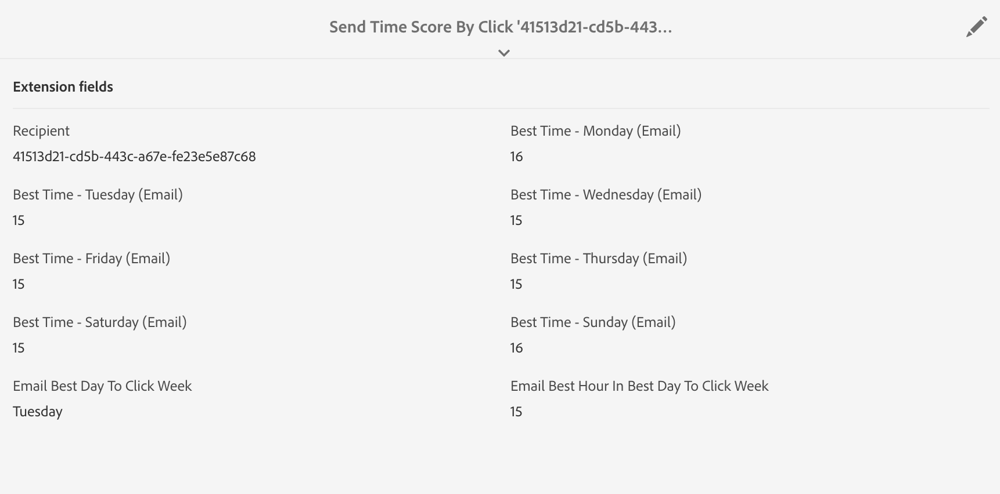
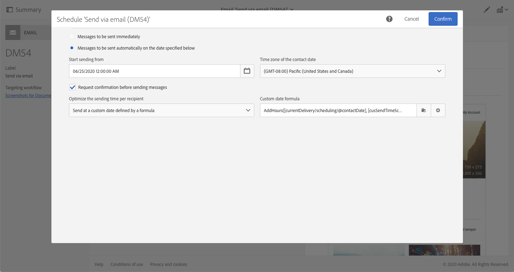
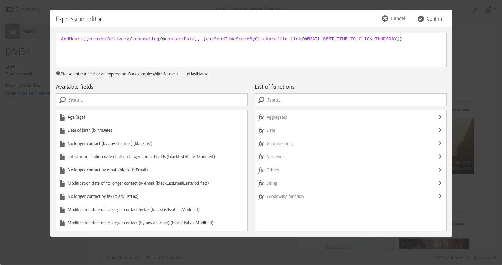
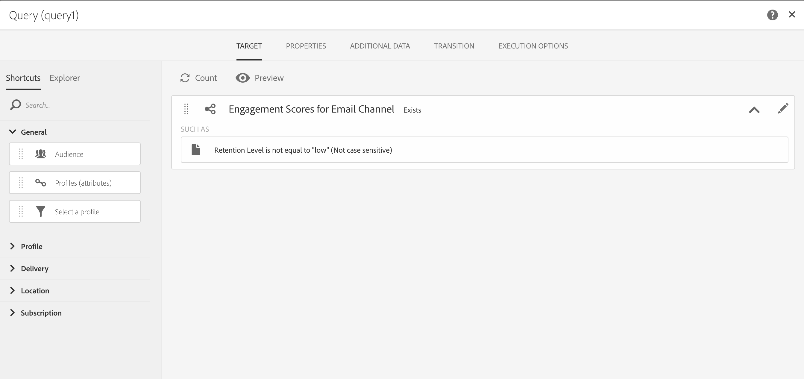

# Recursos preditivos de engajamento do usuário {#journey-ai}

Com o Campaign, você pode otimizar o design e a entrega de jornadas de clientes para prever a preferência de engajamento de cada pessoa. Alimentada por IA e aprendizado de máquina, a Otimização de tempo de envio e a Pontuação preditiva de engajamento da Adobe Campaign podem analisar e prever taxas abertas, tempos de envio ideais e churn provável de acordo com métricas de engajamento histórico.

>[!IMPORTANT]
>
>Esse recurso não está disponível para uso imediato como parte do produto. A implementação exige o engajamento da Adobe Consulting. Entre em contato com seu representante da Adobe para obter mais detalhes.

A Adobe Campaign oferece dois novos modelos de aprendizado de máquina: **Otimização preditiva do tempo de envio** e **Pontuação preditiva do engajamento**. Esses dois modelos são modelos de aprendizado de máquina específicos para projetar e fornecer melhores jornadas ao cliente.

* A **Otimização preditiva do tempo de envio** prevê qual é o melhor tempo de envio para cada perfil de destinatário para aberturas de email ou cliques e aberturas de mensagem por push. As pontuações indicam o melhor horário de envio para cada dia da semana e qual o melhor dia para enviar a fim de obter melhores resultados para cada perfil de destinatário.

* **Pontuação preditiva de engajamento**: prevê a probabilidade de engajamento de um recipient em uma mensagem, bem como a probabilidade de opt out (cancelamento de inscrição) nos próximos 7 dias após o próximo envio de email. As probabilidades são divididas em grupos de acordo com o nível previsto de engajamento com seu conteúdo: alto, médio ou baixo. Esses modelos também fornecem a classificação do percentil de risco de cancelamento de subscrição para que os clientes entendam onde está a classificação de um determinado cliente em relação a outros.

## Otimização preditiva do tempo de envio{#predictive-send-time}

A Otimização preditiva de tempo de envio prevê qual é o melhor momento de envio para cada perfil de recipient para aberturas ou cliques de email e aberturas de mensagem por push. As pontuações indicam o melhor horário de envio para cada dia da semana e qual o melhor dia para enviar a fim de obter melhores resultados para cada perfil de destinatário.

No modelo de Otimização preditiva de tempo de envio, há dois submodelos:

* **O tempo preditivo de envio para abrir** é o melhor horário para o envio de uma comunicação ao cliente para maximizar as aberturas

* **O tempo preditivo de envio para o clique** é o melhor horário para o envio da comunicação ao cliente para maximizar os cliques

**Entrada do modelo**: Logs da entrega, logs de rastreamento e atributos de perfil (não PII)

**Saída do modelo**: Melhor horário para o envio de uma mensagem (para aberturas e cliques)

Detalhes da saída

* Calcula o melhor horário do dia para enviar um email nos 7 dias da semana com intervalos de 1 hora (por exemplo: 9h, 10h:00, 11h:00):00
* O modelo indicará o melhor dia da semana e o melhor horário do dia
* Cada horário ideal é calculado duas vezes: uma vez para maximizar a taxa de abertura e outra para maximizar a taxa de cliques
* São administrados 16 campos (14 para os dias da semana e 2 para a semana inteira):

* Melhor horário para enviar um email para otimizar cliques na segunda-feira - valores entre 0 e 23

* Melhor horário para enviar um email para otimizar as aberturas na segunda-feira - valores entre 0 e 23
* ...
* Melhor horário para enviar um email para otimizar cliques no domingo - valores entre 0 e 23
* Melhor horário para enviar um email para otimizar as aberturas no domingo - valores entre 0 e 23
* ...
* Melhor dia para enviar um email para otimizar as aberturas da semana inteira - de segunda a domingo
* Melhor horário para enviar um email para otimizar as aberturas da semana inteira - valores entre 0 e 23

>[!NOTE]
>
>O modelo precisa de pelo menos um mês de dados para produzir resultados significativos.
>
>Esses recursos preditivos se aplicam somente aos canais de email e push.

Depois de implementados no Campaign, os recursos de aprendizado de máquina enriquecem os dados dos perfis com novas guias e as melhores pontuações de abertura/clique. As métricas são calculadas e trazidas para o Campaign usando workflows técnicos.

Para acessar essas métricas, é necessário:

1. Abrir um perfil e clicar no botão Editar.

1. Clicar na guia **Enviar pontuação de tempo por clique** ou **Enviar pontuação de tempo ao abrir**.

Por padrão, as pontuações do perfil oferecerão o melhor horário do dia para cada dia da semana e o melhor horário geral da semana.



### Enviar mensagens no melhor momento{#use-predictive-send-time}

Para que os emails sejam enviados no horário ideal por perfil, a entrega deve ser agendada usando a opção **[!UICONTROL Send at a custom date defined by a formula]**.

Saiba como calcular a data de envio [nesta seção](../../sending/using/computing-the-sending-date.md).

A fórmula precisa ser preenchida com o melhor horário específico do dia em que a entrega for lançada.



Exemplo de fórmula:

```
AddHours([currentDelivery/scheduling/@contactDate],
[cusSendTimeScoreByClickprofile_link/@EMAIL_BEST_TIME_TO_CLICK_WEDNESDAY])
```



>[!NOTE]
>
>O modelo de dados pode ser diferente dependendo da implementação.

## Pontuação preditiva de engajamento {#predictive-scoring}

A Pontuação preditiva de engajamento prevê a probabilidade de engajamento de um recipient em uma mensagem, bem como a probabilidade de opt out (cancelamento de inscrição) nos próximos 7 dias após o próximo envio de email.

As probabilidades são divididas em grupos de acordo com o nível previsto de engajamento com seu conteúdo: alto, médio ou baixo. Esses modelos também fornecem a classificação do percentil de risco de cancelamento de subscrição para que os clientes entendam onde está a classificação de um determinado cliente em relação a outros.

A Pontuação preditiva de engajamento permite:

* **Selecionar um público-alvo**: ao usar a atividade de consulta, você pode selecionar o público-alvo para se engajar com uma mensagem específica
* **Excluir um público-alvo**: usando a atividade de consulta, você pode remover o público-alvo com maior probabilidade de cancelar a inscrição
* **Personalizar**: personalizar mensagens de acordo com o nível de engajamento (usuários altamente engajados receberão uma mensagem diferente daqueles não engajados)

Este modelo usa várias pontuações para indicar:

* **Pontuação de engajamento ao abrir/Pontuação de engajamento ao clicar**: esse valor corresponde à probabilidade de um assinante se engajar com uma mensagem específica (abrir ou clicar). Os valores variam de 0,0 a 1,0.
* **Probabilidade de cancelamento de inscrição**: esse valor corresponde à probabilidade do destinatário cancelar a inscrição do canal de email considerando um email aberto. Os valores variam de 0,0 a 1,0.
* **Nível de retenção**: esse valor classifica os usuários em três níveis: baixo, médio e alto. O alto tem mais probabilidade de adesão à marca, enquanto o baixo provavelmente cancelará a assinatura.
* **Classificação de percentil de retenção**: Classificação do perfil em termos de probabilidade de cancelamento de assinatura. Os valores variam de 0,0 a 1,0. Por exemplo, se a classificação de porcentagem de retenção for de 0,953, esse recipient terá mais probabilidade de permanecer com a marca e menos probabilidade de cancelar a inscrição do que 95,3% de todos os recipients.

>[!NOTE]
>
>Esses recursos preditivos se aplicam apenas para entregas de email.
>
>O modelo precisa de pelo menos um mês de dados para produzir resultados significativos.

**Entrada do modelo**: Logs da entrega, logs de rastreamento e atributos específicos do perfil

**Saída do modelo**: Um atributo de perfil que descreve a pontuação e a categoria do perfil

Para acessar essas métricas, é necessário:

1. Abrir um perfil e clicar no botão Editar.

1. Clicar na guia **Pontuações de engajamento para canal de email**.

Ao usar uma atividade de query em um workflow, a pontuação pode ser usada para otimizar o público. Por exemplo, com os critérios **Nível de retenção**:

