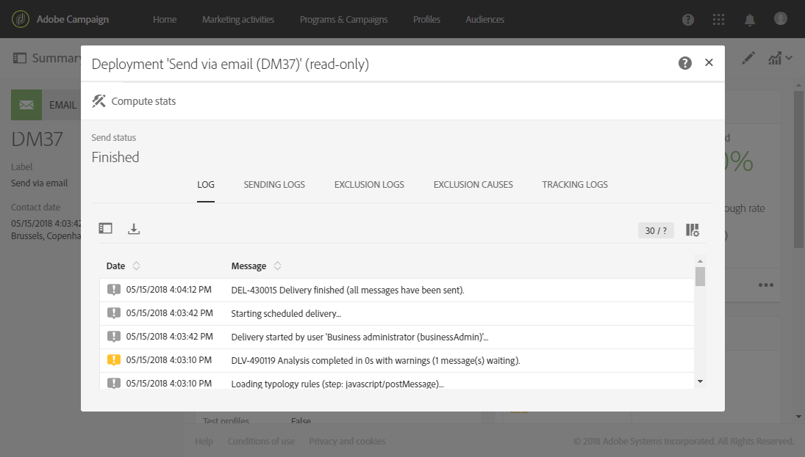

# Preparação do envio{#preparing-the-send}

A preparação corresponde à etapa de cálculo do público-alvo e geração do conteúdo da mensagem para cada perfil incluído no target. Quando a preparação for concluída, as mensagens estarão prontas para serem enviadas, imediatamente ou em [a data e a hora programadas](../../sending/using/about-scheduling-messages.md).

1. Para começar a preparar o envio, clique no link **Preparar** localizado na barra de ações.

   

1. A variável **[!UICONTROL Deployment]** O bloco mostra o progresso da preparação e, em seguida, as estatísticas da preparação: número de mensagens direcionadas, número de mensagens a serem enviadas etc.

   Dependendo do tamanho do público-alvo, essa operação pode levar algum tempo.

   

1. Interrompa a preparação a qualquer momento usando o **Parar** localizado na barra de ações.

   Durante a fase de preparação, nenhuma mensagem é enviada. Portanto, você pode iniciar ou parar isso sem o risco de afetar nada.

   

1. Sua mensagem é salva automaticamente durante a fase de preparação para o delivery. Se precisar fazer alterações na programação da mensagem após a etapa de preparação, verifique se clicou no botão **[!UICONTROL Prepare]** botão novamente para que essas alterações sejam consideradas. Para obter mais informações sobre como agendar uma mensagem, consulte esta página [página](../../sending/using/about-scheduling-messages.md).

   

1. Para exibir os logs de preparação, clique no botão localizado na parte inferior direita do bloco.

   

1. A variável **[!UICONTROL Deployment]** será aberta, corrija os erros e reinicie a preparação.

   A última mensagem de log exibe mensagens de erro e o número de erros. Um ícone específico mostra o tipo de erro encontrado: o ícone amarelo indica um erro de processamento não crítico, o ícone vermelho indica um erro crítico que impede que o delivery seja iniciado.

   

1. Verifique as estatísticas de preparação antes de confirmar o envio das mensagens. Se o número de mensagens a enviar não corresponder à sua configuração, edite o público-alvo (consulte [Seleção de um público-alvo em uma mensagem](../../audiences/using/selecting-an-audience-in-a-message.md)) e reinicie a preparação.

Após concluir a preparação, sua mensagem estará pronta para ser enviada. Para obter mais informações, consulte [Confirmação de envio](../../sending/using/confirming-the-send.md).

**Regras de tipologia**

O Adobe Campaign vem com um conjunto de regras de tipologia incorporadas que são aplicadas durante a preparação da mensagem. Eles são usados para verificar se uma mensagem é válida e atende aos seus critérios de qualidade. Consulte [Tipologias](../../sending/using/about-typology-rules.md). Você pode definir suas próprias regras de tipologia; por exemplo, é possível definir regras de fadiga globais entre canais que excluirão automaticamente perfis excessivamente solicitados de campanhas. Consulte [Regras de fadiga](../../sending/using/fatigue-rules.md).

**Verificação de mensagem SMS**

Se você tiver inserido campos de personalização ou texto condicional no conteúdo da mensagem SMS, esses fatores poderão introduzir caracteres que não são considerados pela codificação GSM. Quando a preparação for executada, o comprimento da mensagem será monitorado e uma mensagem de aviso será exibida se o limite for ultrapassado.

Para obter mais informações, consulte [Codificação, comprimento e transliteração do SMS](../../administration/using/configuring-sms-channel.md#sms-encoding--length-and-transliteration) e [Personalizar mensagens SMS](../../channels/using/personalizing-sms-messages.md) seções.
