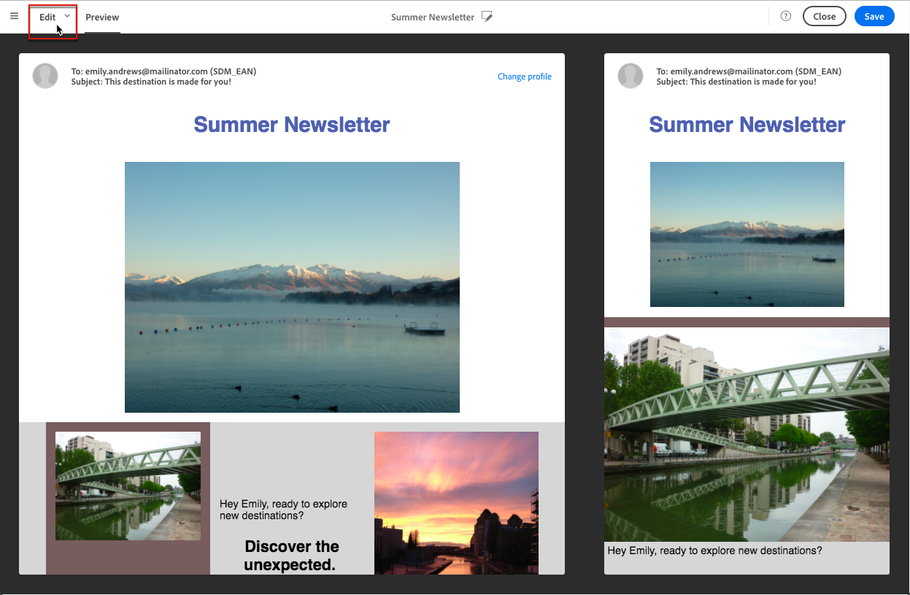

# Pré-visualização de delivery {#previewing-messages}

## Visualizar emails {#previewing-emails}

O Campaign Standard permite que você pré-visualização mensagens antes de enviá-las, para verificar a personalização e como seus recipient as visualizarão.

A pré-visualização de mensagens é executada usando perfis **de** teste adicionados ao público alvo da mensagem.

Para mensagens de **email** , o Campaign Standard permite que você pré-visualização mensagens usando perfis direcionados em vez de perfis de teste. Isso permite obter uma representação exata da mensagem que um perfil específico receberá. Para mais informações, consulte [Testar mensagens de email usando perfis segmentados](../../sending/using/testing-messages-using-target.md).

Para pré-visualização de uma mensagem usando perfis de teste, siga estas etapas:

1. No [Email Designer](../../designing/using/designing-content-in-adobe-campaign.md), clique no **[!UICONTROL Preview]** botão.

   

   Uma visualização de desktop e uma visualização móvel responsiva do seu email são exibidas lado a lado.

1. Uma verificação automática de antispam é executada durante cada pré-visualização. Click the **[!UICONTROL Anti-spam analysis]** button to find out more about the warning.

   

1. Selecione o **[!UICONTROL Change profile]** botão para escolher o perfil de teste no qual deseja testar os elementos de personalização.

   

1. Para sair do **[!UICONTROL Preview]** modo, clique no **[!UICONTROL Edit]** botão na parte superior esquerda da tela.

   

**Tópicos relacionados**

* [Gerenciamento de perfis de teste](../../audiences/using/managing-test-profiles.md)
* [Testar mensagens de email usando perfis direcionados](../../sending/using/testing-messages-using-target.md)
* [Envio de provas](../../sending/using/sending-proofs.md)

## Visualizar mensagens SMS {#previewing-sms}

Para mensagens **SMS** , o Campaign Standard permite que você pré-visualização mensagens usando perfis de teste. Isso permite obter uma representação exata da mensagem que um perfil específico receberá. Para mais informações, consulte [Gerenciamento de perfis de teste](../../audiences/using/managing-test-profiles.md).

Para pré-visualização de uma mensagem SMS usando perfis de teste, siga estas etapas:

1. Depois de preencher a mensagem **[!UICONTROL Properties]** de SMS e selecionar suas audiências, você pode personalizar seu delivery. For more information, refer to [section](../../channels/using/personalizing-sms-messages.md).

   

1. Depois de personalizar o conteúdo, clique em **[!UICONTROL Create]** para acessar a **[!UICONTROL Summary]** janela.

1. Na **[!UICONTROL Summary]** janela, clique em **[!UICONTROL Content]** para start para visualizar seu delivery.

   

1. Clique **[!UICONTROL Preview]** na barra de ferramentas.

   

1. Clique **[!UICONTROL Change profile]** para selecionar seu perfil de teste e depois **[!UICONTROL Confirm]**.

   

Agora você pode ver a representação exata de sua mensagem, dependendo dos perfis de teste selecionados.

**Tópicos relacionados**

* [Sobre mensagens SMS](../../channels/using/about-sms-messages.md)
* [Criar uma mensagem SMS](../../channels/using/creating-an-sms-message.md)
* [Personalizar mensagens SMS](../../channels/using/personalizing-sms-messages.md)

## Visualizar notificações por push {#previewing-push}

Para notificações **por** push, o Campaign Standard permite que você pré-visualização mensagens usando perfis de teste. Isso permite obter uma representação exata da mensagem que um perfil específico receberá. Para mais informações, consulte [Gerenciamento de perfis de teste](../../audiences/using/managing-test-profiles.md).

Para pré-visualização de uma notificação por push usando perfis de teste, siga estas etapas:

1. Após preencher a notificação por push e selecionar **[!UICONTROL Properties]** as audiências, você poderá personalizar o delivery. Para obter mais informações, consulte [Personalizar uma notificação](../../channels/using/customizing-a-push-notification.md)por push.

1. Depois de personalizar o conteúdo, você pode verificar diretamente a renderização das notificações por push, dependendo dos dispositivos e do SO na janela pré-visualização.

   

1. Para pré-visualização sua notificação por push usando perfis de teste, clique em **[!UICONTROL Preview with test profile]**.

   

1. Selecione seu perfil de teste **[!UICONTROL Confirm]**.

Agora você pode ver a representação exata de sua mensagem, dependendo dos perfis de teste selecionados.

**Tópicos relacionados**

* [Sobre as notificações por push](../../channels/using/about-push-notifications.md)
* [Preparação e envio de uma notificação por push](../../channels/using/preparing-and-sending-a-push-notification.md)
* [Personalização de uma notificação por push](../../channels/using/customizing-a-push-notification.md)

## Visualizar mensagens no aplicativo {#previewing-in-app}

Para **No aplicativo**, o Campaign Standard permite que você pré-visualização mensagens usando perfis de teste. Isso permite obter uma representação exata da mensagem que um perfil específico receberá. Para mais informações, consulte [Gerenciamento de perfis de teste](../../audiences/using/managing-test-profiles.md).

Para pré-visualização de uma mensagem no aplicativo usando perfis de teste, siga estas etapas:

1. Depois de preencher a mensagem **[!UICONTROL Properties]** no aplicativo, selecionar suas audiências e definir **[!UICONTROL Triggers]**, você poderá personalizar o delivery. Para obter mais informações, consulte [Personalizar uma mensagem](../../channels/using/customizing-an-in-app-message.md)no aplicativo.

1. Depois de personalizar o conteúdo, você pode verificar diretamente a renderização da sua mensagem no aplicativo, dependendo dos dispositivos e do SO na janela pré-visualização.

   

1. Para pré-visualização sua mensagem no aplicativo usando perfis de teste, clique em **[!UICONTROL Preview]**.

   

1. Selecione seu perfil de teste **[!UICONTROL Confirm]**.

Agora você pode ver a representação exata de sua mensagem, dependendo dos perfis de teste selecionados.

**Tópicos relacionados**

* [Sobre mensagens no aplicativo](../../channels/using/about-in-app-messaging.md)
* [Preparação e envio de uma mensagem no aplicativo](../../channels/using/preparing-and-sending-an-in-app-message.md)
* [Personalização de mensagem no aplicativo](../../channels/using/customizing-an-in-app-message.md)