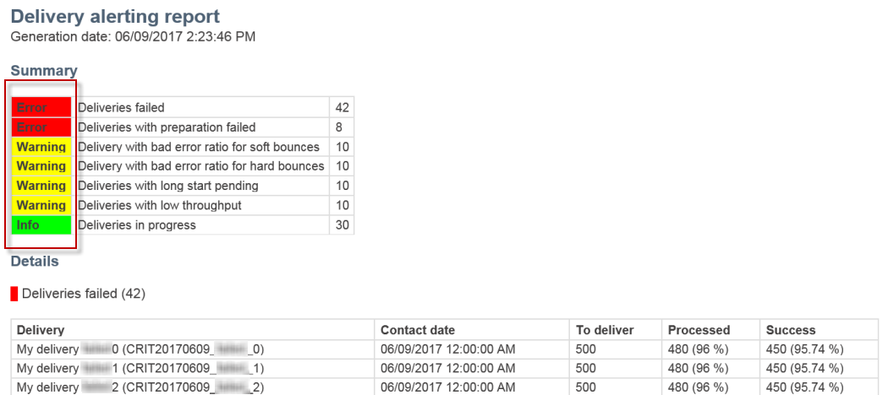
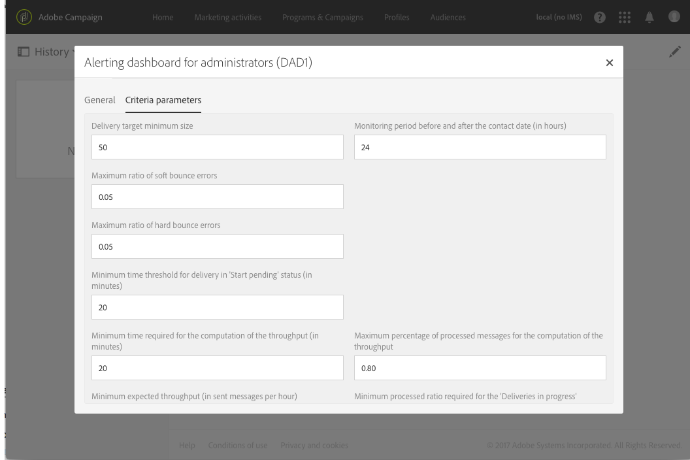

# Receber alertas quando ocorrerem falhas{#receiving-alerts-when-failures-happen}

## Sobre alertas de delivery {#about-delivery-alerting}

O recurso **Delivery alerting** é um sistema de gerenciamento de alertas que permite que um grupo de usuários receba automaticamente notificações contendo informações sobre a execução de seus deliveries.

As notificações enviadas contêm um relatório baseado, por padrão, nos seguintes critérios:

* Deliveries com falha
* Deliveries com preparação com falha
* Deliveries com uma taxa de erro de devolução temporária incorreta
* Deliveries com uma taxa de erro de devolução permanente incorreta
* Deliveries com status pendente maior do que o normal
* Deliveries com baixa taxa de transferência
* Deliveries em andamento

Os destinatários dos alertas podem monitorar os deliveries que estão sendo processados pelo Adobe Campaign e tomar as ações apropriadas quando houver problemas na execução.

Essas notificações de alerta podem ser personalizadas, dependendo de critérios de alerta específicos definidos por meio de um painel na interface do Adobe Campaign.

>[!NOTE]
>
>As notificações de alerta são entregues somente por email.

As notificações enviadas contêm:

* Um **[!UICONTROL Summary]** exibindo o número de deliveries que atendem aos critérios definidos e o rótulo/cor escolhido para cada critério.
* Uma seção **[!UICONTROL Details]** listando todos os critérios de delivery definidos para o painel correspondente e todos os deliveries para cada critério.

## Painéis de alerta de delivery {#delivery-alerting-dashboards}

### Sobre painéis de alerta de delivery {#about-delivery-alerting-dashboards}

Para gerenciar os destinatários das notificações, definir os critérios de alerta e acessar o histórico dos alertas, é necessário usar painéis.

>[!NOTE]
>
>Para acessar e configurar os painéis e os critérios de alerta, você deve ter direitos administrativos ou aparecer no grupo **Delivery supervisors** security . Os usuários padrão não podem acessar os painéis na interface do Adobe Campaign. Eles só podem receber as notificações de alerta. Para obter mais informações sobre usuários e segurança no Adobe Campaign, consulte [Tipos de usuários](../../administration/using/users-management.md) e [Sobre grupos de segurança](../../administration/using/managing-groups-and-users.md#about-security-groups).

Na interface do Adobe Campaign, é possível:

* Crie e gerencie painéis de alertas de delivery. Consulte [Criação de um painel de alerta de delivery](#creating-a-delivery-alerting-dashboard).
* Defina e gerencie os critérios de alerta do delivery para cada painel. Por exemplo, você pode criar alertas com base em deliveries com uma preparação com falha ou deliveries com uma taxa de transferência baixa somente. Consulte [Sobre os critérios de alerta](#about-alerting-criteria).
* Modifique os parâmetros de critérios para cada painel. Consulte [Parâmetros de critérios](#criteria-parameters).
* Defina um grupo de recipients para cada painel.

   Por exemplo, você deseja informar os usuários com direitos administrativos somente sobre deliveries com falha. No entanto, você deseja que os usuários de marketing recebam informações sobre os deliveries com uma taxa de erro de rejeição temporária. Portanto, é necessário criar dois painéis diferentes e definir os critérios desejados para cada grupo de recipients.

* Acesse o histórico de todos os alertas enviados para cada painel.

   Ao selecionar um painel, o último alerta enviado para esse painel é exibido por padrão. Todos os alertas enviados são listados à esquerda da tela. Clique em um item na lista **[!UICONTROL History]** para acessar os alertas correspondentes.

### Criar um painel de alerta de delivery {#creating-a-delivery-alerting-dashboard}

Se desejar enviar notificações baseadas em critérios específicos para diferentes grupos de usuários, é necessário usar vários painéis. Para criar um novo painel:

1. Acesse **[!UICONTROL Administration]** > **[!UICONTROL Channels]** > **[!UICONTROL Delivery alerting]**.
1. Selecione **[!UICONTROL Delivery alerting dashboards]** e clique em **[!UICONTROL Create]**.
1. Marque a caixa **[!UICONTROL Enabled]** para ativar o painel atual.

   Se essa opção estiver desativada, as notificações vinculadas a esse painel não serão mais enviadas. Essa opção está desabilitada por padrão.

   

1. Selecione o grupo de recipients que deseja notificar na lista suspensa **[!UICONTROL Alert group]**. Para modificar ou criar um grupo, consulte [Criação de um grupo de segurança e atribuição de usuários](../../administration/using/managing-groups-and-users.md#creating-a-security-group-and-assigning-users).
1. Na seção **[!UICONTROL Delivery alerting criteria]** , clique em **[!UICONTROL Create element]** para adicionar critérios. Consulte [Sobre os critérios de alerta](#about-alerting-criteria).
1. Selecione o botão **[!UICONTROL Edit properties]**. Na guia **[!UICONTROL Criteria parameters]** , defina como os critérios serão aplicados. Consulte [Parâmetros de critérios](#criteria-parameters).
1. Clique em **[!UICONTROL Create]** para salvar o painel.

Agora, sempre que um delivery atender aos critérios definidos neste painel, uma notificação de alerta será enviada para o grupo de usuários especificado.

## Critérios de alerta de delivery {#delivery-alerting-criteria}

### Sobre os critérios de alerta {#about-alerting-criteria}

Para acessar os critérios de alerta do delivery, vá para **[!UICONTROL Administration]** > **[!UICONTROL Channels]** > **[!UICONTROL Delivery alerting]** e selecione **[!UICONTROL Delivery alerting criteria]**.

Os seguintes critérios podem ser usados nos painéis de alerta do delivery:

* **[!UICONTROL Deliveries failed]**: Qualquer delivery agendado em um intervalo definido, com um status incorreto.
* **[!UICONTROL Deliveries with preparation failed]**: Qualquer delivery modificado em um intervalo definido, para o qual a etapa de preparação (cálculo de target e geração de conteúdo) falhou. Para obter mais informações, consulte [Preparando o envio](../../sending/using/preparing-the-send.md).
* **[!UICONTROL Delivery with bad error ratio for soft bounces]**: Qualquer delivery agendado em um intervalo definido, com um status mínimo  **[!UICONTROL In progress]**, com uma taxa de erro de devolução temporária maior que uma porcentagem definida.
* **[!UICONTROL Delivery with bad error ratio for hard bounces]**: Qualquer delivery agendado em um intervalo definido, com um status pelo menos  **[!UICONTROL In progress]**, com uma taxa de erro de rejeição permanente maior que uma porcentagem definida.
* **[!UICONTROL Deliveries with long start pending]**: Qualquer delivery agendado em um intervalo definido, com um  **[!UICONTROL Start pending]** status por mais de uma duração definida,  **[!UICONTROL Start pending]** status que significa que as mensagens ainda não foram consideradas pelo sistema.
* **[!UICONTROL Deliveries with low throughput]**: Qualquer delivery iniciado por mais do que uma duração definida, com menos de uma porcentagem definida de mensagens processadas, com uma taxa de transferência menor do que um valor definido.
* **[!UICONTROL Deliveries in progress]**: Qualquer delivery agendado em um intervalo definido, com o  **[!UICONTROL In progress]** status .

>[!NOTE]
>
>Todos os parâmetros que se aplicam aos critérios acima têm valores padrão. Esses valores podem ser alterados na guia **[!UICONTROL Criteria parameters]** dos painéis de alerta do delivery. Consulte [Parâmetros de critérios](#criteria-parameters).

Você pode selecionar qualquer item na lista **[!UICONTROL Delivery alerting criteria]** para acessar seus detalhes.

Para cada critério, você pode definir as seguintes configurações:

* **[!UICONTROL Indicators to add in alerts]**, ou seja, as colunas que aparecerão na  **[!UICONTROL Details]** seção da notificação para os deliveries correspondentes ao critério selecionado.

   

* **[!UICONTROL Alert type]**, o que significa o rótulo e a cor que aparecerão ao lado do critério de delivery no resumo da notificação.

   

* **[!UICONTROL Criteria frequency]**: Se um critério for atendido para um delivery, ele será repetido em cada notificação enviada dentro do período de monitoramento. Caso contrário, somente um alerta será enviado por dia (na primeira ocorrência) por critério de alerta para um delivery.

   Por padrão, essa opção é definida como uma vez por dia para todos os critérios.

**Tópicos relacionados:**

* [Envio de logs](../../sending/using/monitoring-a-delivery.md#sending-logs)
* [Frequência dos alertas](#alerting-frequency)
* [Ícones e status da atividade de marketing](../../start/using/marketing-activities.md#marketing-activity-icons-and-statuses)

### Criação de um critério de alerta de delivery {#creating-a-delivery-alerting-criterion}

Você pode criar novos critérios de alerta do delivery para atender melhor às suas necessidades.

Por exemplo, você pode criar um novo critério que permita enviar uma notificação listando todos os deliveries com um status **[!UICONTROL Finished]** .

Para fazer isso, primeiro é necessário estender o recurso **Delivery** e adicionar um novo filtro que permita selecionar apenas os deliveries com um status **[!UICONTROL Finished]**.

1. Vá para **Adobe Campaign** > **Administração** > **Desenvolvimento** > **Recursos personalizados** e clique em **[!UICONTROL Create]**.
1. Selecione **[!UICONTROL Extend an existing resource]**, selecione o recurso **[!UICONTROL Delivery]** na lista suspensa e clique em **[!UICONTROL Create]** para editá-lo.

   

   Para obter mais informações sobre a extensão de um recurso existente, consulte [Definir o recurso](../../developing/using/creating-or-extending-the-resource.md).

1. No recurso **[!UICONTROL Delivery]**, vá para a guia **[!UICONTROL Filter definition]** e clique em **[!UICONTROL Add an element]** para criar um filtro.

   

1. Edite a nova definição de filtro: na janela **[!UICONTROL Filter definition]**, arraste e solte o item **[!UICONTROL Status]** no espaço de trabalho e selecione **[!UICONTROL Finished]** como condição de filtro.

   

   Para obter mais informações sobre como criar e editar filtros personalizados, consulte [Definir filtros](../../developing/using/configuring-filter-definition.md).

1. Salve as alterações e publique os recursos. Para obter mais informações, consulte [Publicação de um recurso personalizado](../../developing/using/updating-the-database-structure.md#publishing-a-custom-resource).

   O filtro é criado e agora pode ser selecionado em um novo critério de alerta de delivery.

1. Vá para **[!UICONTROL Administration]** > **[!UICONTROL Channels]** > **[!UICONTROL Delivery alerting]**, selecione **[!UICONTROL Delivery alerting criteria]** e clique em **[!UICONTROL Create]**.
1. Na lista suspensa **[!UICONTROL Delivery filter applied by this criterion]**, selecione o filtro que acabou de criar.

   

   Você pode definir as configurações do seu critério da mesma forma que os critérios padrão. Consulte [Sobre os critérios de alerta](#about-alerting-criteria).

Após a criação, esses critérios podem ser adicionados a um painel de alertas de delivery, bem como a outros critérios. Consulte [Sobre painéis de alerta de delivery](#about-delivery-alerting-dashboards).

**Tópicos relacionados:**

[Adicionar ou estender um recurso](../../developing/using/key-steps-to-add-a-resource.md)

## Parâmetros de alerta de delivery {#delivery-alerting-parameters}

### Parâmetros de critérios {#criteria-parameters}

Na guia **[!UICONTROL Criteria parameters]** de um [painel de alerta de delivery](#creating-a-delivery-alerting-dashboard), você pode definir as configurações que se aplicam aos critérios selecionados neste painel.

* **[!UICONTROL Delivery target minimum size]**: Por exemplo, se você inserir 100 nesse campo, uma notificação será enviada apenas para deliveries com um target igual ou superior a 100 recipients. Esse parâmetro se aplica a todos os critérios.
* **[!UICONTROL Monitoring period before and after the contact date (in hours)]**: Número de horas antes e depois do tempo atual. Somente os deliveries com uma data de contato nesse intervalo de tempo são considerados. Esse parâmetro se aplica a todos os critérios. Por padrão, o valor desse campo é definido como 24 horas.

   Para obter mais informações sobre a data de contato, consulte [Sobre o agendamento](../../sending/using/about-scheduling-messages.md).

* **[!UICONTROL Maximum ratio of soft bounce errors]**: Uma notificação é enviada para todos os deliveries com uma taxa de erro de devolução temporária maior que o valor especificado. Por padrão, o valor desse campo é definido como 0,05 (5%).

   Para obter mais informações sobre erros de devolução temporária, consulte [Bounce mail qualification](../../sending/using/understanding-delivery-failures.md#bounce-mail-qualification) e [List of delivery failure types](../../sending/using/understanding-delivery-failures.md#delivery-failure-types-and-reasons).

* **[!UICONTROL Maximum ratio of hard bounce errors]**: Uma notificação é enviada para todos os deliveries com uma taxa de erro de rejeição permanente maior que o valor especificado. Por padrão, o valor desse campo é definido como 0,05 (5%).

   Para obter mais informações sobre erros de devolução permanente, consulte [Bounce mail qualification](../../sending/using/understanding-delivery-failures.md#bounce-mail-qualification) e [List of delivery failure types](../../sending/using/understanding-delivery-failures.md#delivery-failure-types-and-reasons).

* **[!UICONTROL Minimum time threshold for delivery in 'Start pending' status (in minutes)]**: Uma notificação é enviada para todos os deliveries com um  **[!UICONTROL Start pending]** status por mais do que a duração especificada neste campo,  **[!UICONTROL Start pending]** status que significa que as mensagens ainda não foram consideradas pelo sistema.
* **[!UICONTROL Minimum time required for the computation of the throughput (in minutes)]**: Somente os deliveries iniciados (com  **[!UICONTROL In progress]** status) por mais do que a duração especificada são considerados para o  **[!UICONTROL Deliveries with low throughput]** critério .
* **[!UICONTROL Maximum percentage of processed messages for the computation of the throughput]**: Somente os deliveries com uma porcentagem de mensagens processadas inferior à porcentagem especificada são considerados para o  **[!UICONTROL Deliveries with low throughput]** critério.
* **[!UICONTROL Minimum expected throughput (in sent messages per hour)]**: Somente os deliveries com uma taxa de transferência inferior ao valor especificado são considerados para o  **[!UICONTROL Deliveries with low throughput]** critério.
* **[!UICONTROL Minimum processed ratio required for 'Deliveries in progress' criterion]**: Somente os deliveries com uma porcentagem de mensagens processadas superior à porcentagem especificada são considerados.

### Frequência de alerta {#alerting-frequency}

A opção **[!UICONTROL Frequency of delivery alerting]** permite definir o atraso entre dois envios de alerta. Por padrão, é definido como 10 minutos.

Você pode alterar essa configuração usando o menu **[!UICONTROL Administration]** > **[!UICONTROL Application settings]** > **[!UICONTROL Options]**.

>[!NOTE]
>
>Essa opção se aplica a todos os painéis definidos no Adobe Campaign. Não é possível definir uma frequência específica para cada painel.

## Motivos de alerta de delivery {#delivery-alerting-reasons}

O recurso **Delivery alerting** mantém todos os usuários envolvidos do Adobe Campaign informados automaticamente sobre o status de execução da entrega, por email e pelo painel.

Agora, quando você recebe uma notificação de alerta de delivery, aqui estão algumas dicas sobre o que você pode fazer.

Primeiro, marque a guia **Log** do delivery para exibir todas as informações relacionadas ao delivery e às provas. Os ícones vermelho e amarelo permitem identificar erros ou avisos. O ícone vermelho indica um erro crítico que impede o início do delivery.

Para exibir o histórico de cada ocorrência de um delivery, selecione a guia **[!UICONTROL Sending logs]** . Ela contém a lista de mensagens enviadas e seus status. Você pode verificar o status do delivery para cada recipient ( **[!UICONTROL Sent]**, **[!UICONTROL Pending]**, **[!UICONTROL Failed]**, etc.). Para obter mais informações, consulte [Envio de logs](../../sending/using/monitoring-a-delivery.md#sending-logs).

Estes são alguns motivos possíveis para receber notificações de alerta de acordo com os critérios que são atendidos para um delivery.

* **[!UICONTROL Deliveries failed]**: Esse critério informa você sobre todos os deliveries com um status incorreto. Pode ser devido a:

   * Um problema com o servidor de delivery (MTA, Message Transfer Agent)
   * Tempo limite de conexão entre o servidor de entrega do Adobe Campaign e o servidor de recebimento
   * Um problema da capacidade de entrega
   * Um workflow incorreto

   Se o delivery for acionado com um workflow, verifique se ele foi iniciado corretamente. Para obter mais informações, consulte [Execução de um workflow](../../automating/using/about-workflow-execution.md). Caso contrário, entre em contato com o administrador do Adobe Campaign para resolver o problema.

* **[!UICONTROL Deliveries with preparation failed]**: Um erro pode ocorrer durante a preparação do delivery nos seguintes casos:

   * Falta um assunto no delivery.
   * Há uma sintaxe incorreta nos campos de personalização.
   * O destino está ausente.
   * O delivery excede o limite de tamanho.

   Para obter mais informações, consulte [Preparando o envio](../../sending/using/preparing-the-send.md). No entanto, esses erros geralmente são detectados durante a análise da mensagem. Consulte [Regras de controle](../../sending/using/control-rules.md).

* As possíveis causas para um alerta **[!UICONTROL Delivery with bad error ratio for soft bounces]** podem ser:

   * O servidor do recipient está inativo.
   * A caixa de correio do destinatário está cheia.

   Para obter mais informações, marque as guias **[!UICONTROL Exclusion logs]** e **[!UICONTROL Exclusion causes]** dos logs do delivery. Consulte [Logs de exclusão](../../sending/using/monitoring-a-delivery.md#exclusion-logs).

   As possíveis causas para um alerta **[!UICONTROL Delivery with bad error ratio for hard bounces]** podem ser:

   * O recipient é adicionado à  de lista de bloqueios, o que significa que ele não deseja mais ser contatado.
   * O endereço de email do destinatário não existe.
   * O domínio do recipient não existe.
   * O servidor do recipient está bloqueando o delivery.

   Para evitar erros de devolução temporária e temporária, siga as práticas recomendadas abaixo:

   * Crie regras de tipologia de filtragem para excluir uma parte do público alvo da mensagem durante a análise de delivery, como recipients em quarentena. Consulte [Criação de uma regra de filtragem](../../sending/using/filtering-rules.md).
   * Atualize regularmente o banco de dados do cliente para manter bons processos de gerenciamento de quarentena. Consulte [Sobre quarentenas](../../sending/using/understanding-quarantine-management.md#about-quarantines).
   * Em geral, melhore a capacidade de entrega da melhor maneira possível. Consulte a documentação detalhada [Deliverability](../../sending/using/about-deliverability.md) do Adobe Campaign e entre em contato com o administrador do Adobe Campaign para obter assistência.

* **[!UICONTROL Deliveries with long start pending]**: Normalmente, isso significa que há um problema no nível do MTA (Message Transfer Agent). O processo de execução está aguardando a disponibilidade de alguns recursos. O MTA pode não ter sido iniciado.

   **[!UICONTROL Deliveries with low throughput]**: Novamente, esse é um problema de deliverability que significa que o MTA é muito lento.

   Para obter mais informações sobre esses problemas, entre em contato com o administrador do Adobe Campaign.

**Tópicos relacionados:**

* [Noções básicas sobre falhas de delivery](../../sending/using/understanding-delivery-failures.md)
* [Noções básicas sobre gestão de quarentena](../../sending/using/understanding-quarantine-management.md)
* [Sobre participação e não participação no Campaign](../../audiences/using/about-opt-in-and-opt-out-in-campaign.md)

