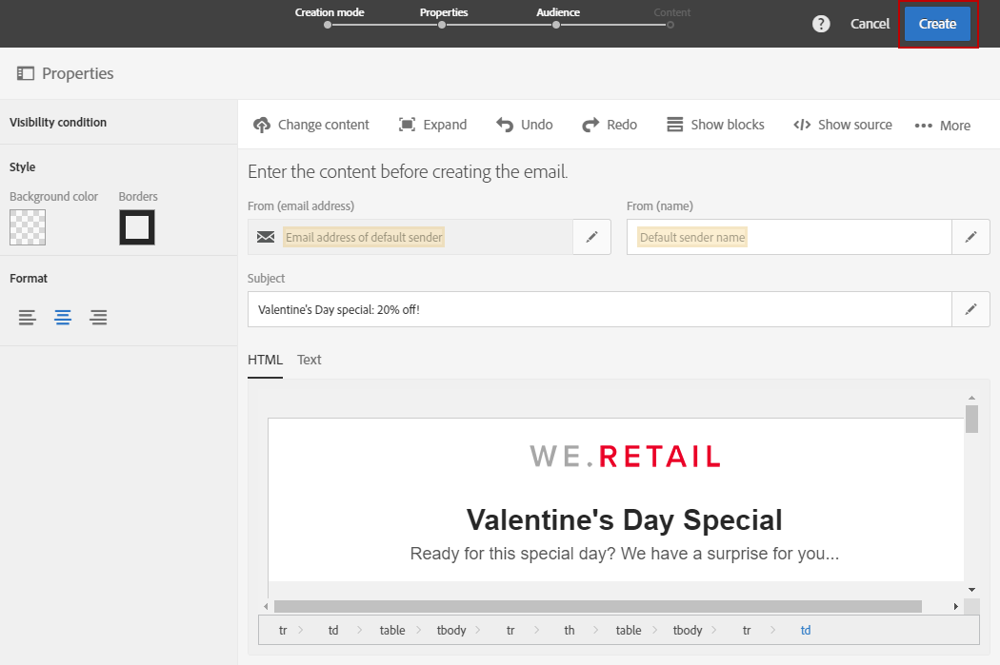

# Envio de mensagens no fuso horário do recipient{#sending-messages-at-the-recipient-s-time-zone}

Ao gerenciar uma campanha na qual a data e a hora são importantes, você pode programar um delivery que considere a hora local de cada recipient: eles receberão email, SMS ou notificações por push na hora programada, em seu próprio fuso horário.

>[!NOTE]
>
>Para usar essa funcionalidade, verifique se todos os perfis direcionados pelo delivery têm um fuso horário especificado na seção **[!UICONTROL Address]** de suas propriedades. Para obter mais informações sobre o acesso às propriedades dos perfis, consulte esta [seção](../../audiences/using/editing-profiles.md).

Para enviar um delivery no fuso horário do recipient, você também pode usar a atividade **[!UICONTROL Scheduler]** em um fluxo de trabalho. Para obter mais informações, consulte esta [página](../../automating/using/scheduler.md).

No exemplo a seguir, queremos enviar um código promocional válido somente no Dia dos namorados para todos os clientes no mundo todo. Para que haja tempo suficiente para usá-lo durante o dia, todos os clientes devem receber a mensagem em 14 de fevereiro, às 8h, dependendo de seus fusos horários.

1. Na guia **[!UICONTROL Marketing activities]**, comece criando o delivery, no nosso caso, um email. Para saber mais sobre a criação de email, consulte esta [seção](../../channels/using/creating-an-email.md).
1. Depois de criar o email Dia dos namorados, clique em **[!UICONTROL Create]** para acessar o painel do delivery. Para obter mais informações sobre design de email, consulte esta [página](../../designing/using/personalization.md#example-email-personalization).

   

1. No painel do delivery, selecione o bloco **[!UICONTROL Schedule]**.

   

1. Selecione a opção **[!UICONTROL Messages to be sent automatically on the date]** especificada abaixo. Em seguida, no campo **[!UICONTROL Start sending from]**, defina a data do contato, no nosso caso, 14 de fevereiro às 8h, para que todos os recipients recebam no Dia dos namorados.

   

1. No campo **[!UICONTROL Time zone of the contact date]**, selecione em qual fuso horário o delivery deve ser enviado por padrão.

   Se um **[!UICONTROL Time zone]** do perfil for deixado como **[!UICONTROL Default]**, os recipients receberão o delivery dependendo do fuso horário escolhido aqui.

1. No menu suspenso **[!UICONTROL Optimize the sending time per recipient]**, escolha **[!UICONTROL Send at the recipient's time zone]**. Assim, os recipients receberão o email do Dia dos namorados no dia 14 de fevereiro, dependendo do fuso horário.

   

1. Depois de confirmar a programação do delivery, clique no botão **[!UICONTROL Prepare]** e depois **[!UICONTROL Confirm]** seu delivery.

   Confirme o envio com pelo menos 24 horas de antecedência. Caso contrário, dependendo da sua localização, alguns recipients poderão receber o delivery antes do evento Dia dos namorados.

   

Não importa onde eles estejam localizados, todos os recipients receberão a mensagem em 14 de fevereiro, às 8h, no horário local.
