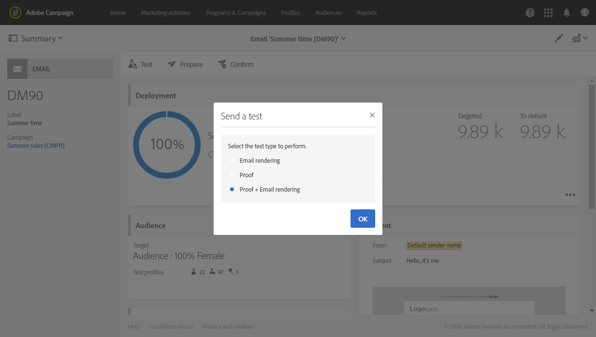
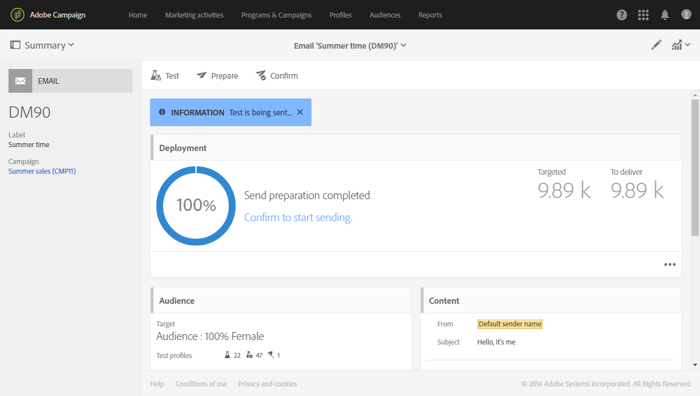

# Envio de provas {#sending-proofs}

## Sobre provas {#about-proofs}

Uma prova é uma mensagem especial com a qual é possível testar um delivery antes de enviá-lo ao público alvo principal. Os recipients da prova são responsáveis pela aprovação da mensagem (seu conteúdo e formato).

Há dois tipos de recipients de prova:

* **Perfis de teste** permitem segmentar recipients adicionais que não correspondam aos critérios de direcionamento definidos.

   Eles podem ser adicionados ao público de uma mensagem para detectar qualquer uso fraudulento do banco de dados do seu recipient ou para garantir que os emails cheguem às caixas de entrada. Para mais informações, consulte [Gerenciamento de perfis de teste](../../audiences/using/managing-test-profiles.md).

   >[!NOTE]
   >
   >Para enviar uma prova, você precisa incluir os perfis de teste no público da sua mensagem.

* **Perfis de substituição** permitem que você se posicione como um dos perfis segmentados e obtenha uma representação exata da mensagem que o perfil receberá. Para mais informações, consulte [Testar mensagens de email usando perfis segmentados](../../sending/using/testing-messages-using-target.md).

   >[!NOTE]
   >
   >Esse recurso está disponível somente para o canal de email.

## Envio de prova {#sending-a-proof}

Para enviar provas, siga estas etapas:

1. Verifique se os recipients da prova foram configurados:
   * Os **perfis de teste** devem ser incluídos no público da sua mensagem.
   * Os **perfis de substituição** devem ser adicionados assim que a preparação da mensagem tiver sido realizada com êxito (consulte [esta seção](../../sending/using/testing-messages-using-target.md)).

1. Clique no botão **[!UICONTROL Send a test]**.

   

1. Selecione o tipo de prova que deseja usar:

   * **[!UICONTROL Email rendering]**: selecione essa opção para testar a maneira com que sua mensagem é recebida de acordo com as caixas de entrada segmentadas. Para mais informações, consulte [Renderização de email](../../sending/using/email-rendering.md).
   * **[!UICONTROL Proof]**: selecione essa opção para testar a mensagem antes de enviá-la para o público alvo principal. Os recipients de prova são responsáveis pela aprovação do delivery, verificando o conteúdo e o formato.
   * **[!UICONTROL Proof + Email rendering]**: essa opção combina as duas opções anteriores.
   

   >[!NOTE]
   >
   >A renderização de email está disponível somente com perfis de teste. Se nenhum perfil de teste tiver sido adicionado à mensagem, somente a opção **[!UICONTROL Proof]** estará disponível para seleção.

1. Confirme sua escolha.

   As provas são enviadas para os recipients que foram configurados.

   

1. É possível exibir suas provas na lista suspensa **[!UICONTROL Proofs]**.

   

1. Selecione uma prova para acessar o resumo. Para um email, se você selecionou a opção **Renderização de email** como o tipo de prova, o ícone **[!UICONTROL Access email rendering]** será exibido à direita do rótulo da prova. Consulte [Renderização de email](../../sending/using/email-rendering.md).

   

Dependendo dos comentários das pessoas que recebem a prova, talvez você tenha que modificar o conteúdo do delivery. Após realizar as modificações, é necessário reiniciar a preparação do email e, em seguida, reenviar uma prova. Cada nova prova pode ser acessada usando o botão **[!UICONTROL Show proofs]**.

Você precisa enviar quantas provas forem necessárias até concluir o conteúdo do seu delivery. Finalizada essa etapa, você poderá enviar o delivery para o público alvo principal e fechar o ciclo de aprovação.

## Configuração da linha de assunto da prova {#configuring-proofs-subject-line}

Ao enviar uma prova, a linha de assunto é configurada por padrão com o prefixo **&quot;Prova&quot;**, e também um contador, que indica o número da prova.

Para alterar a linha de assunto padrão a ser usada, siga estas etapas:

1. No painel da mensagem, clique no botão **[!UICONTROL Open properties]**.
1. Na seção **[!UICONTROL Advanced parameters]**, defina o prefixo que você deseja usar por padrão na linha de assunto.

Para ocultar o número da prova na linha de assunto, ative a opção **[!UICONTROL Hide proof prefix counter]**.

>[!NOTE]
>
>Se quiser ocultar o prefixo de prova inteiro, deixe o campo **[!UICONTROL Subject line prefix]** em branco.

1. Clique em **[!UICONTROL Confirm]**. As configurações serão aplicadas por padrão a todas as provas enviadas para a mensagem selecionada.

**Tópicos relacionados:**

* Vídeo [Envio de teste, preparação e envio de email](https://docs.adobe.com/content/help/en/campaign-learn/campaign-standard-tutorials/getting-started/sending-test-preparing-sending-email.html)
* [Teste de mensagens de email usando perfis segmentados](../../sending/using/testing-messages-using-target.md).
* [Gerenciamento de perfis de teste](../../audiences/using/managing-test-profiles.md).
* [Visualização de mensagens](../../sending/using/previewing-messages.md)
* [Configuração do canal de email](../../administration/using/configuring-email-channel.md)
