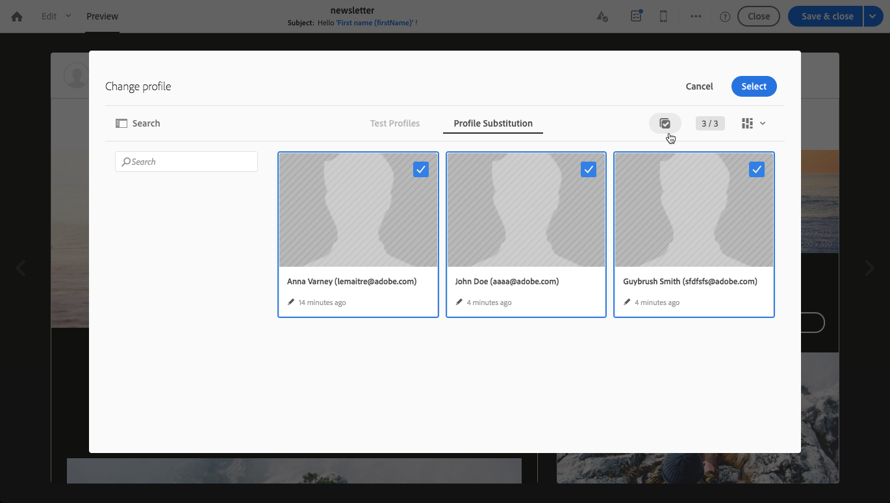
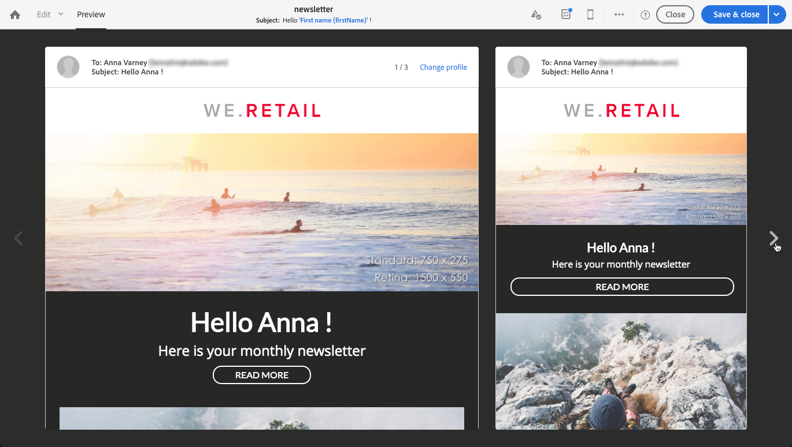

# Testar mensagens de email usando perfis direcionados {#testing-message-profiles}

## Visão geral {#overview}

Além de [perfis de teste](../../audiences/using/managing-test-profiles.md), você pode testar uma mensagem de email colocando-se na posição de um dos perfis direcionados. Isso permite obter uma representação exata da mensagem que o perfil receberá (campos personalizados, informações dinâmicas e personalizadas, incluindo dados adicionais de workflows...).

>[!NOTE]
>
> Este recurso está disponível somente com mensagens de email.

As etapas principais são as seguintes:

1. Configure sua mensagem e inicie a fase **Preparação**.
1. **Selecione um ou vários** perfis entre os perfis direcionados pela mensagem.
1. Associe a cada perfil um **endereço de substituição** para o qual as provas serão enviadas.
1. (opcional) Para cada perfil, defina um **prefixo** para adicionar à linha de assunto da prova.
1. **Visualize** no Designer de email como a mensagem será exibida para os perfis.
1. Envie as provas.

>[!IMPORTANT]
>
>Esse recurso permite enviar informações pessoais do perfil para endereços de email externos. Lembre-se de que a execução de solicitações de privacidade (GDPR e CCPA) no Campaign Standard NÃO executará externamente essa solicitação.

 [Descubra este recurso no vídeo](#video)

## Selecionar perfis e endereços de substituição {#selecting-profiles}

Para usar perfis direcionados para testes, primeiro selecione-os e, em seguida, defina os endereços de substituição que receberão as provas. Para fazer isso, você pode [selecionar perfis específicos](#selecting-individual-profiles) entre os perfis direcionados ou [importar perfis de uma audiência existente](#importing-from-audience).

>[!NOTE]
>
>Você pode selecionar no máximo 100 perfis para teste.

### Selecionar perfis individuais {#selecting-individual-profiles}

1. No painel de mensagens, verifique se a preparação da mensagem foi bem-sucedida e clique no bloco **[!UICONTROL Audience]**.

   

1. Na guia **[!UICONTROL Profile substitutions]**, clique no botão **[!UICONTROL Create element]** para selecionar os perfis a serem usados para teste.

   

1. Clique no botão de seleção do perfil para exibir a lista dos perfis direcionados pela mensagem.

   

1. Selecione o perfil a ser usado para teste, digite no campo **[!UICONTROL Address]** o endereço de substituição desejado e clique em **[!UICONTROL Confirm]**. Todas as provas que direcionam o perfil serão enviadas para este endereço de email, em vez da definida no banco de dados para este perfil.

   Se desejar adicionar um prefixo específico à linha de assunto do prova, preencha o campo **[!UICONTROL Subject line prefix]**.

   >[!NOTE]
   >
   >O prefixo da linha de assunto pode conter até 500 caracteres.

   

   O prefixo será exibido como abaixo:

   

1. O perfil é adicionado à lista, com seu endereço de substituição e prefixo associados. Repita as etapas acima para todos os perfis que deseja usar para teste e clique em **[!UICONTROL Confirm]**.

   

   Se quiser enviar uma prova para vários endereços de substituição de um mesmo perfil, você deve adicionar esse perfil quantas vezes forem necessárias.

   No exemplo abaixo, a prova baseada no perfil John Smith será enviada para dois endereços de substituição diferentes:

   

1. Depois que todos os perfis e endereços de substituição forem definidos, você poderá enviar uma prova para testar a mensagem. Para fazer isso, clique no botão **[!UICONTROL Test]** e selecione o tipo de teste a ser executado.

   Observe que se nenhum perfil de teste tiver sido adicionado ao público alvo de mensagem, as opções **[!UICONTROL Email rendering]** e **[!UICONTROL Proof + Email rendering]** não estarão disponíveis.  Para obter mais informações sobre como enviar provas, consulte [esta seção](../../sending/using/sending-proofs.md).

   

>[!IMPORTANT]
>
>Se você fizer alguma alteração na sua mensagem, certifique-se de iniciar a preparação da mensagem novamente. Caso contrário, as alterações não serão refletidas na prova.

### Importando perfis de uma audiência {#importing-from-audience}

O Campaign Standard permite importar uma audiência de perfis que você pode usar para testes. Isso permite, por exemplo, enviar para um endereço de email exclusivo um conjunto inteiro de mensagens direcionadas a perfis diferentes.

Além disso, se sua audiência já estiver configurada com as colunas de endereço e prefixo, você poderá importar essas informações na guia **[!UICONTROL Profile substitutions]**. Um exemplo de importação de audiência com endereços de substituição está detalhado em [esta seção](#use-case).

>[!NOTE]
>
>Ao importar uma audiência, somente os perfis correspondentes ao público alvo de mensagem são selecionados e adicionados à guia **[!UICONTROL Profile substitutions]**.

Para importar perfis para uso em testes de uma audiência, siga estas etapas:

1. No painel de mensagens, verifique se a preparação da mensagem foi bem-sucedida e clique no bloco **[!UICONTROL Audience]**.

   

1. Na guia **[!UICONTROL Profile substitutions]**, clique em **[!UICONTROL Import from an audience]**.

   

1. Selecione a audiência a ser usada e insira o endereço de substituição e o prefixo a ser usado para as provas enviadas para a audiência.

   >[!NOTE]
   >
   >O prefixo da linha de assunto pode conter até 500 caracteres.

   

   Se os endereços de substituição e/ou prefixos a serem usados já tiverem sido definidos na audiência, selecione a opção **[!UICONTROL From Audience]** e especifique a coluna a ser usada para recuperar essas informações.

   

1. Clique no botão **[!UICONTROL Import]**. Os perfis da audiência que correspondem ao público alvo de mensagem são adicionados à guia **[!UICONTROL Profile substitution]**, bem como os endereços de substituição e os prefixos associados.

>[!NOTE]
>
>Se você importar a mesma audiência novamente, com endereços de substituição e/ou prefixos diferentes, os perfis serão adicionados à lista, além dos da importação anterior.

## Visualização da mensagem com perfis direcionados

>[!NOTE]
>
>A pré-visualização está disponível somente no Designer de email.

Para poder pré-visualização mensagens usando perfis direcionados, certifique-se de ter adicionado esses perfis à lista **[!UICONTROL Profile substitution]** (consulte [Definindo perfis e endereços de substituição](#selecting-profiles)).

Se você quiser usar campos de personalização na mensagem, eles devem ser adicionados **antes de** iniciar a preparação da mensagem. Caso contrário, não serão tomadas em consideração na pré-visualização. Como resultado, inicie a preparação da mensagem novamente se houver alguma alteração nos campos de personalização.

Para pré-visualização de mensagens usando substituição de perfil, siga estas etapas:

1. No painel de mensagens, clique no instantâneo de conteúdo para abrir a mensagem no Designer de email.

   

1. Selecione a guia **[!UICONTROL Preview]** e clique em **[!UICONTROL Change profile]**.

   

1. Clique na guia **[!UICONTROL Profile Substitution]** para exibir os perfis de substituição que foram adicionados para teste.

   Selecione os perfis que deseja usar para a pré-visualização e clique em **[!UICONTROL Select]**.

   

1. Uma pré-visualização da mensagem é exibida. Use as setas para navegar entre os perfis selecionados.

   

## Caso de uso {#use-case}

Nesse caso de uso, queremos enviar para um conjunto de perfis específicos um boletim eletrônico personalizado. Antes de enviar o boletim informativo, queremos pré-visualização-lo usando alguns perfis direcionados e enviar provas para endereços de email internos definidos em um arquivo externo.

As principais etapas para esse caso de uso são as seguintes:

1. Crie a audiência a ser usada para testes.
1. Crie um fluxo de trabalho para perfis de públicos alvos e envie o boletim informativo.
1. Configure as substituições de perfil da mensagem.
1. Pré-visualização a mensagem usando perfis direcionados.
1. Envie provas.

### Etapa 1: Crie a audiência a ser usada para teste

1. Prepare o arquivo a ser importado para criar a audiência. Em nosso caso, deve conter o endereço de substituição a ser usado para a prova e um prefixo a ser adicionado à linha de assunto da prova.

   Neste exemplo, o endereço de email &quot;oliver.vaughan@internal.com&quot; receberá uma prova da mensagem direcionada ao perfil com o endereço de email &quot;john.doe@mail.com&quot;. O prefixo &quot;JD&quot; será adicionado à linha de assunto do prova.

   

1. Crie o fluxo de trabalho para criar uma audiência a partir do arquivo. Para fazer isso, adicione e configure as atividades abaixo:

   * **[!UICONTROL Load file]** atividade: Importa o arquivo CSV (para obter mais informações sobre essa atividade, consulte  [esta seção](../../automating/using/load-file.md)).
   * **[!UICONTROL Reconciliation]** atividade: Vincula informações do arquivo a informações do banco de dados. Neste exemplo, usaremos o endereço de email do perfil como campo de reconciliação (para obter mais informações sobre essa atividade, consulte [esta seção](../../automating/using/reconciliation.md)).
   * **[!UICONTROL Save audience]** atividade: Cria uma audiência com base no arquivo importado (para obter mais informações sobre essa atividade, consulte  [esta seção](../../automating/using/save-audience.md)).

   

1. Execute o fluxo de trabalho e vá para a guia **[!UICONTROL Audiences]** para verificar se a audiência foi criada com as informações desejadas.

   Nesse exemplo, a audiência é composta por três perfis. Cada um deles está vinculado a um endereço de email de substituição que receberá a prova, com um prefixo para usar na linha de assunto da prova.

   

### Etapa 2: Crie um fluxo de trabalho para perfis de públicos alvos e envie a newsletter

1. Adicione **[!UICONTROL Query]** e **[!UICONTROL Email delivery]** atividades e configure-as de acordo com suas necessidades (consulte as seções [Query](../../automating/using/query.md) e [delivery de e-mail](../../automating/using/email-delivery.md)).

   

1. Execute o fluxo de trabalho e verifique se a preparação da mensagem foi bem-sucedida.

### Etapa 3: Configure a guia de substituição de Perfil da mensagem

1. Abra a atividade **[!UICONTROL Email delivery]**. No painel da mensagem, clique no bloco **[!UICONTROL Audience]**.

   

1. Selecione a guia **[!UICONTROL Profile substitutions]** e clique em **[!UICONTROL Import from an audience]**.

   

1. No campo **[!UICONTROL Audience]**, selecione a audiência criada no arquivo.

   

1. Defina o endereço de substituição e o prefixo da linha de assunto a serem usados ao enviar as provas.

   Para fazer isso, selecione a opção **[!UICONTROL From audience]** e a coluna da audiência que contém as informações.

   

1. Clique no botão **[!UICONTROL Import]**. Perfis da audiência são adicionados à lista, com seus endereços de substituição associados e prefixos de linha de assunto.

   

   >[!NOTE]
   >
   >Em nosso caso, todos os perfis da audiência são direcionados pela atividade **[!UICONTROL Query]**. Se um desses perfis não fizesse parte do público alvo de mensagens, ele não seria adicionado à lista.

### Etapa 4: Pré-visualização da mensagem usando perfis direcionados

1. No painel de mensagens, clique no instantâneo de conteúdo para abrir a mensagem no Designer de email.

   

1. Selecione a guia **[!UICONTROL Preview]** e clique em **[!UICONTROL Change profile]**.

   

1. Clique na guia **[!UICONTROL Profile Substitution]** para exibir os perfis de substituição que foram adicionados anteriormente.

   Selecione os perfis que deseja usar para a pré-visualização e clique em **[!UICONTROL Select]**.

   

1. Uma pré-visualização da mensagem é exibida. Use as setas para navegar entre os perfis selecionados.

   

### Etapa 5: Enviar provas

1. No painel da mensagem, clique no botão **[!UICONTROL Test]** e confirme.

   

1. As provas são enviadas de acordo com o que foi configurado na guia **[!UICONTROL Profile substitutions]**.

   

## Vídeo tutorial {#video}

Este vídeo mostra como você pode testar suas mensagens de email usando substituição de Perfil.

>[!VIDEO](https://video.tv.adobe.com/v/32368?quality=12)

Vídeos de procedimentos de Campaign Standard adicionais estão disponíveis [aqui](https://experienceleague.adobe.com/docs/campaign-standard-learn/tutorials/overview.html?lang=pt-BR).
