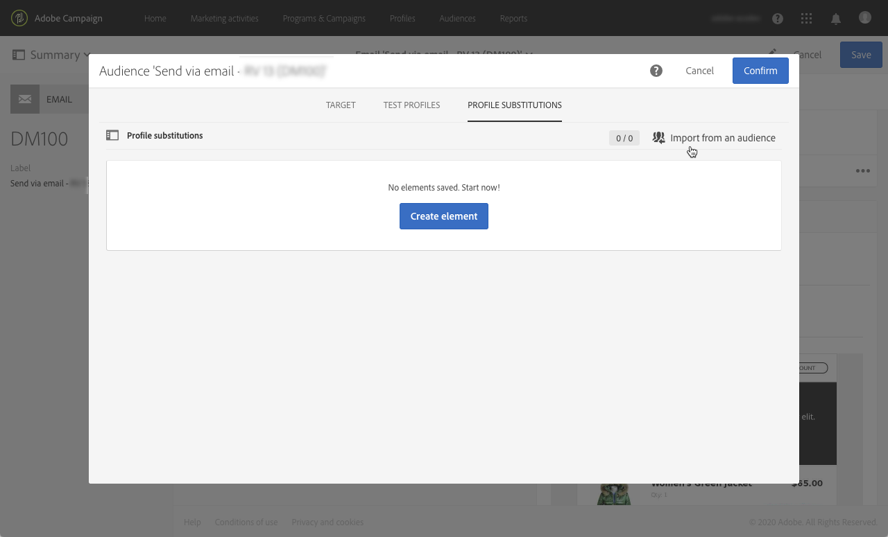

# Teste de mensagens de email usando perfis direcionados {#testing-message-profiles}

## Visão geral {#overview}

Além de [perfis de teste](../../audiences/using/managing-test-profiles.md), você pode testar uma mensagem de email colocando-se na posição de um dos perfis direcionados. Isso permite obter uma representação exata da mensagem que o perfil receberá (campos personalizados, informações dinâmicas e personalizadas, incluindo dados adicionais de workflows...).

>[!IMPORTANT]
>
>Esse recurso permite enviar informações pessoais do perfil para endereços de email externos. Lembre-se de que a execução de solicitações de privacidade (GDPR e CCPA) no Campaign Standard NÃO executará externamente essa solicitação.

As principais etapas são as seguintes:

1. Configure sua mensagem e inicie o **Preparação** fase.
1. **Selecione um ou vários perfis** entre os perfis direcionados pela mensagem.
1. Associar a cada perfil um **endereço de substituição** para as quais as provas serão enviadas.
1. (opcional) Para cada perfil, defina uma **prefixo** para adicionar à linha de assunto da prova.
1. **Visualizar** no Designer de email, como a mensagem será exibida para os perfis.
1. Envie as provas.

   >[!IMPORTANT]
   >
   >Provas são processadas por [!DNL Campaign Standard] como deliveries padrão. Como resultado, o envio de provas usando a substituição de perfil adicionará registros ao delivery e aos logs de rastreamento dos perfis selecionados.

 [Descubra este recurso no vídeo](#video)

## Seleção de perfis e endereços de substituição {#selecting-profiles}

Para usar perfis direcionados para testes, primeiro você deve selecioná-los e depois definir os endereços de substituição que receberão as provas. Para fazer isso, você pode: [selecionar perfis específicos](#selecting-individual-profiles) entre os perfis segmentados ou [importar perfis de um público existente](#importing-from-audience).

>[!NOTE]
>
>É possível selecionar no máximo 100 perfis para teste.

### Seleção de perfis individuais {#selecting-individual-profiles}

1. No painel da mensagem, verifique se a preparação da mensagem foi bem-sucedida e clique no botão **[!UICONTROL Audience]** bloco.

   

1. No **[!UICONTROL Profile substitutions]** clique na guia **[!UICONTROL Create element]** para selecionar os perfis a serem usados para teste.

   

1. Clique no botão de seleção de perfil para exibir a lista de perfis direcionados pela mensagem.

   

1. Selecione o perfil a ser usado para teste e insira no **[!UICONTROL Address]** o endereço de substituição desejado e clique em **[!UICONTROL Confirm]**. Todas as provas que direcionam o perfil serão enviadas para este endereço de email, em vez de para o endereço definido no banco de dados desse perfil.

   Se quiser adicionar um prefixo específico à linha de assunto da prova, preencha o **[!UICONTROL Subject line prefix]** campo.

   >[!NOTE]
   >
   >O prefixo da linha de assunto pode conter até 500 caracteres.

   

   O prefixo será exibido conforme abaixo:

   

1. O perfil é adicionado à lista, com seu endereço de substituição e prefixo associados. Repita as etapas acima para todos os perfis que deseja usar para testes e clique em **[!UICONTROL Confirm]**.

   

   Para enviar uma prova para vários endereços de substituição para um mesmo perfil, adicione esse perfil quantas vezes forem necessárias.

   No exemplo abaixo, a prova baseada no perfil John Smith será enviada para dois endereços de substituição diferentes:

   

1. Depois que todos os perfis e endereços de substituição forem definidos, você poderá enviar uma prova para testar a mensagem. Para fazer isso, clique no link **[!UICONTROL Test]** e selecione o tipo de teste a ser executado.

   Observe que se nenhum perfil de teste tiver sido adicionado ao destino da mensagem, a variável **[!UICONTROL Email rendering]** e **[!UICONTROL Proof + Email rendering]** opções não estão disponíveis.  Para obter mais informações sobre o envio de provas, consulte [nesta seção](../../sending/using/sending-proofs.md).

   

>[!IMPORTANT]
>
>Se você fizer alterações em sua mensagem, inicie a preparação da mensagem novamente. Caso contrário, as alterações não serão refletidas na prova.

### Importação de perfis de um público {#importing-from-audience}

O Campaign Standard permite importar um público-alvo de perfis que você pode usar para testes. Isso permite, por exemplo, enviar para um endereço de email exclusivo um conjunto inteiro de mensagens direcionadas a perfis diferentes.

Além disso, se o público-alvo já estiver configurado com as colunas de endereço e prefixo, você poderá importar essas informações no **[!UICONTROL Profile substitutions]** guia. Um exemplo de importação de público-alvo com endereços de substituição é detalhado em [nesta seção](#use-case).

>[!NOTE]
>
>Ao importar um público-alvo, somente os perfis correspondentes ao público-alvo da mensagem são selecionados e adicionados ao **[!UICONTROL Profile substitutions]** guia.

Para importar perfis a serem usados para testes de um público-alvo, siga estas etapas:

1. No painel da mensagem, verifique se a preparação da mensagem foi bem-sucedida e clique no botão **[!UICONTROL Audience]** bloco.

   

1. Na guia **[!UICONTROL Profile substitutions]**, clique em **[!UICONTROL Import from an audience]**.

   

1. Selecione o público-alvo a ser usado e insira o endereço de substituição e o prefixo a ser usado para as provas enviadas ao público-alvo.

   >[!NOTE]
   >
   >O prefixo da linha de assunto pode conter até 500 caracteres.

   

   Se os endereços de substituição e/ou prefixos a serem usados já tiverem sido definidos em seu público-alvo, selecione o **[!UICONTROL From Audience]** e especifique a coluna a ser usada para recuperar essas informações.

   

1. Clique no botão **[!UICONTROL Import]**. Os perfis do público-alvo correspondente ao público-alvo da mensagem são adicionados ao **[!UICONTROL Profile substitution]** , bem como os endereços e prefixos de substituição associados.

>[!NOTE]
>
>Se você importar o mesmo público-alvo novamente, com diferentes endereços de substituição e/ou prefixos, os perfis serão adicionados à lista além daqueles da importação anterior.

## Pré-visualização da mensagem com perfis direcionados

>[!NOTE]
>
>A visualização está disponível somente com o Designer de email.

Para poder visualizar mensagens usando perfis direcionados, verifique se você adicionou esses perfis à **[!UICONTROL Profile substitution]** (consulte [Definição de perfis e endereços de substituição](#selecting-profiles)).

Se quiser usar campos de personalização na mensagem, eles deverão ser adicionados **antes** iniciando a preparação da mensagem. Caso contrário, elas não serão consideradas na pré-visualização. Como resultado, inicie a preparação da mensagem novamente se qualquer alteração for feita nos campos de personalização.

Para visualizar mensagens usando a substituição de perfil, siga estas etapas:

1. No painel da mensagem, clique no instantâneo de conteúdo para abrir a mensagem no Designer de email.

   

1. Selecione o **[!UICONTROL Preview]** e clique em **[!UICONTROL Change profile]**.

   

1. Clique em **[!UICONTROL Profile Substitution]** para exibir os perfis de substituição que foram adicionados para teste.

   Selecione os perfis que deseja usar para visualização e clique em **[!UICONTROL Select]**.

   

1. Uma pré-visualização da mensagem é exibida. Use as setas para navegar entre os perfis selecionados.

   

## Caso de uso {#use-case}

Nesse caso de uso, queremos enviar a um conjunto de perfis específicos um boletim informativo por email personalizado. Antes de enviar o informativo, queremos visualizá-lo usando alguns dos perfis direcionados e enviar provas para endereços de email internos definidos em um arquivo externo.

As principais etapas para esse caso de uso são as seguintes:

1. Crie o público-alvo a ser usado para testes.
1. Crie um fluxo de trabalho para direcionar perfis e envie o informativo.
1. Configure as substituições de perfil da mensagem.
1. Pré-visualize a mensagem usando perfis direcionados.
1. Enviar provas.

### Etapa 1: criar o público-alvo para usar em testes

1. Prepare o arquivo a ser importado para criar o público-alvo. Em nosso caso, ele deve conter o endereço de substituição a ser usado para a prova e um prefixo para adicionar à linha de assunto da prova.

   Neste exemplo, o endereço de email &quot;oliver.vaughan@internal.com&quot; receberá uma prova da mensagem direcionada ao perfil com o endereço de email &quot;john.doe@mail.com&quot;. O prefixo &quot;JD&quot; será adicionado à linha de assunto da prova.

   

1. Crie o fluxo de trabalho para criar um público-alvo a partir do arquivo. Para fazer isso, adicione e configure as atividades abaixo:

   * **[!UICONTROL Load file]** Atividade: importa o arquivo CSV (para obter mais informações sobre essa atividade, consulte [nesta seção](../../automating/using/load-file.md)).
   * **[!UICONTROL Reconciliation]** Atividade: vincula informações do arquivo às informações do banco de dados. Neste exemplo, use o endereço de email do perfil como campo de reconciliação (para obter mais informações sobre essa atividade, consulte [nesta seção](../../automating/using/reconciliation.md)).
   * **[!UICONTROL Save audience]** Atividade: cria um público com base no arquivo importado (para obter mais informações sobre essa atividade, consulte [nesta seção](../../automating/using/save-audience.md)).

   

1. Execute o fluxo de trabalho e vá para a **[!UICONTROL Audiences]** para verificar se o público-alvo foi criado com as informações desejadas.

   Neste exemplo, o público-alvo é composto de três perfis. Cada uma delas está vinculada a um endereço de email de substituição que receberá a prova, com um prefixo para usar na linha de assunto da prova.

   

### Etapa 2: criar um fluxo de trabalho para direcionar perfis e enviar o informativo

1. Adicionar **[!UICONTROL Query]** e **[!UICONTROL Email delivery]** atividades do e configure-as de acordo com suas necessidades (consulte [Query](../../automating/using/query.md) e [Entrega de email](../../automating/using/email-delivery.md) seções).

   

1. Execute o fluxo de trabalho e verifique se a preparação da mensagem foi bem-sucedida.

### Etapa 3: configure a guia Substituição de perfil da mensagem

1. Abra a atividade **[!UICONTROL Email delivery]**. No painel da mensagem, clique na guia **[!UICONTROL Audience]** bloco.

   

1. Selecione o **[!UICONTROL Profile substitutions]** e clique em **[!UICONTROL Import from an audience]**.

   

1. No **[!UICONTROL Audience]**  selecione o público-alvo criado no arquivo.

   

1. Defina o endereço de substituição e o prefixo da linha de assunto a serem usados ao enviar as provas.

   Para fazer isso, selecione a variável **[!UICONTROL From audience]** e selecione a coluna no público-alvo que contém as informações.

   

1. Clique no botão **[!UICONTROL Import]**. Os perfis do público-alvo são adicionados à lista, com seus endereços de substituição associados e prefixos de linha de assunto.

   

   >[!NOTE]
   >
   >Em nosso caso, todos os perfis do público-alvo são direcionados pelo **[!UICONTROL Query]** atividade. Se um desses perfis não fizesse parte do público-alvo da mensagem, ele não seria adicionado à lista.

### Etapa 4: visualizar a mensagem usando perfis direcionados

1. No painel da mensagem, clique no instantâneo de conteúdo para abrir a mensagem no Designer de email.

   

1. Selecione o **[!UICONTROL Preview]** e clique em **[!UICONTROL Change profile]**.

   

1. Clique em **[!UICONTROL Profile Substitution]** para exibir os perfis de substituição que foram adicionados anteriormente.

   Selecione os perfis que deseja usar para visualização e clique em **[!UICONTROL Select]**.

   

1. Uma pré-visualização da mensagem é exibida. Use as setas para navegar entre os perfis selecionados.

   

### Etapa 5: enviar provas

1. No painel da mensagem, clique na guia **[!UICONTROL Test]** e depois confirme.

   

1. As provas são enviadas de acordo com o que foi configurado no **[!UICONTROL Profile substitutions]** guia.

   

## Tutorial em vídeo {#video}

Este vídeo mostra como você pode testar suas mensagens de email usando a substituição de perfil.

>[!VIDEO](https://video.tv.adobe.com/v/32368?quality=12)

Vídeos extras explicativos sobre o Campaign Standard estão disponíveis [aqui](https://experienceleague.adobe.com/docs/campaign-standard-learn/tutorials/overview.html?lang=pt-BR).
