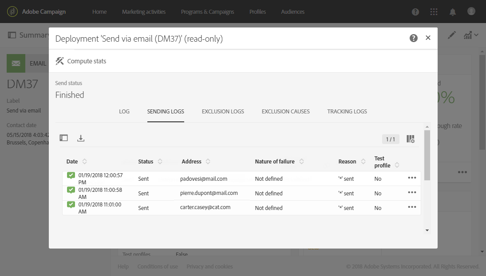

# Noções básicas sobre falhas de entrega{#understanding-delivery-failures}

## Sobre falhas de delivery {#about-delivery-failures}

Quando uma entrega não pode ser enviada para um perfil, o servidor remoto envia automaticamente uma mensagem de erro, que é coletada pela plataforma do Adobe Campaign e qualificada para determinar se o endereço de email ou o número de telefone devem ser colocados em quarentena. Consulte Qualificação [de envio de e-mails](#bounce-mail-qualification).

>[!NOTE]
>
>**Mensagens de erro de email (ou &quot;devoluções&quot;) são qualificadas pelo processo inMail.** **Mensagens de erro de SMS (ou &quot;SR&quot; para &quot;Relatório de Status&quot;) são qualificadas pelo processo MTA.**

As mensagens também podem ser excluídas durante a preparação do delivery se um endereço estiver em quarentena ou se um perfil for incluído na blacklist. As mensagens excluídas são listadas na **[!UICONTROL Exclusion logs]** guia do painel de entrega (consulte [esta seção](../../sending/using/monitoring-a-delivery.md#exclusion-logs)).

**Tópicos relacionados:**

* [Noções básicas sobre gestão de quarentena](../../sending/using/understanding-quarantine-management.md)
* [Gerenciamento de listas negras no Campaign](../../audiences/using/about-opt-in-and-opt-out-in-campaign.md)

## Identificar falhas de entrega de uma mensagem {#identifying-delivery-failures-for-a-message}

Quando uma entrega é enviada, a **[!UICONTROL Sending logs]** guia (consulte [esta seção](../../sending/using/monitoring-a-delivery.md#sending-logs)) permite que você visualize o status de entrega de cada perfil e o tipo e motivo da falha associados (consulte Tipos e motivos [de falha](#delivery-failure-types-and-reasons)de entrega).

Um relatório pronto para uso dedicado também está disponível. Este relatório detalha os erros gerais de hardware e software encontrados durante as entregas, bem como o processamento automático de rejeições. Para obter mais informações, consulte [esta seção](../../reporting/using/bounce-summary.md).

## Tipos e motivos de falha de delivery {#delivery-failure-types-and-reasons}

Há três tipos de erros quando uma entrega falha:

* **Disco rígido**: Um erro &quot;rígido&quot; indica um endereço inválido. Isso envolve uma mensagem de erro que declara explicitamente que o endereço é inválido, como: &quot;Usuário desconhecido&quot;.
* **Soft**: Este pode ser um erro temporário ou que não pode ser categorizado, como: &quot;Domínio inválido&quot; ou &quot;Caixa de correio cheia&quot;.
* **Ignorado**: Esse é um erro que é conhecido como temporário, como &quot;Fora do escritório&quot; ou um erro técnico, por exemplo, se o tipo de remetente for &quot;postmaster&quot;.

Os possíveis motivos para uma falha de delivery são:

* **[!UICONTROL User unknown]** (Tipo de disco rígido): o endereço não existe. Não haverá mais tentativas de delivery para este perfil.
* **[!UICONTROL Quarantined address]** (Tipo de disco rígido): o endereço foi colocado em quarentena.
* **[!UICONTROL Unreachable]** (Tipo Soft/Hard): ocorreu um erro na cadeia de entrega de mensagens (como domínio temporariamente inacessível). De acordo com o erro retornado pelo provedor, o endereço será enviado para quarentena direta ou a entrega será tentada novamente até que o Campaign receba um erro que justifique o status de Quarentena ou até que o número de erros atinja 5.
* **[!UICONTROL Address empty]** (Tipo de disco rígido): o endereço não está definido.
* **[!UICONTROL Mailbox full]** (Tipo suave): a caixa de correio deste usuário está cheia e não pode aceitar mais mensagens. Esse endereço pode ser removido da lista de quarentena para fazer outra tentativa. Ele é removido automaticamente após 30 dias.

   Para que o endereço seja removido automaticamente da lista de endereços em quarentena, o fluxo de trabalho técnico de **[!UICONTROL Database cleanup]** deve ser iniciado.

* **[!UICONTROL Refused]** (Tipo Soft/Hard): o endereço foi colocado em quarentena devido a um feedback de segurança como um relatório de spam. De acordo com o erro retornado pelo provedor, o endereço será enviado para quarentena direta ou a entrega será tentada novamente até que o Campaign receba um erro que justifique o status de Quarentena ou até que o número de erros atinja 5.
* **[!UICONTROL Duplicate]**: o endereço já foi detectado na segmentação.
* **[!UICONTROL Not defined]** (Tipo suave): o endereço está em qualificação porque os erros ainda não foram aumentados.

   Esse tipo de erro ocorre quando uma nova mensagem de erro é enviada pelo servidor: pode ser um erro isolado, mas se ocorrer novamente, o contador de erros aumentará, o que alertará as equipes técnicas.

* **[!UICONTROL Error ignored]**: o endereço está na lista de permissões e um e-mail será enviado para ele em qualquer caso.
* **[!UICONTROL Blacklisted address]**: o endereço estava na lista negra no momento do envio.
* **[!UICONTROL Account disabled]** (Tipo Soft/Hard): quando o Provedor de Acesso à Internet (IAP) detecta um longo período de inatividade, ele pode fechar a conta do usuário: as entregas ao endereço do usuário serão então impossíveis. O tipo Soft ou Hard depende do tipo de erro recebido: se a conta estiver temporariamente desativada devido a seis meses de inatividade e ainda puder ser ativada, o status **[!UICONTROL Erroneous]** será atribuído e a entrega será tentada novamente. Se o erro recebido indicar que a conta está permanentemente desativada, então ela será enviada diretamente para a quarentena.
* **[!UICONTROL Not connected]**: o telefone celular do perfil é desligado ou não está conectado à rede quando a mensagem é enviada.
* **[!UICONTROL Invalid domain]** (Tipo suave): o domínio do endereço de email está incorreto ou não existe mais. Este perfil será alvo novamente até que a contagem de erros chegue a 5. Após isso, o registro será definido como Status de Quarentena e não haverá nenhuma tentativa nova.
* **[!UICONTROL Text too long]**: o número de caracteres na mensagem SMS excede o limite. Para obter mais informações, consulte codificação, comprimento e transliteração [de](../../administration/using/configuring-sms-channel.md#sms-encoding--length-and-transliteration)SMS.
* **[!UICONTROL Character not supported by encoding]**: a mensagem SMS contém um ou mais caracteres que não são suportados pela codificação. &amp;Para obter mais informações, consulte [Tabela de caracteres - GSM Standard](../../administration/using/configuring-sms-channel.md#table-of-characters---gsm-standard).

## Tentativas após uma falha temporária de delivery {#retries-after-a-delivery-temporary-failure}

Se uma mensagem falhar devido a um erro temporário do tipo **Ignorado** , as tentativas serão executadas durante a duração da entrega. Para obter mais informações sobre os tipos de erros, consulte Tipos de falha de [entrega e motivos](#delivery-failure-types-and-reasons).

Para modificar a duração de um delivery, vá para os parâmetros avançados do delivery ou template de delivery especifique a duração desejada no campo correspondente. As propriedades avançadas de delivery são apresentadas [nesta seção](../../administration/using/configuring-email-channel.md#validity-period-parameters).

A configuração padrão permite cinco tentativas em intervalos de uma hora, seguidos por uma nova tentativa por dia, por quatro dias. O número de tentativas pode ser alterado globalmente (entre em contato com o administrador técnico da Adobe) ou para cada delivery ou template de delivery (consulte [esta seção](../../administration/using/configuring-email-channel.md#sending-parameters)).

## Erros síncronos e assíncronos {#synchronous-and-asynchronous-errors}

Uma entrega pode falhar imediatamente (erro síncrono) ou posteriormente, depois de ter sido enviada (erro assíncrono).

* **Erro** síncrono: se o servidor remoto contatado pelo servidor de entrega do Adobe Campaign retornar imediatamente uma mensagem de erro, a entrega não poderá ser enviada para o servidor do perfil.
* **Erro** assíncrono: uma mensagem de rejeição ou um SR foi reenviado posteriormente pelo servidor destinatário. Podem ocorrer erros assíncronos até uma semana depois do envio.

## Qualificação de email de devolução {#bounce-mail-qualification}

<!--Delivery failure error messages (or "SMTP bounce responses") are picked up by the Adobe Campaign platform and then processed and qualified as **Hard**, **Soft**, or **Ignored** using the **[!UICONTROL Delivery log qualification]** database.

//Delivery failure error messages (or "bounces") are picked up by the Adobe Campaign platform and qualified by the inMail process to enrich the list of email management rules.(applies to asynchronous (out-of-band) bounces)

This list is available to administrators only and contains all the rules used by Adobe Campaign to qualify delivery failures.-->

>[!IMPORTANT]
>
>Após a atualização para o MTA aprimorado, as qualificações de rejeição na tabela Campanha **[!UICONTROL Message qualification]** não são mais usadas.

Para mensagens de erro de falha de entrega síncrona, o MTA aprimorado determina o tipo de rejeição e a qualificação e envia essas informações para o Campaign. Para obter mais informações sobre o Adobe Campaign Enhanced MTA, consulte este [documento](https://helpx.adobe.com/campaign/kb/campaign-enhanced-mta.html).

As rejeições assíncronas ainda são qualificadas pelo processo do InMail por meio das **[!UICONTROL Inbound email]** regras. Para acessar essas regras, clique no **[!UICONTROL Adobe Campaign]** logotipo, na parte superior esquerda, selecione **[!UICONTROL Administration > Channels > Email > Email processing rules]** e selecione **[!UICONTROL Bounce mails]**. For more on this rule, refer to this [section](../../administration/using/configuring-email-channel.md#email-processing-rules).

<!--Bounces can have the following qualification statuses:

* **[!UICONTROL To qualify]**: the bounce mail needs to be qualified. Qualification must be done by the Deliverability team to ensure that the platform deliverability functions correctly. As long as it is not qualified, the bounce mail is not used to enrich the list of email processing rules.
* **[!UICONTROL Keep]**: the bounce mail was qualified and will be used by the **Update for deliverability** workflow to be compared to existing email processing rules and enrich the list.
* **[!UICONTROL Ignore]**: the bounce mail was qualified but will not be used by the **Update for deliverability** workflow. So it will not be sent to the client instances.

To list the various bounces and their associated error types et reasons, click the **[!UICONTROL Adobe Campaign]** logo, in the top left, then select **[!UICONTROL Administration > Channels > Quarantines > Message qualification]**.

-->

## Otimização da entrega de emails com mecanismo de aceitação dupla {#optimizing-mail-deliverability-with-double-opt-in-mechanism}

O mecanismo de aceitação dupla é uma prática recomendada ao enviar emails. Ela protege a plataforma contra endereços de email errados ou inválidos, spambots e evita possíveis reclamações de spam.

O princípio é enviar um email para confirmar o acordo do visitante antes de armazená-lo como &quot;perfis&quot; no banco de dados do Campaign: o visitante preenche uma página de aterrissagem on-line, recebe um email e precisa clicar no link de confirmação para finalizar sua assinatura.

Para obter mais informações, consulte [esta seção](../../channels/using/setting-up-a-double-opt-in-process.md).
