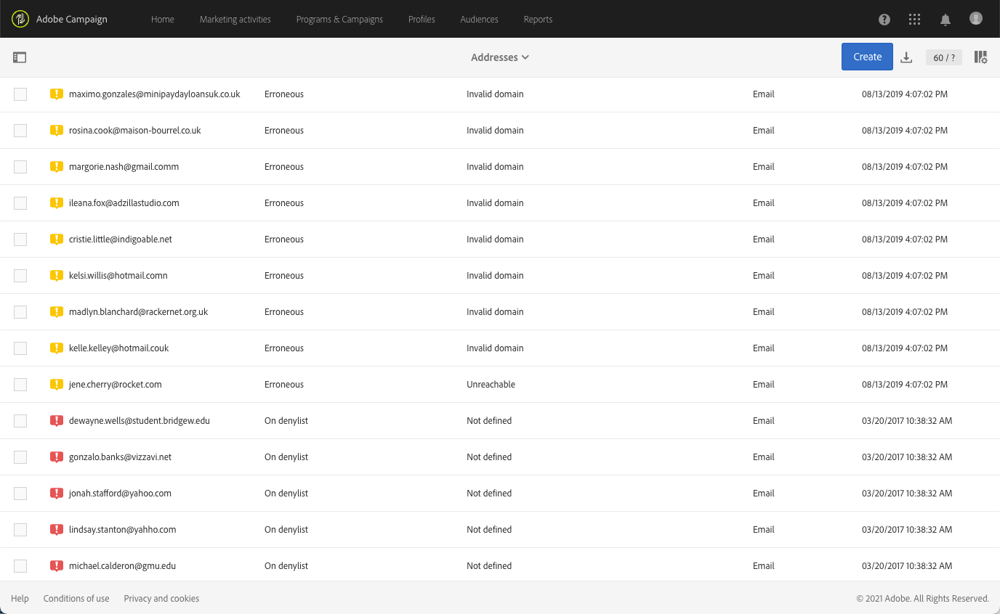
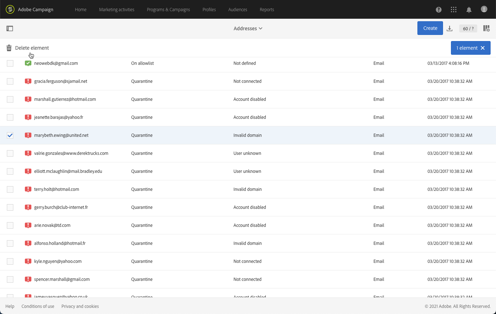

# Compreensão do gerenciamento de quarentena{#understanding-quarantine-management}

## Sobre quarentenas {#about-quarantines}

Um endereço de email pode ser colocado em quarentena, por exemplo, quando a caixa de entrada estiver cheia ou se o endereço não existir.

Em qualquer caso, o procedimento de quarentena está em conformidade com as regras específicas descritas nesta [seção](#conditions-for-sending-an-address-to-quarantine).

### Otimização de sua entrega por meio de quarentenas {#optimizing-your-delivery-through-quarantines}

Os perfis cujos endereços de email ou número de telefone estão em quarentena são excluídos automaticamente durante a preparação da mensagem (consulte [Identificação de endereços em quarentena para um delivery](#identifying-quarantined-addresses-for-a-delivery)). Isso irá acelerar os deliveries, pois a taxa de erro tem um efeito significativo na velocidade do delivery.

Alguns provedores de acesso à Internet consideram automaticamente emails como spam se a taxa de endereços inválidos é muito alta. A quarentena, portanto, evita que você seja adicionado à lista de bloqueios por esses provedores.

Além disso, a quarentena ajuda a reduzir os custos de envio de SMS, excluindo números de telefone incorretos dos deliveries.

Para obter mais informações sobre as práticas recomendadas para proteger e otimizar seus deliveries, consulte [esta página](../../sending/using/delivery-best-practices.md).

### Quarentena ×  Lista de bloqueios {#quarantine-vs-denylist}

A quarentena e a lista de bloqueios não se aplicam ao mesmo objeto:

* A **quarentena** se aplica somente a um **endereço** (ou número de telefone etc.), não ao próprio perfil. Por exemplo, um perfil cujo endereço de email está em quarentena poderia atualizar seu perfil e inserir um novo endereço e pode ser alvo de ações de delivery novamente. Da mesma forma, se dois perfis tiverem o mesmo número de telefone, ambos serão afetados se o número estiver em quarentena.

   Os endereços em quarentena ou os números de telefone são exibidos nos [logs de exclusão](#identifying-quarantined-addresses-for-a-delivery) (para um delivery) ou na [lista de quarentena](#identifying-quarantined-addresses-for-the-entire-platform) (para toda a plataforma).

* Por outro lado, com a inclusão na **lista de bloqueios**, o **perfil** não será mais direcionado pelo delivery, por exemplo, depois de um cancelamento de inscrição (recusa de participação) de um determinado canal. Por exemplo, se um perfil na lista de bloqueios para o canal de email tiver dois endereços de email, ambos os endereços serão excluídos do delivery. Para obter mais informações sobre o processo de  de lista de bloqueios, consulte [Sobre participação e não participação no Campaign](../../audiences/using/about-opt-in-and-opt-out-in-campaign.md).

   Você pode verificar se um perfil está na lista de bloqueios para um ou mais canais na **[!UICONTROL No longer contact (on denylist)]** da seção do perfil **[!UICONTROL General]** guia . Consulte [esta seção](../../audiences/using/managing-opt-in-and-opt-out-in-campaign.md#managing-opt-in-and-opt-out-from-a-profile).

>[!NOTE]
>
>A quarentena inclui uma **Na  lista de bloqueios** , que se aplica quando os recipients relatam sua mensagem como spam ou respondem a uma mensagem SMS com uma palavra-chave como &quot;PARAR&quot;. Nesse caso, o endereço envolvido do perfil ou o número de telefone é enviado para quarentena com o **[!UICONTROL On denylist]** status. Para obter mais informações sobre como gerenciar mensagens SMS PARAR, consulte [esta seção](../../channels/using/managing-incoming-sms.md#managing-stop-sms).

<!--When a user replies to an SMS message with a keyword such as STOP in order to opt-out from SMS deliveries, his profile is not added to the denylist like in the email opt-out process. Instead, the profile's phone number is sent to quarantine with the **[!UICONTROL On denylist]** status. This status refers to the phone number only, meaning that the profile will continue receiving email messages.<!-- Also, if the profile has another phone number, he can still receive SMS messages on the other number. For more on this, refer to [this section](../../channels/using/managing-incoming-sms.md#managing-stop-sms).-->

## Identificação de endereços em quarentena {#identifying-quarantined-addresses}

Os endereços em quarentena podem ser exibidos para um delivery específico ou para toda a plataforma.

<!--
If you need to remove an address from quarantine, contact your technical administrator.
-->

### Identificação de endereços em quarentena para uma entrega {#identifying-quarantined-addresses-for-a-delivery}

Os endereços em quarentena para um delivery específico são listados durante a fase de preparação do delivery, na guia **[!UICONTROL Exclusion logs]** do painel de delivery (consulte [esta seção](../../sending/using/monitoring-a-delivery.md#exclusion-logs)). Para saber mais sobre a preparação de deliveries, consulte [esta seção](../../sending/using/preparing-the-send.md).

### Identificação de endereços em quarentena para toda a plataforma {#identifying-quarantined-addresses-for-the-entire-platform}

Os administradores podem acessar a lista detalhada dos endereços de email em quarentena para toda a plataforma do **[!UICONTROL Administration > Channels > Quarantines > Addresses]** menu.

<!--
This menu lists quarantined elements for **Email**, **SMS** and **Push notification** channels.
-->

>[!NOTE]
>
>O aumento no número de quarentenas é um efeito normal relacionado ao &quot;desgaste&quot; do banco de dados. Por exemplo, se o tempo de vida de um endereço de email for considerado três anos e a tabela de recipients aumentar em 50% todo ano, o aumento da quarentena poderá ser calculado da seguinte maneira: Fim do Ano 1: (1)&#42;0,33)/(1+0,5)=22%. Fim do Ano 2: (1.22)&#42;0,33)+0,33)/(1,5+0,75)=32,5%.

Os filtros estão disponíveis para ajudar você a navegar pela lista. Você pode filtrar o endereço, o status e/ou o canal.

Você pode editar ou [excluir](#removing-a-quarantined-address) cada entrada, bem como criar novas.

Para editar uma entrada, clique na linha correspondente e modifique os campos conforme necessário.

Para adicionar manualmente uma nova entrada, use o **[!UICONTROL Create]** botão.

Defina o endereço (ou número de telefone etc.) e tipo de canal. Você pode definir um status para estar na lista de quarentena e um motivo de erro. Você também pode indicar a data em que o erro ocorreu, o número de erros e inserir o texto do erro. Se necessário, selecione o último delivery que foi enviado para o endereço na lista suspensa.

## Remoção de um endereço da quarentena {#removing-a-quarantined-address}

### Atualizações automáticas {#unquarantine-auto}

Os endereços que correspondem a condições específicas são automaticamente excluídos da lista de quarentena pelo workflow de limpeza do banco de dados . Saiba mais sobre workflows técnicos. Consulte [esta seção](../../administration/using/technical-workflows.md#list-of-technical-workflows).

Os endereços são removidos automaticamente da lista de quarentena nos seguintes casos:

* Os endereços em um status **[!UICONTROL Erroneous]** serão removidos da lista de quarentena após um delivery bem-sucedido.
* Os endereços em um status **[!UICONTROL Erroneous]** serão removidos da lista de quarentena se o último retorno de erro tiver ocorrido há mais de 10 dias. Para obter mais informações sobre o gerenciamento de erros de software, consulte [esta seção](#soft-error-management).
* Os endereços em um status **[!UICONTROL Erroneous]** que tiverem retornado com o erro **[!UICONTROL Mailbox full]** serão removidos da lista de quarentena após 30 dias.

O status muda então para **[!UICONTROL Valid]**.

O número máximo de tentativas a serem executadas em caso de **[!UICONTROL Erroneous]** O status e o atraso mínimo entre tentativas agora se baseiam no desempenho histórico e atual de um IP em um determinado domínio.

>[!IMPORTANT]
>
>Recipients com um endereço em um **[!UICONTROL Quarantine]** ou **[!UICONTROL Denylisted]** status nunca são removidos, mesmo que recebam um email.

### Atualizações manuais {#unquarantine-manual}

Também é possível cancelar a quarentena de um endereço manualmente.  Para remover manualmente um endereço da lista da quarentena, você pode removê-lo da lista da quarentena ou alterar seu status para **[!UICONTROL Valid]**.

* Selecione o endereço do **[!UICONTROL Administration > Channels > Quarantines > Addresses]** e selecione **[!UICONTROL Delete element]**.

   

* Selecione um endereço e altere seu **[!UICONTROL Status]** para **[!UICONTROL Valid]**.

   

### Atualizações em massa {#unquarantine-bulk}

Talvez seja necessário executar atualizações em massa na lista de quarentena, por exemplo, no caso de uma interrupção de ISP. Nesse caso, os emails são marcados incorretamente como rejeições porque não podem ser entregues com êxito ao recipient. Esses endereços devem ser removidos da lista de quarentena.

Para fazer isso, crie um workflow e adicione um **[!UICONTROL Query]** atividade na tabela de quarentena para filtrar todos os recipients afetados. Uma vez identificados, eles podem ser removidos da lista de quarentena e incluídos em deliveries de email futuros do Campaign.

Com base no período do incidente, abaixo estão as diretrizes recomendadas para esse query.

* **Texto de erro (texto em quarentena)** contém &quot;550-5.1.1&quot; AND **Texto de erro (texto em quarentena)** contém &quot;support.ISP.com&quot;

   onde &quot;support.ISP.com&quot; pode ser: &quot;support.apple.com&quot; ou &quot;support.google.com&quot;, por exemplo

* **Atualizar status (@lastModified)** em ou após MM/DD/AAAA HH:MM:SS AM
* **Atualizar status (@lastModified)** em ou antes de MM/DD/AAAA HH:MM:PM SS

Depois de ter a lista de recipients afetados, adicione um **[!UICONTROL Update data]** atividade para definir seu status de endereço de email como **[!UICONTROL Valid]** assim, eles serão removidos da lista de quarentena pelo **[!UICONTROL Database cleanup]** fluxo de trabalho. Também é possível excluí-los da tabela de quarentena.

## Condições para enviar um endereço para quarentena {#conditions-for-sending-an-address-to-quarantine}

O Adobe Campaign gerencia a quarentena de acordo com o tipo de falha do delivery e o motivo atribuído durante a qualificação das mensagens de erro (consulte [Tipos e motivos de falha do delivery](../../sending/using/understanding-delivery-failures.md#delivery-failure-types-and-reasons) e [Qualificação do email de rejeição](../../sending/using/understanding-delivery-failures.md#bounce-mail-qualification)).

* **Erro ignorado**: os erros ignorados não enviam um endereço para quarentena.
* **Erro grave**: o endereço de email correspondente é enviado imediatamente para quarentena.
* **Erro suave**: erros suaves não enviam um endereço imediatamente para quarentena, mas incrementam um contador de erros. Para obter mais informações, consulte [Gerenciamento de erros leves](#soft-error-management).

   <!--
  When the error counter reaches the limit threshold, the address goes into quarantine. In the default configuration, the threshold is set at five errors, where two errors are significant if they occur at least 24 hours apart. The address is placed in quarantine at the fifth error. The error counter threshold can be modified. For more on this, refer to this [page](../../administration/using/configuring-email-channel.md#email-channel-parameters).
  When a delivery is successful after a retry, the error counter of the address which was prior to that quarantined is reinitialized. The address status changes to **[!UICONTROL Valid]** and it is deleted from the list of quarantines after two days by the **[!UICONTROL Database cleanup]** workflow.
  -->

Se um usuário qualificar um email como spam ([loop de feedback](https://experienceleague.adobe.com/docs/deliverability-learn/deliverability-best-practice-guide/transition-process/infrastructure.html?lang=pt-BR#feedback-loops)), a mensagem será automaticamente redirecionada para uma caixa de entrada técnica gerenciada pela Adobe. Em seguida, o endereço de email do usuário será enviado automaticamente para quarentena com o status **[!UICONTROL On denylist]**. Esse status se refere apenas ao endereço. O perfil não é incluído na lista de bloqueio para que o usuário continue recebendo mensagens SMS e notificações por push.

>[!NOTE]
>
>A quarentena no Adobe Campaign diferencia maiúsculas de minúsculas. Certifique-se de importar endereços de email em letras minúsculas, para que não sejam redirecionados posteriormente.

Na lista de endereços em quarentena (consulte [Identificação de endereços em quarentena para toda a plataforma](#identifying-quarantined-addresses-for-the-entire-platform)), o campo **[!UICONTROL Error reason]** indica por que o endereço selecionado foi colocado em quarentena.

### Gerenciamento de erros leves {#soft-error-management}

Ao contrário de erros graves, os erros recuperáveis não enviam um endereço imediatamente para quarentena, mas incrementam um contador de erros.

As tentativas serão executadas no decorrer da [duração do delivery](../../administration/using/configuring-email-channel.md#validity-period-parameters). Quando o contador de erros atinge o limite da cota, o endereço vai para a quarentena. Para obter mais informações, consulte [Tentativas após uma falha temporária de delivery](understanding-delivery-failures.md#retries-after-a-delivery-temporary-failure).

<!--In the default configuration, the threshold is set at five errors, where two errors are significant if they occur at least 24 hours apart. The address is placed in quarantine at the fifth error.
The error counter threshold can be modified.-->

O contador de erros será reinicializado se o último erro significativo ocorrer há mais de 10 dias. O status do endereço é alterado para **Válido** e excluído da lista de quarentenas pelo workflow de **limpeza do banco de dados.** (Para obter mais informações sobre workflows técnicos, consulte [esta seção](../../administration/using/technical-workflows.md#list-of-technical-workflows).)
