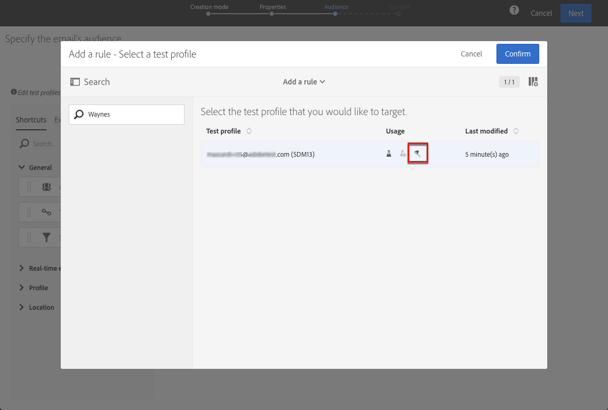

# Uso de traps {#using-traps}

Ao usar armadilhas, a mensagem é enviada para o [perfil de teste](../../audiences/using/managing-test-profiles.md) da mesma forma que é enviada para o público alvo principal, como um meio de identificar se o arquivo cliente está sendo usado de forma fraudulenta.

As armadilhas foram originalmente projetadas para delivery de mala direta. Eles permitem que você:

* Verifique se seu provedor de mala direta está realmente enviando a comunicação.
* Receba o email ao mesmo tempo e nas mesmas condições que seus clientes.
* Guarde uma cópia exata do correio enviado.
* Verifique se a lista do cliente não foi usada indevidamente pelo provedor de mala direta. Na verdade, se qualquer outra comunicação for enviada para o endereço do perfil de teste, o arquivo do cliente pode ter sido usado sem que você saiba. É por esta razão que o endereço do perfil de ensaio deve ser utilizado apenas para este fim.

Para obter mais informações sobre como adicionar armadilhas à audiência de uma mala direta, consulte [Adicionar perfis de teste e armadilha](../../channels/using/defining-the-direct-mail-audience.md#adding-test-and-trap-profiles).

Para outros canais de comunicação, você pode adicionar perfis de teste de armadilha ao público alvo principal para:

* Verifique se sua mensagem foi enviada com êxito.
* Obtenha e guarde uma cópia exata da sua mensagem.
* Rastrear quando foi enviado e recebido.

Para usar um perfil de teste como armadilha, ele deve ser incluído na audiência de sua mensagem.

>[!NOTE]
>
>Ao contrário dos perfis de teste usados para [prova](../../sending/using/sending-proofs.md) ou [renderização por email](../../sending/using/email-rendering.md), a mensagem é enviada ao mesmo tempo para o público alvo principal e para os perfis de teste usados como armadilhas.

Ao definir a audiência de uma mensagem:

1. Na guia **[!UICONTROL Test profiles]**, selecione um perfil de teste. Verifique se ele tem **[!UICONTROL Trap]** como o uso pretendido.

   

1. Quando o conteúdo da mensagem estiver pronto, clique no botão **[!UICONTROL Prepare]**. Consulte [Preparação do send](../../sending/using/preparing-the-send.md).
   >[!NOTE]
   >
   >Verifique se você selecionou um público alvo principal. Caso contrário, sua mensagem não poderá ser enviada.

1. Clique no botão **[!UICONTROL Confirm]**. Consulte [Confirmação do envio](../../sending/using/confirming-the-send.md).

   

A mensagem é enviada ao público alvo principal e ao perfil de teste.

Você pode usar armadilhas ao enviar mensagens transacionais. Nesse caso, o perfil de teste receberá uma mensagem por configuração de evento. Para obter mais informações sobre mensagens transacionais, consulte esta [seção](../../channels/using/getting-started-with-transactional-msg.md).

>[!NOTE]
>
>Ao usar um perfil de teste como armadilha, para qualquer campo enriquecido em uma mensagem, os dados adicionais correspondentes são coletados aleatoriamente de um perfil direcionado real e atribuídos ao perfil de teste de armadilha. Para obter mais informações sobre o enriquecimento, consulte [este exemplo](../../automating/using/enriching-profile-data-file.md).
