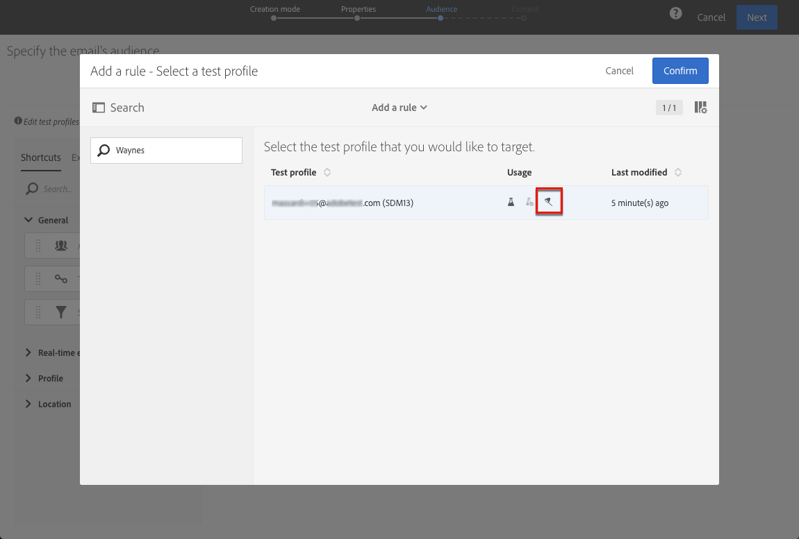
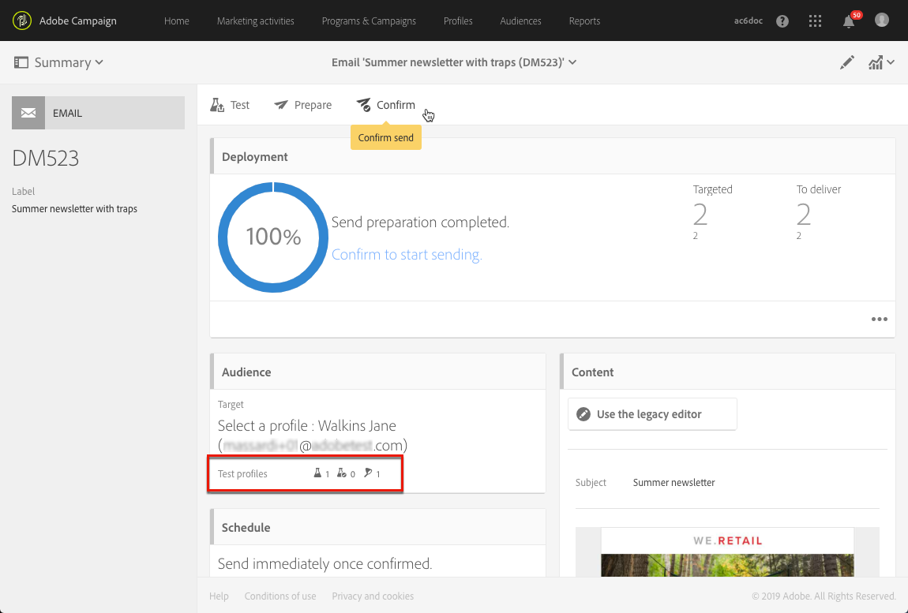

# Utilização de traps {#using-traps}

Ao usar coberturas, a mensagem é enviada para o [perfil de teste](../../audiences/using/managing-test-profiles.md) da mesma forma que é enviada para o público alvo principal, como um meio de identificar se o arquivo do cliente está sendo usado de forma fraudulenta.

As coberturas foram originalmente projetadas para entregas de correspondência direta. Eles permitem:

* Verifique se o provedor de correspondência direta está realmente enviando a comunicação.
* Receba o email ao mesmo tempo e nas mesmas condições que seus clientes.
* Manter uma cópia exata do email enviado.
* Verifique se a lista de clientes não foi usada incorretamente pelo provedor de correspondência direta. Na verdade, se qualquer outra comunicação for enviada para o endereço do seu perfil de teste, o arquivo do cliente pode ter sido usado sem o seu conhecimento. É por isso que o endereço do perfil de teste deve ser usado somente para essa finalidade.

Para obter mais informações sobre como adicionar interceptações ao público de correspondência direta, consulte [Adicionar perfis de teste e interceptação](../../channels/using/defining-the-direct-mail-audience.md#adding-test-and-trap-profiles).

Para os outros canais de comunicação, você pode adicionar perfis de teste de trap ao público alvo principal para:

* Verifique se a mensagem foi enviada com êxito.
* Obtenha e guarde uma cópia exata da sua mensagem.
* Rastrear quando foi enviado e recebido.

Para usar um perfil de teste como interceptação, ele deve ser incluído no público-alvo da sua mensagem.

>[!NOTE]
>
>Ao contrário dos perfis de teste usados para [provas](../../sending/using/sending-proofs.md) ou [renderização de email](../../sending/using/email-rendering.md), a mensagem é enviada ao mesmo tempo para o destino principal e para os perfis de teste usados como armadilhas.

Ao definir o público de uma mensagem:

1. Na guia **[!UICONTROL Test profiles]**, selecione um perfil de teste. Verifique se ele tem **[!UICONTROL Trap]** como o uso pretendido.

   

1. Quando o conteúdo da mensagem estiver pronto, clique no botão **[!UICONTROL Prepare]**. Consulte [Preparando o envio](../../sending/using/preparing-the-send.md).
   >[!NOTE]
   >
   >Verifique se você selecionou um público alvo principal. Caso contrário, sua mensagem não poderá ser enviada.

1. Clique no botão **[!UICONTROL Confirm]**. Consulte [Confirmação do envio](../../sending/using/confirming-the-send.md).

   

A mensagem é enviada para o público-alvo principal e para o perfil de teste.

Você pode usar coberturas ao enviar mensagens transacionais. Nesse caso, o perfil de teste receberá uma mensagem por configuração de evento. Para obter mais informações sobre mensagens transacionais, consulte esta [seção](../../channels/using/getting-started-with-transactional-msg.md).

>[!NOTE]
>
>Ao usar um perfil de teste como trap, os campos enriquecidos em uma mensagem terão seus dados adicionais correspondentes selecionados aleatoriamente de um perfil direcionado real e atribuídos ao perfil de teste de trap. No entanto, esteja ciente de que, se o perfil direcionado real for excluído devido a regras de tipologia aplicadas durante a primeira preparação da mensagem, a preparação do delivery falhará. Essa falha ocorre porque os valores de campo enriquecidos não podem ser substituídos pelo perfil de cobertura. Consequentemente, as regras de tipologia de exclusão podem não se aplicar corretamente aos recipients reais.
>
>Para evitar essa situação, evite usar perfis de teste de trap simultaneamente com regras de filtragem ou fadiga na tipologia transacional. Saiba mais sobre enriquecimento. Para obter mais informações sobre enriquecimento, consulte [este exemplo](../../automating/using/enriching-profile-data-file.md).
