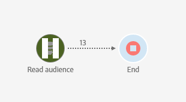

# Acessibilidade no Adobe Campaign Standard {#accessibility-acs}

Saiba mais sobre o suporte à acessibilidade no Adobe Campaign Standard Workspace.

Acessibilidade refere-se à utilização de produtos para pessoas com limitações visuais, auditivas, cognitivas, motoras e outras. Exemplos de recursos de acessibilidade para produtos de software incluem conteúdo semanticamente estruturado, suporte a leitores de tela, equivalentes de texto para gráficos, atalhos de teclado e outros.

O Adobe Campaign Standard fornece recursos que tornam sua utilização mais acessível, como contraste, rótulos, conteúdo estruturado, navegação pelo teclado e ajuda contextual.

## Recursos de acessibilidade {#accessibility-features}

### Contraste e cor {#contrast}

A interface do usuário do Adobe Campaign Standard se esforça para fornecer contraste suficiente no aplicativo e assim garantir uma experiência de exibição acessível para usuários com limitações visuais ou de percepção de cor.

* Texto e cabeçalhos grandes foram aprimorados para atender a uma taxa de contraste de 3:1.

   

* O conteúdo de ajuda e o texto do corpo do aplicativo foram atualizados para atender a uma taxa de contraste de 4.5:1.

* Os ícones de pausa e cancelamento de workflows foram atualizados para melhorar o contraste entre o plano de fundo e as cores do primeiro plano.

   

* Cor, forma e local não são os únicos métodos usados para comunicar informações ou hierarquia no aplicativo.

### Interface do usuário {#user-interface}

A interface do usuário do Adobe Campaign Standard facilita a interação de todos os usuários com o conteúdo, adicionando textos alternativos aos elementos visuais e usando a estrutura semântica para transmitir informações de forma visual e programática.

* Quando o usuário deixa um campo de ID obrigatório em branco, um gráfico indica visualmente qual campo está com erro através de uma mensagem de texto e que as mesmas informações são transmitidas programaticamente para usuários com tecnologias de assistência, como leitores de tela.

   

* O conteúdo que aparece ao passar o mouse ou focar pode ser rejeitado pelo usuário e não obscurece outro conteúdo.

   

* Foram adicionados textos alternativos para imagem e nomes acessíveis para botões, que podem ser lidos em voz alta com tecnologia de assistência, em vez de se basearem apenas em dicas visuais para identificar elementos.

<!--
### Create responsive resize for multiple devices {#resize-devices}

When designing for multiple devices and platforms, it's important to create a seamless experience for screen sizes across mobile and desktop resolutions.

Adobe Campaign Standard allows you to design and test emails and push notifications on different devices such as: iPhone, Android devices, iPad, Android tablet and desktop.

-->

## Ajuda contextual {#contextual-help}

A ajuda contextual pode ajudar você a entender melhor os diferentes campos e recursos disponíveis solicitados. Ele também orienta você na documentação do produto para obter mais informações sobre o recurso selecionado.

Ao criar um email, você pode acessar uma dica de ferramenta que fornecerá descrições de recursos e links para a documentação do produto.

## Suporte para tecnologia assistiva {#screen-magnifiers}

Procuramos maximizar a utilização do aplicativo Adobe Campaign Standard por meio de várias tecnologias de assistência, incluindo, mas não limitado a, teclados modificados, softwares de aumento de tela, leitores de tela, software de reconhecimento de voz e outros dispositivos de assistência.

## Trabalhe no seu idioma preferido {#languages}

O Adobe Campaign Standard está disponível em diferentes idiomas: inglês, francês e alemão.

Observe que o idioma é configurado durante a instalação e não pode ser alterado posteriormente.

## Atalhos de teclado {#shortcuts}

### Página inicial {#homepage-shortcuts}

| Atalho | Ação |
|:-:|:-:|
| Guia | Navegar pelos elementos individuais da interface do usuário |
| Enter ou Space | Ativar o item selecionado |

### Designer de email {#email-designer-shortcuts}

| Atalho | Ação |
|:-:|:-:|
| CTRL + Z | Desfazer |
| CTRL + Y | Refazer |

### Relatórios dinâmicos {#report-shortcuts}

| Atalho | Ação |
|:-:|:-:|
| CTRL + O | Abrir projeto |
| CTRL + S | Salvar |
| Shift + CTRL + S | Salvar como |
| Alt + R | Atualizar projeto |
| Shift + CTRL + V | Baixar CSV |
| Alt + P | Imprimir |
| CTRL + Z | Desfazer |
| CTRL + Shift + Z | Refazer |
| Alt + B | Novo painel em branco |
| Alt + A | Nova forma livre |
| Alt + 1 | Nova tabela de forma livre |
| Alt + 2 | Nova linha |
| Alt + 3 | Nova barra |
| Alt + S | Enviar relatório agora |
| Shift + Alt + S | Enviar relatório programado |
| Shift = Alt + L | Relatórios agendados |

## Leitura adicional {#further-reading}

O Adobe Campaign Standard se esforça para oferecer um grau cada vez maior de acessibilidade, facilitando o uso do produto para todos.

Recomendamos que você use o [Formulário de feedback de acessibilidade da Adobe](https://www.adobe.com/accessibility/feedback.html) para nos enviar sugestões de aprimoramento e problemas de acessibilidade que você esteja observando.

Você também pode consultar as [Notas de versão do Adobe Campaign Standard](https://experienceleague.adobe.com/docs/campaign-standard/using/release-notes/release-notes.html?lang=pt-BR#release-notes) para conhecer os últimos recursos e melhorias.