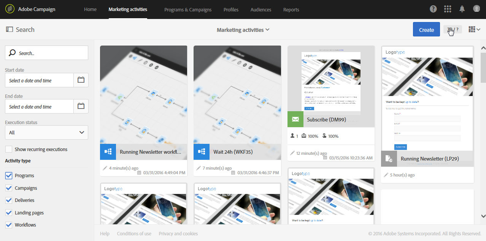

# Descrição da interface{#interface-description}

O Adobe Campaign permite que você navegue por diferentes menus e telas para gerenciar suas campanhas.

Todas as telas do Adobe Campaign são constituídas pelos seguintes elementos:

* Uma barra superior para navegação
* Um menu avançado para acessar funcionalidades e configurações específicas
* Uma zona central para trabalhar em determinados elementos
* Um painel lateral, de acordo com o contexto, para filtrar ou pesquisar dentro dos elementos exibidos.

## Home page {#home-page}

A página inicial é composta de um conjunto de cartões que fornecem acesso rápido às principais funcionalidades do Adobe Campaign. A lista de capacidades que você pode ver na página inicial do Campaign depende de suas permissões e das opções configuradas para sua organização.

* O **[!UICONTROL Create an email]** cartão leva você ao assistente de criação de email. Este assistente permite que você escolha um tipo de email, selecione os destinatários da mensagem e defina o conteúdo. Consulte a seção [Criação de um email](../../channels/using/creating-an-email.md) .
* O **[!UICONTROL Create an SMS]** cartão leva você ao assistente de criação do SMS. Este assistente permite que você escolha um tipo de SMS, selecione os destinatários da mensagem e defina o conteúdo. Consulte a seção [Criação de um SMS](../../channels/using/creating-an-sms-message.md) .
* O **[!UICONTROL Create a Direct mail]** cartão leva você ao assistente de criação de mala direta. Consulte a seção [Criação de uma mala direta](../../channels/using/creating-the-direct-mail.md) .
* O **[!UICONTROL Create a push notification]** cartão leva você ao assistente de criação de notificações. Este assistente permite que você escolha um tipo de notificação por push, selecione os destinatários da mensagem e defina o conteúdo. Consulte a seção [Criação de uma notificação](../../channels/using/preparing-and-sending-a-push-notification.md) por push.
* O **[!UICONTROL Create an InApp message]** cartão leva você ao assistente de criação do InApp. Este assistente permite que você selecione o tipo de mensagem do InApp que deseja criar, defina suas propriedades, público-alvo e conteúdo. Consulte a seção [Criação de uma mensagem](../../channels/using/about-in-app-messaging.md) do InApp.
* O **[!UICONTROL Marketing activities]** cartão leva você à lista completa de todas as atividades, programas e campanhas, especialmente emails, SMS, fluxos de trabalho e páginas de aterrissagem. Aqui, você pode filtrar os elementos pesquisando por nome, data, status ou tipo de atividade. Para obter mais informações, consulte a seção Lista [de atividades de](../../start/using/marketing-activities.md#about-marketing-activities) marketing.
* O **[!UICONTROL Programs & campaigns]** cartão leva você à lista de programas nos quais você pode criar e gerenciar suas campanhas. Consulte a lista [de](../../start/using/programs-and-campaigns.md#about-plans--programs-and-campaigns)Programas.
* O **[!UICONTROL Timeline]** cartão leva você diretamente para uma linha do tempo interativa de suas atividades de marketing, na qual você pode consultar os programas em andamento e seu conteúdo. Consulte a [Linha do tempo](../../start/using/timeline.md).
* O **[!UICONTROL Customer profiles]** cartão leva você diretamente para a lista de perfis. Aqui você pode consultar os eventos referentes a cada um dos perfis na sua lista. Consulte [Gerenciamento de perfis](../../audiences/using/about-profiles.md).
* O **[!UICONTROL Audiences]** cartão leva você diretamente para a lista de públicos. Aqui você pode acessar públicos existentes e criar novos. Consulte [Gerenciamento de públicos-alvo](../../audiences/using/about-audiences.md).

## Barra superior {#top-bar}

A barra superior fica visível em todas as telas e permite navegar pelas funcionalidades do Adobe Campaign, bem como acessar o perfil da Adobe conectado, as notificações, outros serviços e soluções da Adobe Experience Cloud e a documentação.

Os princípios de navegação são:

* O **[!UICONTROL Adobe Campaign]** logotipo no canto superior esquerdo da página fornece acesso aos recursos e configurações avançados. Os menus dependem do seu perfil e das suas permissões.

   O menu avançado é apresentado na seção Menu  avançado.

* O **[!UICONTROL Home]** link permite exibir a página inicial do Adobe Campaign.
* Os **[!UICONTROL Marketing activities]**, **[!UICONTROL Programs & Campaigns]**, **[!UICONTROL Profiles]** e **[!UICONTROL Audiences]** **[!UICONTROL Reports]** links permitem acessar as exibições vinculadas a essas funcionalidades.
* O **[!UICONTROL Help]** botão dá acesso à documentação do produto e à ajuda contextual, notas de versão, números de versão, avisos legais, bem como aos links para a comunidade da Adobe Experience Cloud e atendimento ao cliente.
* O botão da organização
* O ícone do alternador **de** soluções permite alternar para outra solução da Adobe Experience Cloud, bem como para as configurações de perfil.
* O ícone **Notificações** exibe os alertas ou as informações mais recentes.
* O ícone **Usuário** permite exibir informações vinculadas ao seu perfil. Dá acesso ao **[!UICONTROL Sign out]** botão.

### Ajuda {#help}

* **[!UICONTROL Search]** permite que você recupere documentação, artigos e vídeos e filtre o conteúdo por solução

* **[!UICONTROL Help]** guia
   * Os links fornecem acesso rápido a artigos, documentação e vídeos relacionados à página que você está navegando
   * **[!UICONTROL Learning]** este link permite acessar a Experience League.
   * **[!UICONTROL Community]** este link permite acessar o fórum dedicado a suas perguntas sobre o ACS.

* **[!UICONTROL Support]** permite que você crie um ticket de suporte e entre em contato conosco por telefone ou Twitter.

* **[!UICONTROL Feedback ]** permite que você compartilhe problemas e ideias sobre a solução.

   

## Menu Avançado {#advanced-menu}

O menu avançado é exibido clicando no ícone do **Adobe Campaign** , no canto superior esquerdo de cada tela. O menu avançado pode variar dependendo do contrato e das permissões do usuário.

Esse menu permite que você navegue até funcionalidades e configurações específicas.

### Planos de marketing {#marketing-plans}

O **[!UICONTROL Marketing plans]** ícone fornece acesso às seguintes funcionalidades:

* **[!UICONTROL Marketing activities]** - para mais informações, consulte a seção da lista [de atividades de](../../start/using/marketing-activities.md#about-marketing-activities) marketing.
* **[!UICONTROL Programs & Campaigns]** - para obter mais informações, consulte a seção da lista  de programas.
* **[!UICONTROL Timeline]** - para obter mais informações, consulte a seção [Linha do tempo](../../start/using/timeline.md) .
* **[!UICONTROL Transactional messages]**, que contém os submenus **[!UICONTROL Deliveries]** e **[!UICONTROL Event configuration]** - para obter mais informações, consulte a seção Mensagens [transacionais](../../channels/using/about-transactional-messaging.md) .

### Perfis e públicos-alvo {#profiles-e-audiences}

O **[!UICONTROL Profiles & audiences]** ícone fornece acesso às seguintes funcionalidades:

* **[!UICONTROL Profiles]** - para obter mais informações, consulte a seção [Gerenciar perfis](../../audiences/using/about-profiles.md) .
* **[!UICONTROL Test profiles]** - para obter mais informações, consulte a seção [Gerenciar perfis](../../audiences/using/managing-test-profiles.md) de teste.
* **[!UICONTROL Audiences]** - para obter mais informações, consulte a seção [Gerenciamento de públicos-alvo](../../audiences/using/about-audiences.md) .
* **[!UICONTROL Services]** - para obter mais informações, consulte a seção [Criação de um serviço](../../audiences/using/creating-a-service.md) .

### Recursos {#resources}

O **[!UICONTROL Resources]** ícone fornece acesso às seguintes funcionalidades:

* **[!UICONTROL Templates]**, que contém os submenus para cada tipo de modelo - para obter mais informações, consulte a seção [Gerenciar modelos](../../start/using/marketing-activity-templates.md) .
* **[!UICONTROL Content blocks]** - para obter mais informações, consulte a seção [Adicionar um bloco](../../designing/using/personalization.md#adding-a-content-block) de conteúdo.
* **[!UICONTROL Content templates & fragments]** - para obter mais informações, consulte a seção [Content template](../../designing/using/using-reusable-content.md#content-templates) (Modelo de conteúdo).

### Administração {#administration}

O **[!UICONTROL Administration]** ícone fornece acesso às funcionalidades avançadas que só podem ser executadas pelo administrador funcional. For more on this, refer to the [Administration](../../administration/using/about-administrating-adobe-campaign.md) section.

## Zona central {#central-zone}

A zona central da interface do usuário é uma zona dinâmica que contém uma lista de elementos ou um conjunto de cartões, por exemplo. Ele permite que você edite elementos existentes e crie recursos.

O conteúdo e o formato de exibição da zona central podem variar:

* Uma **lista** que apresenta vários elementos, como programas, campanhas, perfis etc. Esses elementos podem ser exibidos no modo **[!UICONTROL Card]** ou **[!UICONTROL List]** . Use o botão change mode (Modo de alteração) para alternar de um para o outro. Cada elemento exibe indicadores.

   

   Um contador permite que você esteja ciente do número de elementos. Se esse número exceder 30, você precisará clicar neste contador para obter o número total.

* Um **painel** que apresenta uma visão geral de todos os parâmetros vinculados a uma atividade. Esta tela inclui zonas interativas que permitem separar e configurar os diferentes conceitos de forma independente.

   

* Se várias ofertas forem possíveis ao criar um elemento, uma tela **de** seleção permitirá que você selecione o tipo de elemento a ser adicionado (campanhas, entregas). Essa tela de seleção também é oferecida para acessar os relatórios.

   

* Para os fluxos de trabalho e o editor de consultas, um espaço de **trabalho** com uma paleta é disponibilizado para você projetar o objeto.

   Você pode arrastar e soltar elementos da paleta no espaço de trabalho para configurar o elemento em questão.

   

## Barra de ação {#action-bar}

De acordo com o tipo de tela exibido, uma barra contendo as ações vinculadas à tela aparece na parte superior.

Essa barra contém não apenas ações comuns, como pesquisa e filtragem, mas também ações relacionadas à tela exibida:

* Para ações relacionadas a telas de tipo de espaço de **trabalho** , consulte a seção da barra [de](../../automating/using/workflow-interface.md#action-bar) Ação para os fluxos de trabalho.
* Para ações relacionadas às telas do **painel** , consulte a seção Painel [de](../../channels/using/message-dashboard.md) mensagens para obter mais informações.
* Para ações relacionadas a telas de tipo de **lista** , consulte a seção [Personalizando listas](../../start/using/customizing-lists.md) abaixo.
