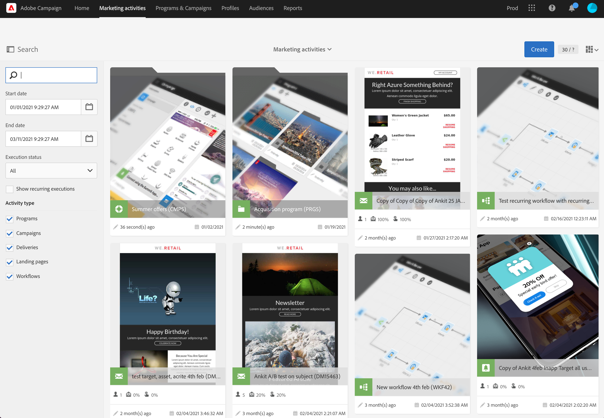
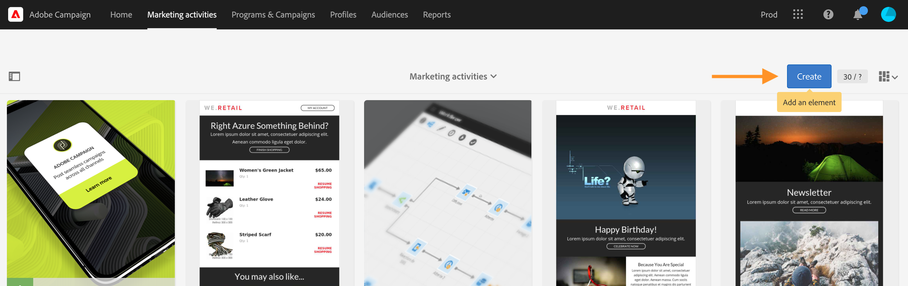

# Atividades de marketing{#marketing-activities}

## Sobre atividades de marketing {#about-marketing-activities}

Você pode criar e gerenciar as atividades de marketing diretamente dos programas e campanhas a que pertencem ou por meio da lista de atividades de marketing.

A lista de atividades de marketing centraliza todas as atividades, quaisquer que sejam os programas ou campanhas em que foram criadas. Programas, campanhas, deliveries (emails, mensagens SMS e notificações por push), páginas de aterrissagem e fluxos de trabalho são, portanto, discriminados em uma ordem hierárquica específica.

Para acessar a lista de atividades de marketing, escolha o link **[!UICONTROL Marketing activities]** na barra superior.

>[!NOTE]
>
>As atividades de marketing também podem ser acessadas selecionando o cartão **[!UICONTROL Marketing activities]** na página inicial.

O painel **[!UICONTROL Search]** permite filtrar elementos de acordo com critérios diferentes: nome (rótulo e ID), data, status ou tipo de atividade. Por padrão, todos os tipos de atividades estão selecionados, exceto programas.

Para acessar diretamente o conteúdo de cada atividade, escolha um dos elementos da lista.

O botão **[!UICONTROL Create]** pode ser usado para criar uma nova atividade. Para mais informações, consulte a seção [Criação de uma atividade de marketing](#creating-a-marketing-activity).

## Ícones e status da atividade de marketing {#marketing-activity-icons-and-statuses}

Na zona principal, cada tipo de atividade na lista tem um ícone:

*  Programa
*  Campanha
*  Email
*  SMS
*  Notificações por push
*  Mensagem no aplicativo
*  Landing page
*  Fluxo de trabalho

Dependendo do período de validade e status, a cor associada a esse ícone indica o status de execução da atividade correspondente.

* Cinza: a atividade ainda não começou - Status **[!UICONTROL Editing]**.
* Azul: a atividade está em andamento - Status **[!UICONTROL In progress]**.
* Verde: a atividade terminou - Status **[!UICONTROL Finished]**.
* Amarelo: a atividade recebeu um aviso - Status **[!UICONTROL Warning]**.
* Vermelho: ocorreu um erro - Status **[!UICONTROL Erroneous]**.

## Criação de uma atividade de marketing {#creating-a-marketing-activity}

Você pode criar diferentes tipos de mensagens (**email**, **SMS**, **notificação por push** etc.), fluxos de trabalho e páginas de aterrissagem, de uma campanha existente.

É possível criar outros programas, campanhas, fluxos de trabalho e páginas de aterrissagem de um programa existente.

>[!NOTE]
>
>Considere a criação de fluxos de trabalho diretamente em uma campanha. Se você criar um fluxo de trabalho em um programa, não poderá movê-lo posteriormente para uma campanha.

Programas e campanhas são apresentados na seção [Programas e campanhas](../../start/using/programs-and-campaigns.md).

1. No painel de um programa ou de uma campanha, crie uma nova atividade de marketing usando o botão **[!UICONTROL Create]**.

   

1. Selecione o tipo de atividade que deseja criar.

   

De acordo com o contexto, você pode:

* Criar um email - [Saiba mais](../../channels/using/creating-an-email.md)
* Criar um SMS - [Saiba mais](../../channels/using/creating-an-sms-message.md)
* Criar uma notificação por push - [Saiba mais](../../channels/using/preparing-and-sending-a-push-notification.md)
* Criar uma mensagem no aplicativo - [Saiba mais](../../channels/using/about-in-app-messaging.md)
* Criar um workflow - [Saiba mais](../../automating/using/building-a-workflow.md#creating-a-workflow)
* Criar uma landing page - [Saiba mais](../../channels/using/getting-started-with-landing-pages.md)
* Criar uma campanha - [Saiba mais](../../start/using/programs-and-campaigns.md#creating-a-campaign)
* Criar um programa - [Saiba mais](../../start/using/programs-and-campaigns.md#creating-a-program)

>[!NOTE]
>
>Você também pode criar uma atividade de marketing na lista de atividades de marketing. Nesse caso, é possível criar qualquer tipo de atividade e optar por vincular a atividade de marketing a uma campanha principal (ou a um programa principal, se você criar um programa) por meio das propriedades da atividade.
