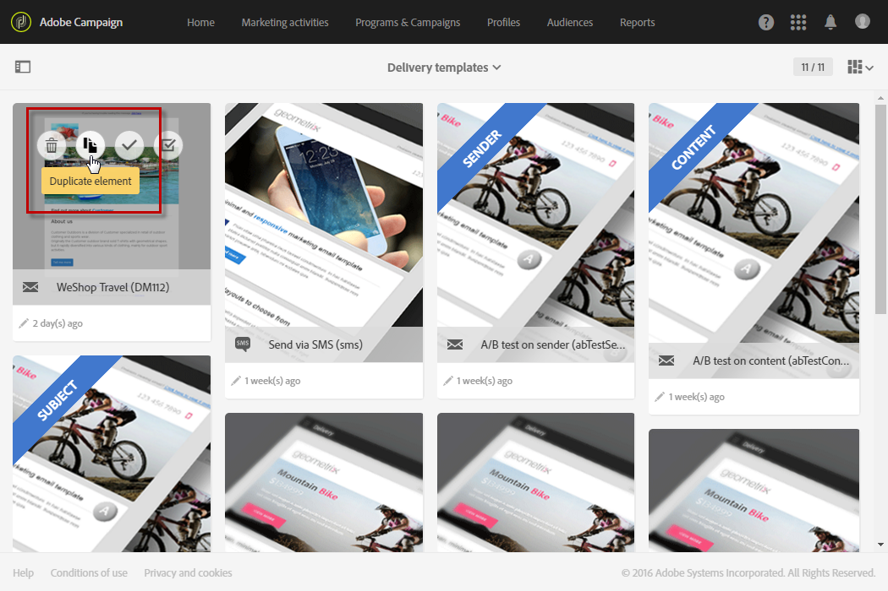

# Templates de atividades de marketing {#marketing-activity-templates}

## Sobre templates {#about-templates}

Ao criar uma nova atividade de marketing, a primeira tela do assistente solicita que você selecione um tipo ou template. Os templates permitem pré-configurar parâmetros específicos de acordo com as necessidades. O template pode conter uma configuração completa ou parcial da atividade de marketing. O gerenciamento de templates é feito pelo administrador funcional.

O usuário final tem uma interface simplificada. Ao criar uma nova atividade de marketing, basta selecionar o template que quer usar. Você não precisa se preocupar com configurações técnicas. Ele já foi pré-configurado pelo administrador funcional no template.

Por exemplo, no caso de um template de email, você pode preencher previamente o conteúdo HTML, o público-alvo e qualquer outro parâmetro do delivery, como programação, perfis de teste, as propriedades gerais do delivery, os parâmetros avançados etc. Assim, você economiza tempo ao criar uma nova atividade.

Para cada tipo de atividade de marketing, um ou vários templates prontos para uso estão disponíveis com configuração mínima. Esses templates prontos para uso não podem ser modificados ou excluídos.

Os templates estão disponíveis para as seguintes atividades de marketing:

* Programas
* Campanhas
* Deliveries de email
* Deliveries por SMS
* Notificações por push
* Landing pages
* Fluxos de trabalho
* Serviços
* Importação
* Mensagens transacionais

## Criação de um novo template {#creating-a-new-template}

Os templates de mensagem podem ser gerenciados pelo administrador funcional da plataforma, no menu **[!UICONTROL Resources > Templates]**. Os templates prontos para uso não podem ser modificados ou excluídos. Para criar um novo template, você deve duplicar um template existente.

1. Selecione um template. Neste exemplo, escolhemos um **[!UICONTROL Delivery template]**.

   

1. Passe o mouse sobre ele e selecione a opção **[!UICONTROL Duplicate element]**.

   

1. Defina as configurações desejadas, da mesma forma que faria ao [criar uma nova atividade de marketing](../../start/using/marketing-activities.md#creating-a-marketing-activity) do zero.

   

Os templates criados podem ser selecionados pelo usuário padrão na primeira tela do assistente ao criar uma atividade de marketing.

## Uso de um template {#using-a-template}

Agora vamos analisar como usar um template criado na seção anterior.

>[!NOTE]
>
>A criação de uma atividade de marketing com base em um template é geralmente feita por um perfil padrão de tipo de usuário.

1. Crie uma nova atividade de marketing.

   

1. Na primeira tela do assistente, selecione o template que deseja usar.

   

   A atividade de marketing é pré-configurada com os parâmetros definidos no template.

   
