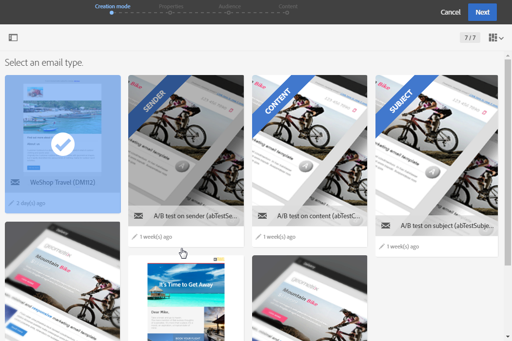
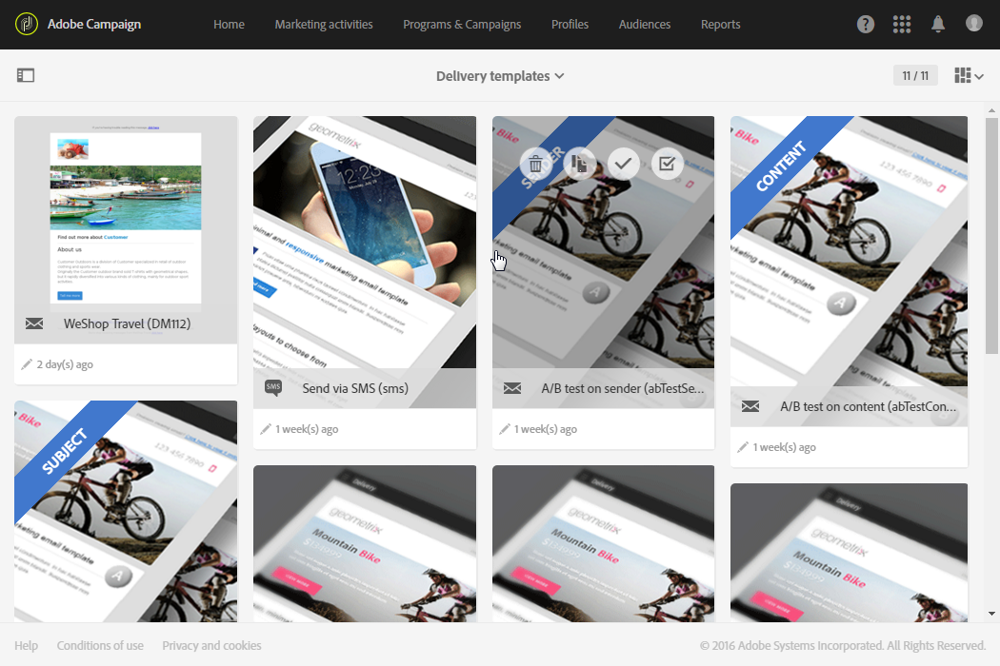
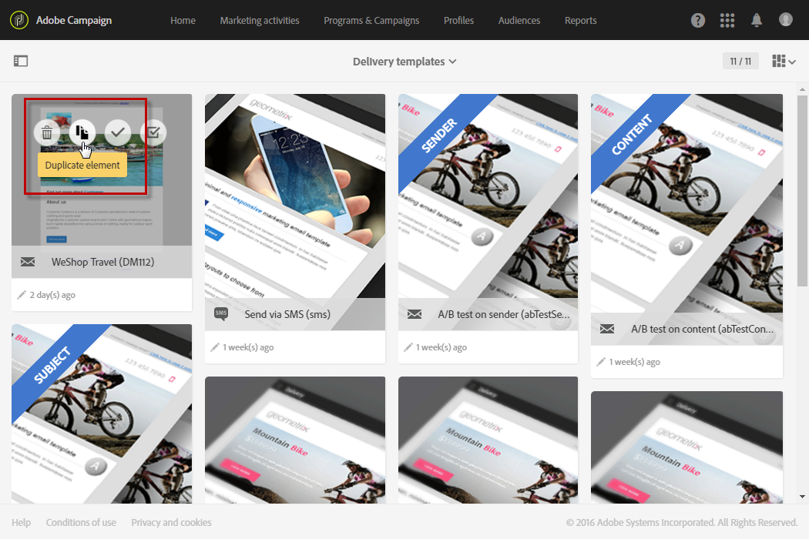
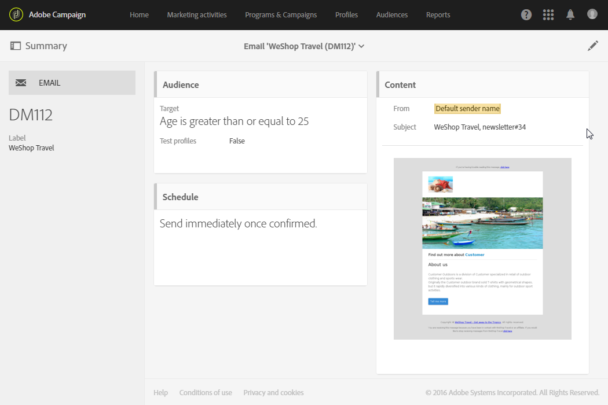
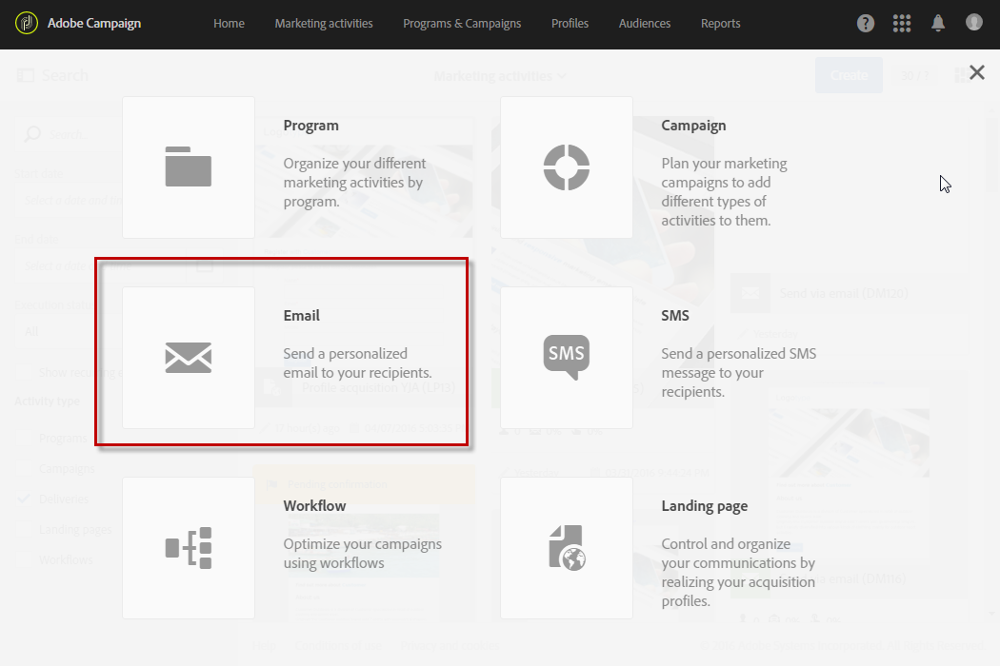
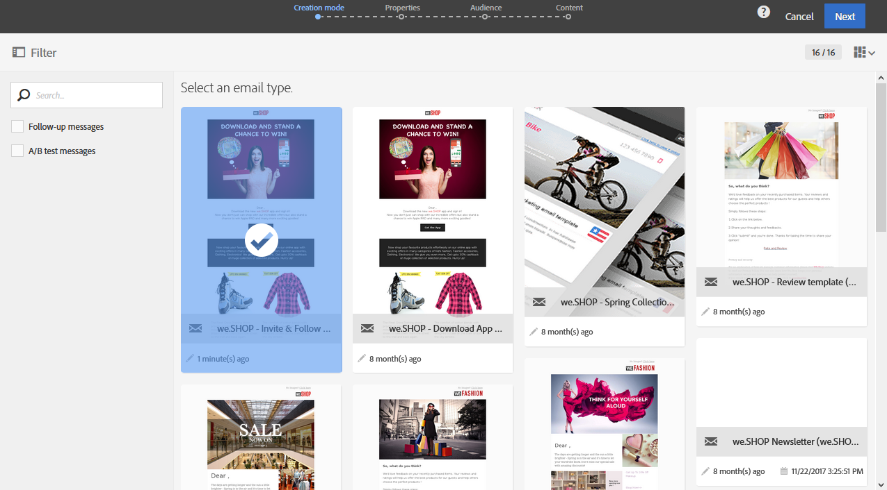
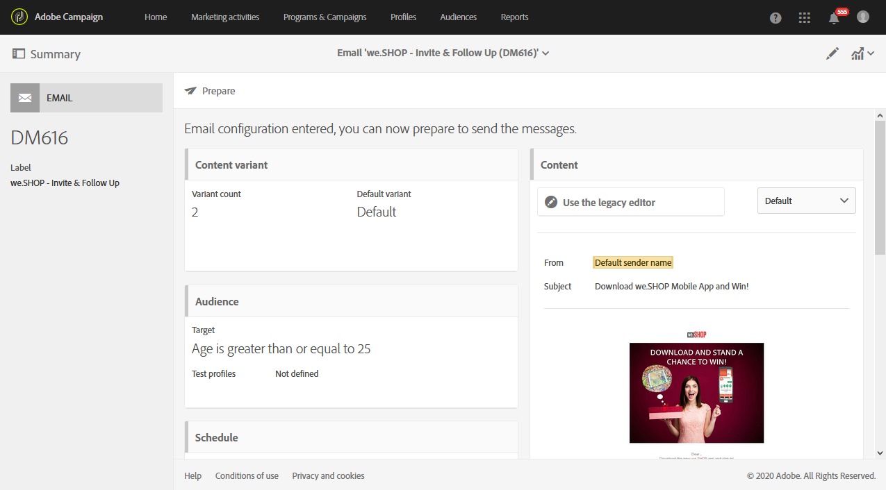

# Modelos de atividades de marketing {#marketing-activity-templates}

## Sobre modelos {#about-templates}

Ao criar uma nova atividade de marketing, a primeira tela do assistente solicita que você selecione um tipo ou modelo. Os modelos permitem pré-configurar parâmetros específicos de acordo com as necessidades. O modelo pode conter uma configuração completa ou parcial da atividade de marketing. O gerenciamento de modelos é feito pelo administrador funcional.

O usuário final tem uma interface simplificada. Ao criar uma nova atividade de marketing, basta selecionar o modelo que quer usar. Você não precisa se preocupar com configurações técnicas. Ele já foi pré-configurado pelo administrador funcional no modelo.

Por exemplo, no caso de um template de email, você pode preencher previamente o conteúdo do HTML, o público-alvo e qualquer outro parâmetro do delivery: programação, perfis de teste, as propriedades gerais do delivery, os parâmetros avançados etc. Isso permite economizar tempo ao criar uma nova atividade.

Para cada tipo de atividade de marketing, um ou vários modelos prontos para uso estão disponíveis com configuração mínima. Esses modelos prontos para uso não podem ser modificados ou excluídos.

Os modelos estão disponíveis para as seguintes atividades de marketing:

* Programas
* Campanhas
* Entregas de email
* Entregas por SMS
* Notificações por push
* Páginas de destino
* Fluxos de trabalho
* Serviços
* Importação
* Mensagens transacionais

## Criação de um novo modelo {#creating-a-new-template}

Os modelos de mensagem podem ser gerenciados pelo administrador funcional da plataforma, no menu **[!UICONTROL Resources > Templates]**. Os modelos prontos para uso não podem ser modificados ou excluídos. Para criar um novo modelo, você deve duplicar um modelo existente.

1. Selecione um modelo. Neste exemplo, escolhemos um **[!UICONTROL Delivery template]**.

   

1. Passe o mouse sobre ele e selecione a opção **[!UICONTROL Duplicate element]**.

   

1. Defina as configurações desejadas, da mesma forma que faria ao [criar uma nova atividade de marketing](../../start/using/marketing-activities.md#creating-a-marketing-activity) do zero.

   

Os modelos criados podem ser selecionados pelo usuário padrão na primeira tela do assistente ao criar uma atividade de marketing.

## Uso de um template {#using-a-template}

Agora vamos analisar como usar um modelo criado na seção anterior.

>[!NOTE]
>
>A criação de uma atividade de marketing com base em um modelo é geralmente feita por um perfil padrão de tipo de usuário.

1. Crie uma nova atividade de marketing.

   

1. Na primeira tela do assistente, selecione o modelo que deseja usar.

   

   A atividade de marketing é pré-configurada com os parâmetros definidos no modelo.

   
