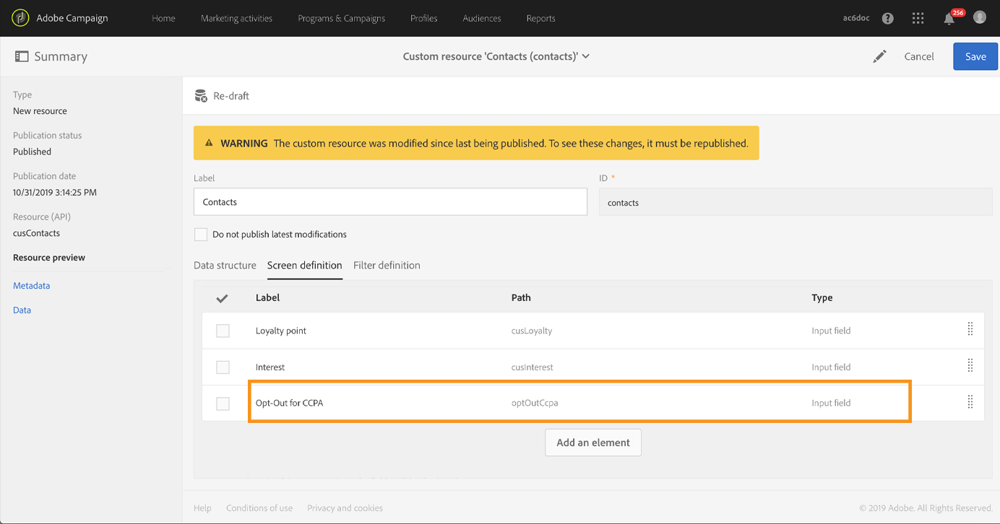

# Gerenciar solicitações de privacidade {#privacy-requests}

Para a apresentação geral sobre o Gerenciamento de privacidade, consulte [esta seção](../../start/using/privacy-management.md).

Essa informação se aplica a GDPR, CCPA, PDPA e LGPD. Para obter mais informações sobre esses requisitos, consulte [esta seção](../../start/using/privacy-management.md#privacy-management-regulations).

A recusa pela venda de informações pessoais, específica para o CCPA, é explicada nesta [seção](#sale-of-personal-information-ccpa).

>[!IMPORTANT]
>
>A utilização da API e da interface do Campaign para solicitações de acesso e exclusão se tornará obsoleta a partir da versão 19.4. Para qualquer solicitação de acesso e exclusão de RGPR, CCPA, PDPA ou LGPD, é necessário usar o método de integração do [Privacy Core Service](#create-privacy-request).

## Sobre solicitações de privacidade {#about-privacy-requests}

Para facilitar a conformidade com a privacidade, o Adobe Campaign permite manipular solicitações de Acesso e Exclusão. O **direito de acesso** e o **direito ao esquecimento** (solicitação de exclusão) estão descritos [nesta seção](../../start/using/privacy-management.md#right-access-forgotten).

Para executar essas solicitações, é necessário usar a integração do **Privacy Core Service**. As solicitações de privacidade transmitidas pelo Privacy Core Service para todas as soluções da Experience Cloud são tratadas automaticamente pelo Campaign, por meio de um fluxo de trabalho específico.

### Pré-requisitos {#prerequesites}

O Adobe Campaign oferece ferramentas de Controladores de dados para criar e processar solicitações de privacidade de dados armazenados no Adobe Campaign. No entanto, é responsabilidade do Controlador de dados gerenciar o relacionamento com o Titular de dados (email, atendimento ao cliente ou um portal da web).

É sua responsabilidade como Controlador de dados confirmar a identidade do Titular de dados que faz a solicitação e pede a confirmação de que os dados retornados ao solicitante pertençam ao Titular de dados.

>[!NOTE]
>
>Para obter mais informações sobre dados pessoais e as diferentes entidades que gerenciam os dados (Controlador de dados, Operador de dados e Titular de dados), consulte [Dados pessoais e Personalidades](../../start/using/privacy.md#personal-data).

### Namespaces {#namesspaces}

Antes de criar solicitações de privacidade, é necessário definir o namespace que será usado. O namespace é a chave que será usada para identificar o Titular de dados no banco de dados do Adobe Campaign. Dois namespaces estão disponíveis e prontos para a utilização: email e celular. Se precisar de um namespace diferente, como por exemplo um campo de perfil personalizado, siga as etapas a seguir.

Você também pode consultar este [tutorial](https://experienceleague.adobe.com/docs/campaign-standard-learn/tutorials/privacy/namespaces-for-privacy-requests.html?lang=pt-BR#privacy) para criar um namespace.

>[!NOTE]
>
>Se você usar vários namespaces, será necessário criar uma solicitação de privacidade por namespace.

1. Clique no logotipo do Adobe Campaign, no canto superior esquerdo, e selecione **[!UICONTROL Administration]** > **[!UICONTROL Namespaces]**.

   

1. Na lista do namespace, clique em **[!UICONTROL Create]**.

   

1. Insira um **[!UICONTROL Label]**.

   

1. Se quiser usar um namespace de serviço de identidade existente, escolha **[!UICONTROL Map from Identity Namespace Service]** e selecione um namespace na lista **[!UICONTROL Identity Service Namespaces]**.

   

   Se quiser criar um novo namespace em **[!UICONTROL Identity Service]** e mapeá-lo no Campaign, selecione **[!UICONTROL Create new]** e insira um nome no campo **[!UICONTROL Identity namespace name]**.

   

   Para saber mais sobre namespaces de identidade, consulte a documentação da [Experience Platform](https://experienceleague.adobe.com/docs/experience-platform/identity/namespaces.html?lang=pt-BR).

1. Um namespace do serviço de identidade está mapeado a um namespace no Campaign. É necessário especificar como o namespace será reconciliado no Campaign.

   Selecione um target mapping (**[!UICONTROL Recipients]**, **[!UICONTROL Real-time event]** ou **[!UICONTROL Subscriptions to an application]**)  Se quiser usar vários target mappings, será necessário criar um namespace por target mapping.

   

1. Escolha o **[!UICONTROL Reconciliation key]**. Este campo será usado para identificar o Titular de dados no banco de dados do Adobe Campaign.

   

1. Clique em **[!UICONTROL Create]**. Agora você pode criar uma solicitação de acesso a dados pessoais com base em seu novo namespace. Se você usar vários namespaces, será necessário criar uma solicitação de privacidade por namespace.

### Criação de uma solicitação de acesso a dados pessoais {#create-privacy-request}

>[!IMPORTANT]
>
>A integração do **Privacy Core Service** é o método que deve ser usado para todas as solicitações de acesso e exclusão.
>
>A utilização da API e da interface do Campaign para solicitações de acesso e exclusão se tornará obsoleta a partir da versão 19.4. Use o Privacy Core Service para qualquer solicitação de acesso e exclusão do GDPR, CCPA, PDPA ou LGPD.

A Integração do Privacy Core Service permite automatizar suas solicitações de acesso a dados pessoais em um contexto de várias soluções por meio de uma única chamada JSON API. As solicitações de privacidade transmitidas pelo Privacy Core Service para todas as soluções da Experience Cloud são tratadas automaticamente pelo Campaign, por meio de um fluxo de trabalho específico.

Consulte a documentação do [Experience Platform Privacy Service](https://experienceleague.adobe.com/docs/experience-platform/privacy/home.html?lang=pt-BR) para saber como criar solicitações de acesso a dados pessoais pelo Privacy Core Service.

Cada tarefa do Privacy Core Service é dividida em várias solicitações de privacidade no Campaign com base no número de namespaces que estão sendo utilizados, onde cada solicitação corresponde a um namespace. Além disso, um trabalho pode ser executado em múltiplas instâncias. Portanto, vários arquivos são criados para uma tarefa. Por exemplo, se uma solicitação tiver dois namespaces e estiver em execução em três instâncias, então será enviado um total de seis arquivos. Um arquivo por namespace e instância.

O padrão para um nome de arquivo é: `<InstanceName>-<NamespaceId>-<ReconciliationKey>.xml`

* **InstanceName**: nome da instância do Campaign
* **NamespaceId**: identificação de namespace do serviço de identidade do namespace utilizado
* **Chave de reconciliação**: chave de reconciliação criptografada

### Lista de recursos {#list-of-resources}

Ao executar uma solicitação de privacidade de Exclusão ou Acesso, o Adobe Campaign pesquisa todos os dados do Titular de dados com base no valor de **Reconciliação** em todos os recursos que têm um link para o recurso de perfis (tipo próprio).

Aqui está a lista de recursos prontos para utilização que são considerados ao executar solicitações de Privacidade:

* Perfis (recipient)
* Logs do delivery de perfil (broadLogRcp)
* Logs de rastreamento de perfil (trackingLogRcp)
* Logs do delivery (Assinaturas de um aplicativo) (broadLogAppSubRcp)
* Registros de rastreamento (assinaturas de um aplicativo) (trackingLogAppSubRcp)
* Assinaturas de um aplicativo (appSubscriptionRcp)
* Histórico de assinaturas de perfis (subHistoRcp)
* Assinaturas de perfil (subscriptionRcp)
* Visitantes (visitor)

Se você criou recursos personalizados com um link para o recurso de perfis (tipo próprio), eles também serão considerados. Por exemplo, se você tiver um recurso de transação vinculado ao recurso de perfis, e um recurso de detalhes de transação vinculado ao recurso de transação, ambos serão considerados.

Consulte este [tutorial](https://experienceleague.adobe.com/docs/campaign-standard-learn/tutorials/privacy/custom-resources-for-privacy-requests.html?lang=pt-BR#privacy) sobre modificação de recursos personalizados.

Para funcionar, é necessário selecionar a opção **[!UICONTROL Deleting the target record implies deleting records referenced by the link]** no recurso personalizado:

1. Clique no logotipo do Adobe Campaign no canto superior esquerdo e selecione **[!UICONTROL Administration]** > **[!UICONTROL Development]** > **[!UICONTROL Custom resources]**.

1. Selecione um recurso personalizado que tenha um link para o recurso de perfis (tipo próprio).

1. Clique na seção **[!UICONTROL Links]**.

1. Para cada link, clique no ícone de lápis (**[!UICONTROL Edit properties]**).

1. Na seção **[!UICONTROL Behavior if deleted/duplicated]** selecione a opção **[!UICONTROL Deleting the target record implies deleting records referenced by the link]**.

   

### Status de solicitação de acesso a dados pessoais {#privacy-request-statuses}

Estes são os diferentes status de solicitações de acesso a dados pessoais:

* **[!UICONTROL New]** / **[!UICONTROL Retry pending]**: em andamento, o workflow ainda não processou a solicitação.
* **[!UICONTROL Processing]** / **[!UICONTROL Retry in progress]**: o workflow está processando a solicitação.
* **[!UICONTROL Delete pending]**: o workflow identificou todos os dados do recipient que serão excluídos.
* **[!UICONTROL Delete in progress]**: workflow está processando a exclusão.
   <!--**[!UICONTROL Delete Confirmation Pending]** (Delete request in 2-steps process mode): the workflow has processed the Access request. Manual confirmation is requested to perform the deletion. The button is available for 15 days.-->
* **[!UICONTROL Complete]**: o processamento da solicitação foi concluído sem erros.
* **[!UICONTROL Error]**: o workflow encontrou um erro. O motivo é exibido na lista de solicitações de acesso a dados pessoais na coluna **[!UICONTROL Request status]**. Por exemplo, **[!UICONTROL Error data not found]** significa que nenhum dado de recipient correspondente ao **[!UICONTROL Reconciliation value]** do titular dos dados foi encontrado no banco de dados.

### Desabilitar o processo de 2 etapas {#disabling-two-step-process}

O Core Privacy Service não é compatível com o processo de duas etapas.

>[!IMPORTANT]
>
>Antes de usar a integração do Core Privacy Service para gerenciar suas solicitações de privacidade, você deve desativar o processo de duas etapas para Excluir solicitações da interface do Campaign Standard.

Se essa opção não estiver desativada, todas as solicitações de exclusão gerenciadas com o Privacy Core Service permanecerão pendentes e não serão concluídas.

O processo de duas etapas é ativado por padrão.

Para alterar esse modo, clique em **[!UICONTROL Edit properties]**, no canto superior direito da tela **[!UICONTROL Privacy Requests]** e, em seguida, desmarque a opção **[!UICONTROL Activate the 2-step process]**.

## Recusar a venda de informações pessoais (CCPA) {#sale-of-personal-information-ccpa}

Os **Direitos de privacidade do consumidor da Califórnia** (CCPA) fornecem aos residentes da Califórnia novos direitos no que diz respeito a suas informações pessoais e impõe responsabilidades de proteção de dados a determinadas entidades com negócios na Califórnia.

A configuração e utilização dos pedidos de acesso e exclusão são comuns. a GDPR e CCPA. Esta seção apresenta a opção pela recusa à venda de dados pessoais, específica da CCPA.

Além das ferramentas de [Gerenciamento de consentimento](../../start/using/privacy-management.md#consent-management) oferecidas pelo Adobe Campaign, existe a possibilidade de monitorar se o cliente optou pela não participação na venda de Informações pessoais.

Um cliente decide, por meio do sistema, que não permite que suas informações pessoais sejam vendidas para terceiros. No Adobe Campaign, você poderá armazenar e rastrear essas informações.

>[!NOTE]
>
>Você pode aproveitar a opção de recusa à venda de informações pessoais por meio da interface do Campaign e da API. Não é possível usá-la por meio do Core Privacy Service.

>[!IMPORTANT]
>
>É sua responsabilidade como Controlador de dados receber a solicitação do Titular dos dados e rastrear as datas da solicitação para CCPA. Como provedor de tecnologia, oferecemos somente uma maneira de recusar a participação. Para obter mais informações sobre sua função como Controlador de dados, consulte [Dados pessoais e Personalidades](../../start/using/privacy.md#personal-data).

### Pré-requisito para tabelas personalizadas {#ccpa-prerequisite}

A partir da versão 19.4, o campo **[!UICONTROL CCPA Opt-Out]** já está pronto para ser utilizado na interface e API do Campaign. Por padrão, o campo está disponível para o recurso **[!UICONTROL Profile]**.

Se você usar um recurso de perfil personalizado, precisará estender o recurso e adicionar o campo. Recomendamos que você use um nome diferente do campo predefinido, por exemplo:  **[!UICONTROL Opt-Out for CCPA]** (optoutccpa). Quando um campo é criado, ele se torna automaticamente compatível com a API do Campaign.

Para obter informações mais detalhadas sobre como estender o recurso do perfil, consulte [esta seção](../../developing/using/extending-the-profile-resource-with-a-new-field.md).

>[!NOTE]
>
>A alteração de recursos é uma operação delicada e deve ser executada somente por usuários especialistas.

1. Acesse **[!UICONTROL Administration]** > **[!UICONTROL Development]** > **[!UICONTROL Custom Resources]**. Clique em recursos de perfil personalizado. Para obter mais informações sobre a extensão de um recurso, consulte [esta seção](../../developing/using/creating-or-extending-the-resource.md).

   

1. Clique em **[!UICONTROL Add field]** ou em **[!UICONTROL Create Element]**, adicione o rótulo, a ID e escolha o tipo **[!UICONTROL Boolean]**. Para o nome, use **Opt-Out for CCPA**. Na identificação, use:**optOutCcpa**.

   

1. Na guia **[!UICONTROL Screen definition]**, em **[!UICONTROL Detail screen configuration]**, adicione o campo e selecione **[!UICONTROL Input field]**. O campo ficará disponível na lista e detalhes de perfil.  Para obter mais informações sobre a configuração de definição da tela, consulte [esta seção](../../developing/using/configuring-the-screen-definition.md).

   

1. Acesse **[!UICONTROL Administration]** > **[!UICONTROL Development]** > **[!UICONTROL Publishing]**, prepare a publicação e publique as modificações. Para obter mais informações sobre a publicação de um recurso, consulte [esta seção](../../developing/using/updating-the-database-structure.md).

   

1. Verifique se o campo está disponível nos detalhes de um perfil. Para obter mais informações, consulte [esta seção](#usage).

### Uso {#usage}

É de responsabilidade do Controlador de dados preencher os valores do campo e seguir as diretrizes e regras do CCPA que dizem respeito à venda.

Para preencher os valores, vários métodos podem ser utilizados:

* Usar a interface do Campaign ao editar as informações do recipient (veja abaixo)
* Usar a API de privacidade do Campaign (consulte a [documentação da API](../../api/using/managing-ccpa-opt-out.md))
* Através de um fluxo de trabalho de importação

Você deve garantir que não venderá a terceiros as informações pessoais de perfis que recusaram a adesão.

1. Na interface do Campaign, edite um perfil para alterar o status de recusa.

   

1. Quando o valor do campo é **[!UICONTROL True]**, as informações são exibidas nas informações do perfil.

   

1. Você pode configurar a lista de perfis para exibir a coluna de recusa. Para saber como configurar a lista, consulte [esta seção](../../start/using/customizing-lists.md).

   

1. Você pode clicar na coluna para classificar os recipients de acordo com as informações de recusa.

   
