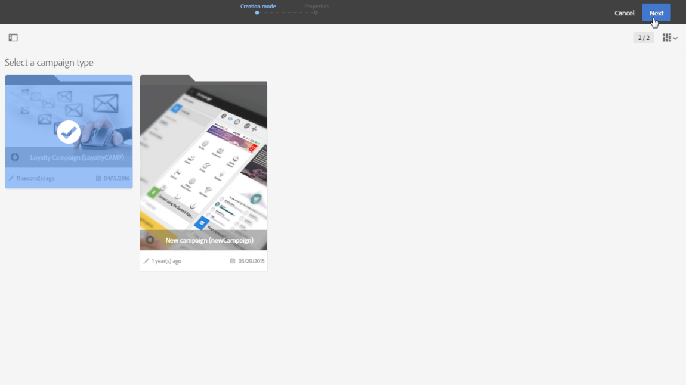

# Programas e campanhas{#programs-and-campaigns}

## Sobre planos, programas e campanhas {#about-plans--programs-and-campaigns}

Com o Adobe Campaign é possível planejar campanhas de marketing nas quais você pode criar e gerenciar diferentes tipos de atividades: emails, mensagens SMS, notificações por push, fluxos de trabalho, páginas de aterrissagem. Essas campanhas e seus conteúdos podem ser coletados em programas.

Com programas e campanhas é possível reagrupar e exibir as diferentes atividades de marketing vinculadas a elas.

* Um **programa** pode conter outros programas, assim como campanhas, fluxos de trabalho e páginas de aterrissagem. Ele aparece na linha do tempo e ajuda na organização de suas atividades de marketing: você pode separá-los por país, por marca, por unidade etc.
* Uma **campanha** possibilita coletar todas as atividades de marketing de sua escolha em uma única entidade. Uma campanha pode conter emails, SMS, notificações por push, malas diretas, fluxos de trabalho e páginas de aterrissagem.

Para organizar melhor seus planos de marketing, a Adobe recomenda a seguinte hierarquia: Programa > Subprogramas > Campanhas > Workflows > Deliveries.

Com os relatórios sobre programas e campanhas é possível analisar o impacto de cada um deles. Por exemplo, você pode criar relatórios no nível da campanha para agregar dados em todos os deliveries contidos nessa campanha.

**Tópicos relacionados:**

* [Linha do tempo](../../start/using/timeline.md)
* [Sobre Relatórios dinâmicos](../../reporting/using/about-dynamic-reports.md)

## Criação de um programa {#creating-a-program}

O programa é o primeiro nível de organização. Ele pode conter subprogramas, campanhas, fluxos de trabalhos ou páginas de aterrissagem.

1. Na página inicial do Adobe Campaign, selecione o cartão **[!UICONTROL Programs & Campaigns]**.
1. Clique no botão **[!UICONTROL Create]**.
1. Na tela **[!UICONTROL Creation mode]**, selecione um tipo de programa.

   

   Os tipos de programas disponíveis são baseados em modelos definidos na seção **[!UICONTROL Resources]** > **[!UICONTROL Templates]** > **[!UICONTROL Program templates]**. Para saber mais, consulte a seção [Gerenciamento de templates](../../start/using/marketing-activity-templates.md).

1. Na tela **[!UICONTROL Properties]**, digite o nome e a ID do programa.

   

1. Selecione uma data de início e término do programa. Estas datas só se aplicam ao próprio programa.

   Você pode criar seu programa em um programa principal. Para fazer isso, selecione o programa principal dos programas existentes.

1. Clique em **[!UICONTROL Create]** para confirmar a criação do programa.

O programa é criado e exibido. Use o botão **[!UICONTROL Create]** para adicionar subprogramas, campanhas, fluxos de trabalho ou páginas de aterrissagem.

>[!NOTE]
>
>Você também pode criar um programa da lista de atividades de marketing.

## Criação de uma campanha {#creating-a-campaign}

Em programas e subprogramas, é possível adicionar campanhas. As campanhas podem conter atividades de marketing, como emails, SMS, notificações por push, fluxos de trabalho e páginas de aterrissagem.

1. Na página inicial do Adobe Campaign, selecione o cartão **[!UICONTROL Programs & Campaigns]** e acesse um programa ou subprograma.
1. Clique no botão **[!UICONTROL Create]** e selecione **[!UICONTROL Campaign]**.
1. Na tela **[!UICONTROL Creation mode]**, selecione um tipo de campanha.

   

   Os tipos de campanha disponíveis são baseados em modelos definidos em **[!UICONTROL Resources]** > **[!UICONTROL Templates]** > **[!UICONTROL Campaign templates]**. Para saber mais, consulte a seção [Gerenciamento de templates](../../start/using/marketing-activity-templates.md).

1. Na tela **[!UICONTROL Properties]**, digite o nome e a ID da campanha.
1. Selecione uma data de início e término para a sua campanha. Estas datas só se aplicam à própria campanha.

   

1. Clique em **[!UICONTROL Create]** para confirmar a criação da campanha.

A campanha é criada e exibida. Use o botão **[!UICONTROL Create]** para adicionar atividades de marketing à sua campanha.

>[!NOTE]
>
>Dependendo do seu contrato de licença, você pode acessar somente algumas dessas atividades.

Você também pode criar uma campanha da lista de atividades de marketing. Você pode escolher vincular a atividade de marketing a um programa ou subprograma principal pela janela de propriedades da campanha.

## Ícones e status de programas e campanhas {#programs-and-campaigns-icons-and-statuses}

Cada programa e cada campanha na lista tem um símbolo visual e um ícone cuja cor indica o status da execução. Esse status depende do período de validade do programa ou da campanha.

* Cinza: o programa/campanha ainda não foi iniciado - status **[!UICONTROL Editing]**.
* Azul: o programa/campanha está em andamento - status **[!UICONTROL In progress]**.
* Verde: o programa/campanha terminou - status **[!UICONTROL Finished]**. Por padrão, a data atual é exibida automaticamente como a data inicial de validade, e a data final é calculada de acordo com a data inicial (**D+186 dias**). É possível alterar essas datas nas propriedades do programa ou da campanha.

