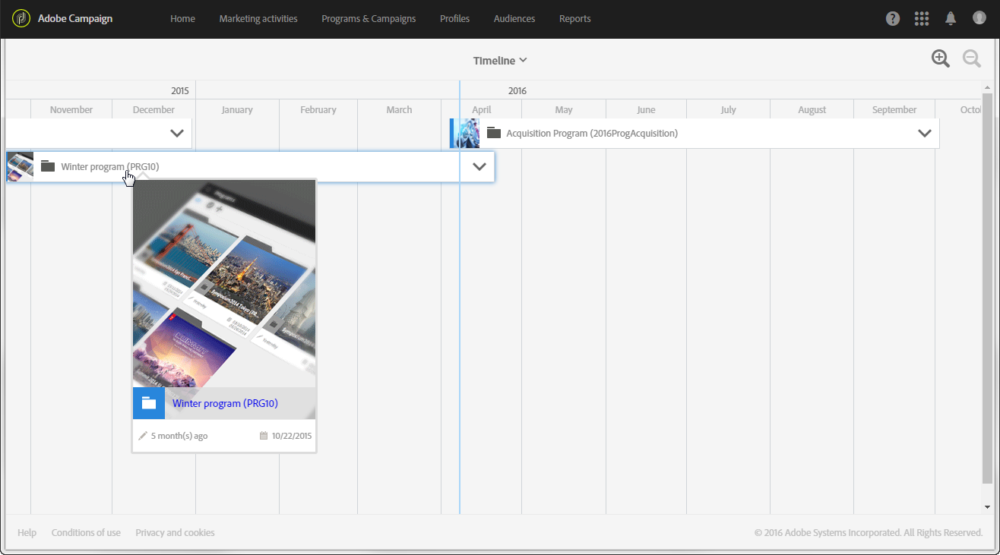
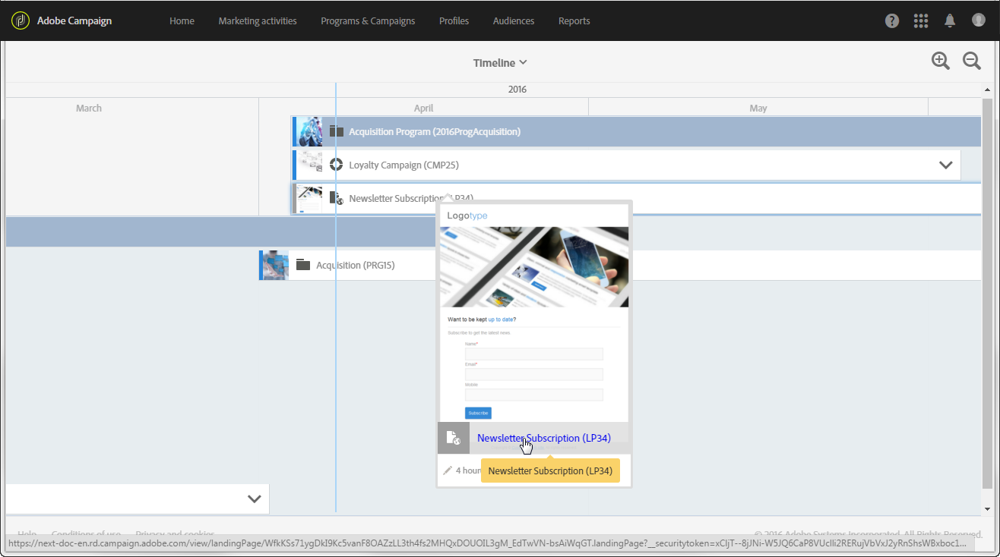

# Linha do tempo{#timeline}

O **[!UICONTROL Timeline]** permite visualizar programas que estão em andamento e seu conteúdo.

Para acessar a linha do tempo, clique no cartão correspondente da home page.

Por padrão, a linha do tempo só detalha os programas que são exibidos cronologicamente entre as datas de início e de término definidas.

Cada programa é representado por uma caixa contendo a miniatura e o rótulo correspondentes. Dependendo do tamanho da tela e do número de elementos a serem exibidos, o rótulo pode ser substituído pela ID do programa.

A linha vertical azul é um marcador cronológico para realçar a data atual. Por padrão, ele é encontrado no meio da tela. Você pode rolar a tela para a direita ou para a esquerda para modificar o período exibido.

Use os ícones para;

*  reduzir o perímetro ou aumentar o nível de detalhes por um período mais limitado, até que os dias sejam exibidos
*  aumente o perímetro ou exiba um período de tempo maior

Clique na seta à direita de cada nome de programa para exibir o conteúdo correspondente. Um programa pode conter subprogramas, campanhas e landing pages. Uma campanha é implantada da mesma forma que um programa e pode conter emails, SMS e landing pages.

>[!NOTE]
>
>Como os workflows não têm uma noção específica de uma data, eles não aparecem na linha do tempo.

Quando o conteúdo de um programa ou de uma campanha é exibido, a caixa correspondente fica azul, e a seta no lado direito fica invertida. Clique novamente na seta para ocultar o conteúdo.

Cada elemento tem um ícone que corresponde ao seu tipo:

*  Programa
*  Campanha
*  Landing page
*  Email
*  SMS
*  Notificações por push

A linha colorida na borda esquerda de cada caixa indica o status do elemento em questão.

* Quando um elemento ainda não foi iniciado, a linha fica cinza.
* Se um elemento estiver em andamento, a linha ficará azul.
* Assim que um elemento terminar, a linha fica verde.

Clique em um programa ou em qualquer outro elemento exibido para fazer com que o cartão correspondente apareça. Em seguida, clique no cartão para ir diretamente ao conteúdo do elemento selecionado e modificá-lo.

Clique em qualquer outro lugar na tela para fazer o cartão desaparecer.
