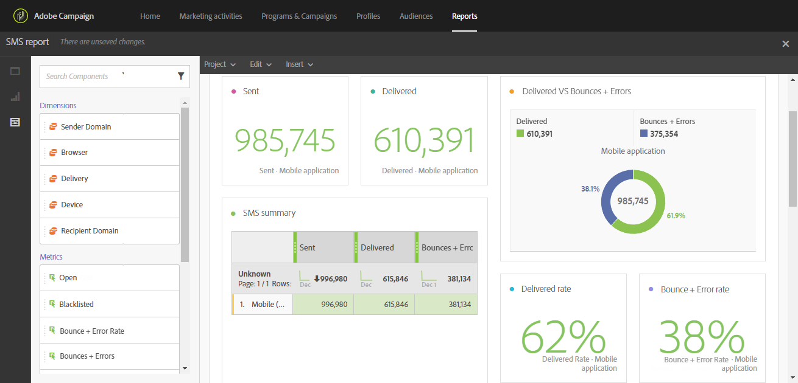

# Rastreamento, monitoramento e relatórios{#tracking-monitoring-and-reporting}

Além dos modelos de relatórios avançados e prontos para uso, o Adobe Campaign permite que você crie relatórios personalizados em nível de entrega, campanha, usuário ou segmento. Acompanhe suas mensagens e entenda o comportamento de seus clientes enriquecendo progressivamente os dados de perfil. As ferramentas de relatórios e análise permitem aproveitar cada nova campanha, melhor definir metas para as ações de marketing e otimizar o impacto e o retorno sobre o investimento.

A interface gráfica fornece acesso rápido e fácil aos principais indicadores e estatísticas de entrega.

A interface do usuário do relatório da campanha facilita a criação de relatórios dinâmicos. Você pode usar variáveis de arrastar e soltar para personalizar seus relatórios e analisar o sucesso de suas campanhas. Dependendo da complexidade de suas consultas e cálculos, os dados podem ser agregados em uma exibição de lista ou acessados em um formato que facilita a geração de relatórios de análise de marketing.

Para obter mais informações sobre relatórios, consulte a seção [Acessar relatórios](../../reporting/using/about-dynamic-reports.md) .

Com o Adobe Campaign, você pode monitorar e rastrear cada entrega individualmente. O painel de mensagens exibe registros dedicados para processos de acompanhamento, regras e identificar possíveis erros e avisos. Para obter mais informações sobre monitoramento de entrega, consulte a seção [Monitoramento de uma entrega](../../sending/using/monitoring-a-delivery.md) . Os princípios e recursos de rastreamento são apresentados na seção Mensagens [de](../../sending/using/tracking-messages.md) rastreamento.
